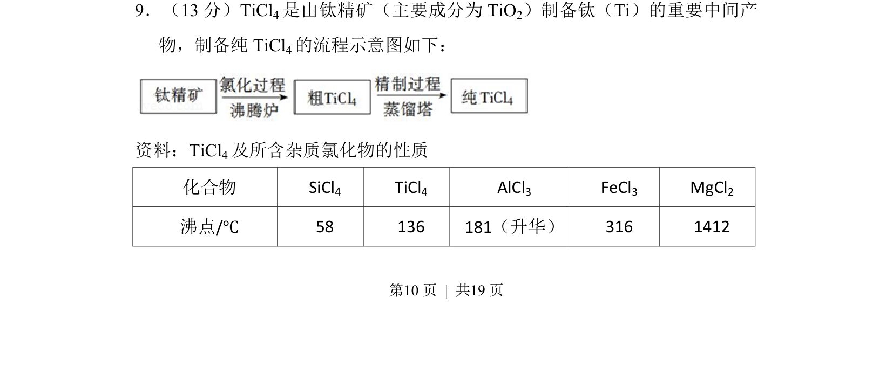
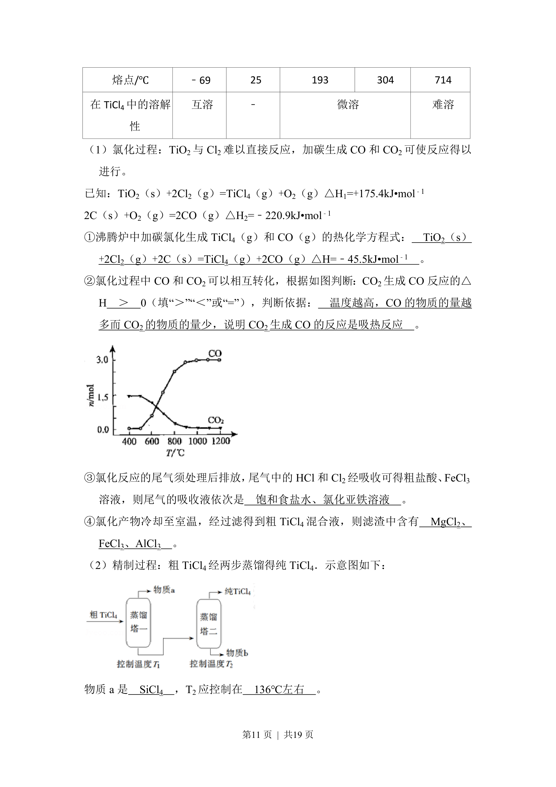
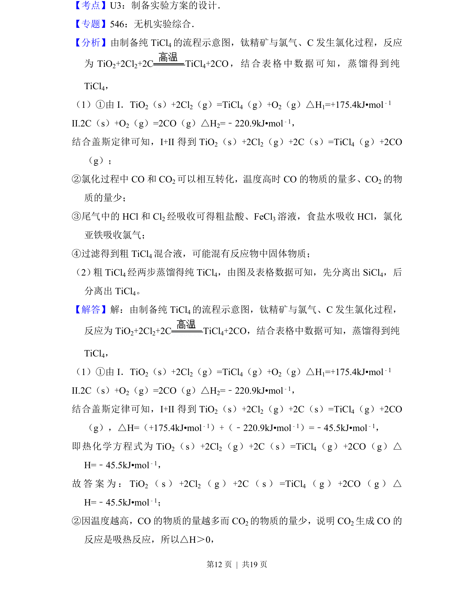
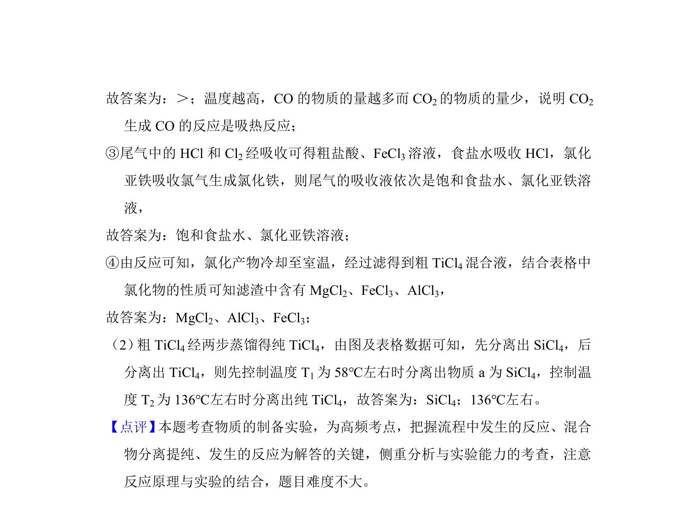

## 题面

## 摘要

该题考查利用各物质沸点差异，通过蒸馏提纯TiCl₄的工艺流程分析。

## 关联考点

- [[943-物质的分离与提纯|物质的分离与提纯]]
- [[079-蒸馏|蒸馏]]
- [[033-沸腾|沸点]]
- [[679-工艺流程|工艺流程]]

## 答案与解析

> 📄 原 PDF 第 10 页：`素材/真题/北京/2008-2024·（北京）化学高考真题/2017年高考化学试卷（北京）（解析卷）.pdf`
