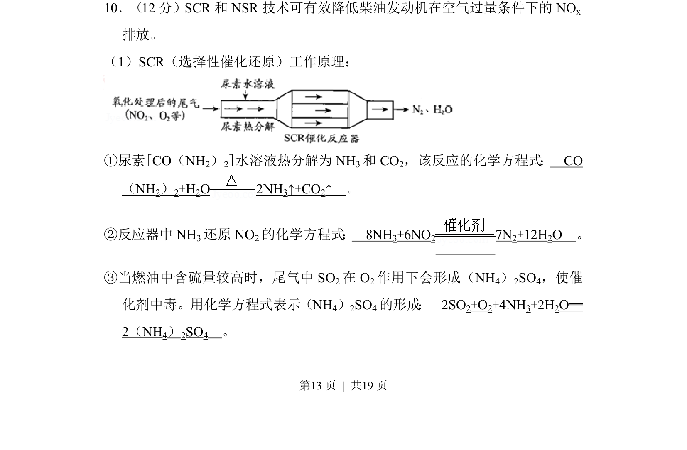
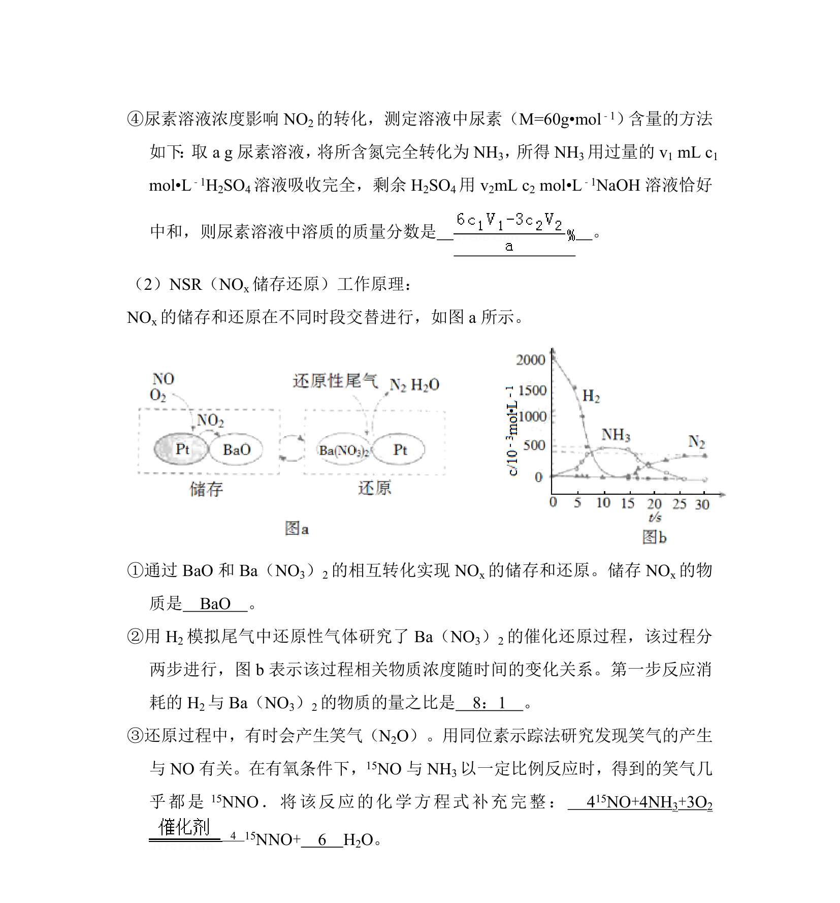
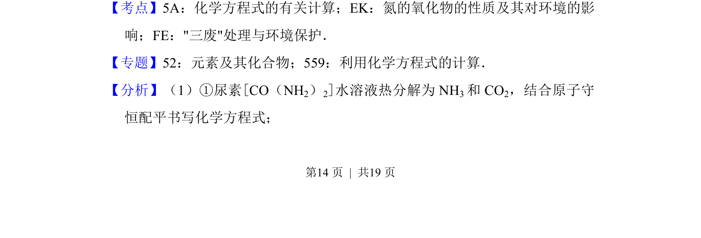
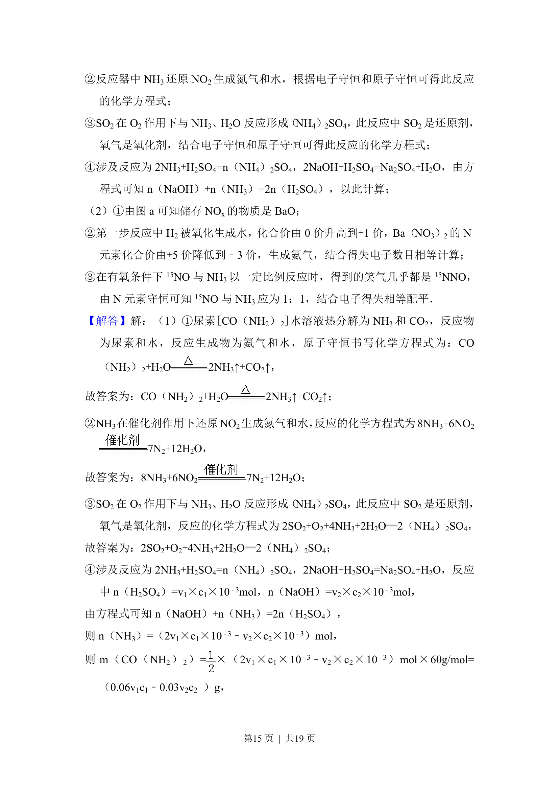
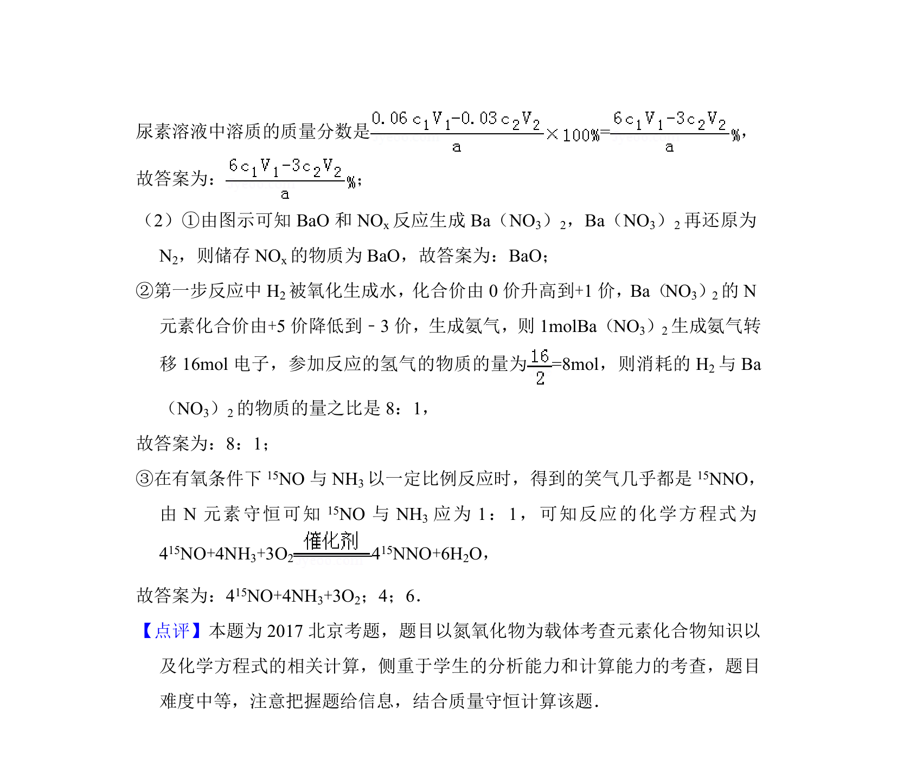

## 题面

## 摘要

考查SCR技术中尿素分解、氨还原氮氧化物及硫酸铵生成的化学方程式书写。

## 关联考点

- [[052-化学方程式|化学方程式]]
- [[162-氧化还原反应|氧化还原反应]]
- [[氮氧化物处理]]
- [[催化剂中毒]]

## 答案与解析

> 📄 原 PDF 第 13 页：`素材/真题/北京/2008-2024·（北京）化学高考真题/2017年高考化学试卷（北京）（解析卷）.pdf`
