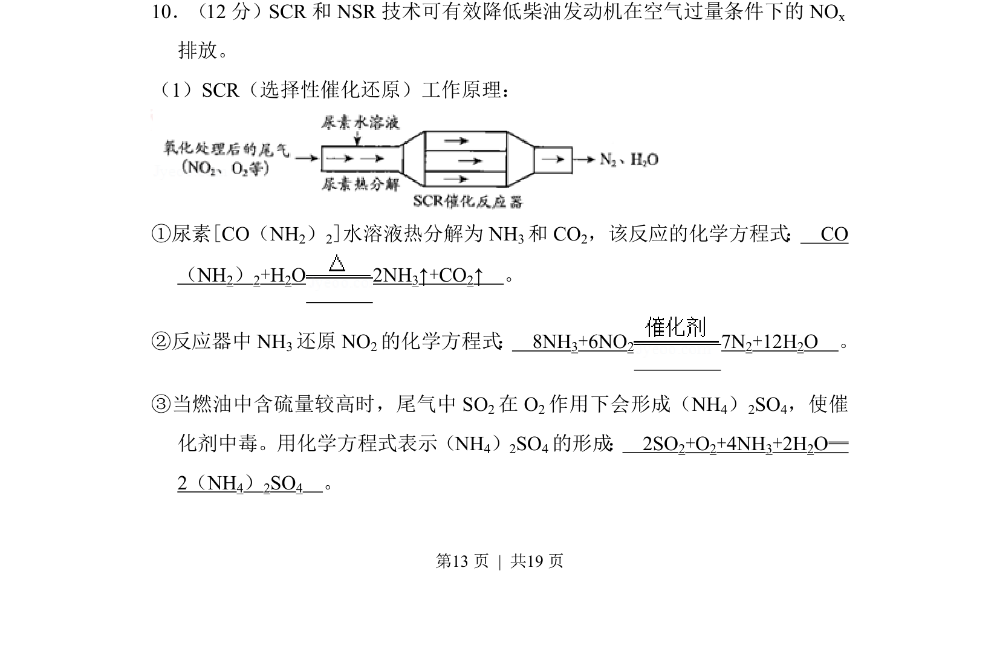
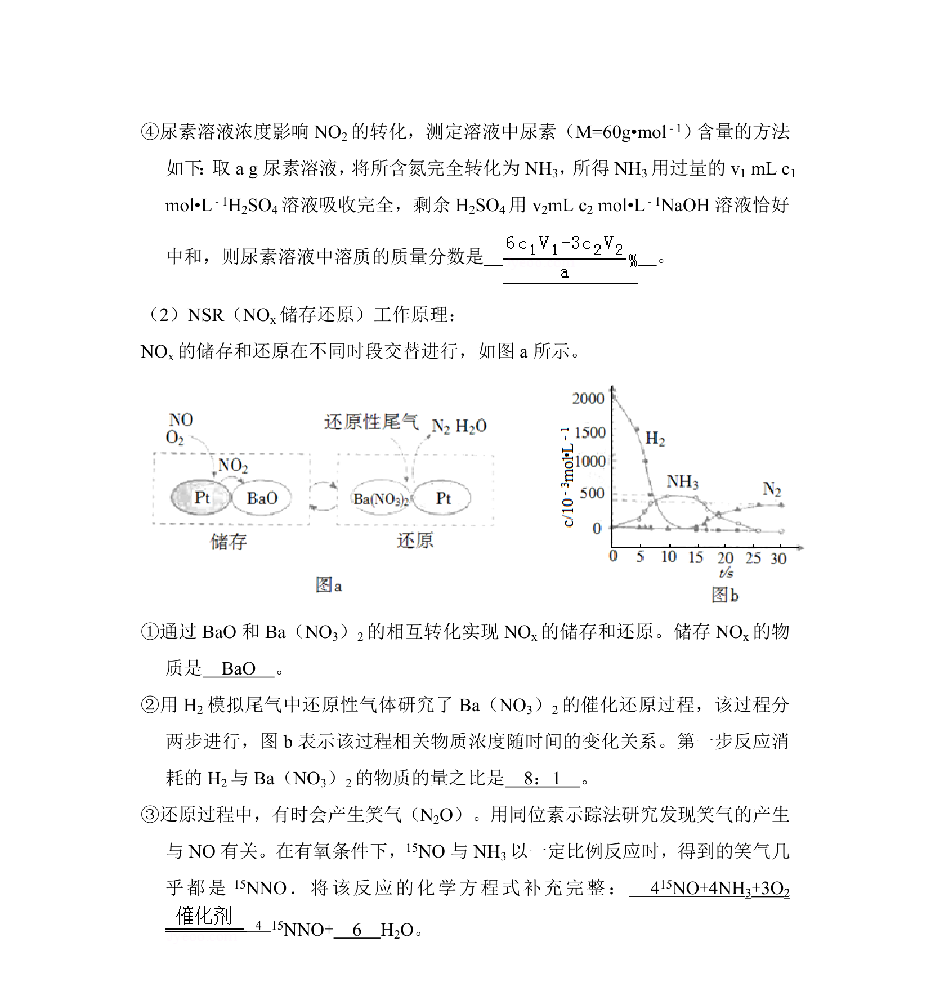
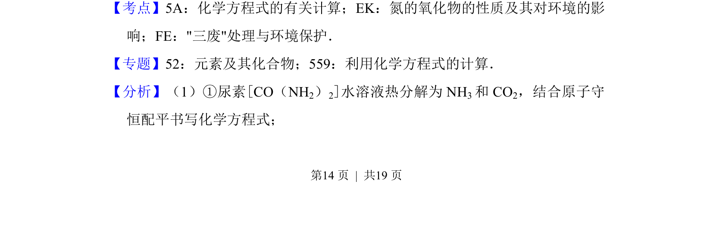
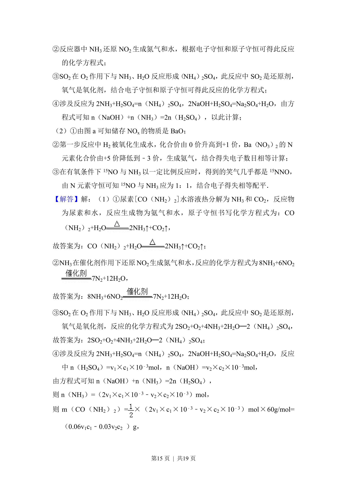
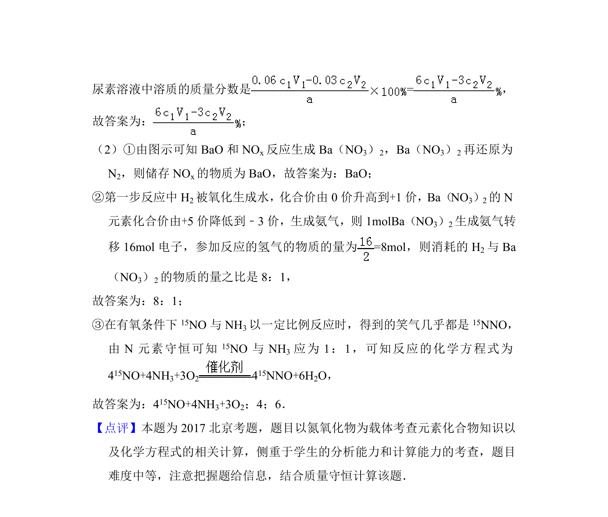

## 题面

## 摘要

考查SCR技术中尿素分解、氨还原氮氧化物及硫酸铵生成的化学方程式书写。

## 关联考点

- [[052-化学方程式|化学方程式]]
- [[162-氧化还原反应|氧化还原反应]]
- [[氮氧化物处理]]
- [[催化剂中毒]]

## 答案与解析

> 📄 原 PDF 第 13 页：`素材/真题/北京/2008-2024·（北京）化学高考真题/2017年高考化学试卷（北京）（解析卷）.pdf`

<!-- 题干文本-start -->
## 题干文本
10．（12分）SCR和NSR技术可有效降低柴油发动机在空气过量条件下的NO x
排放。
（1）SCR（选择性催化还原）工作原理：
①尿素[CO（NH2）2]水溶液热分解为NH 3和CO 2，该反应的化学方程式：　CO
（NH2）2+H2O 2NH3↑+CO2↑　。
②反应器中NH 3还原NO 2的化学方程式 ： 　8NH3+6NO2 7N2+12H2O　。
③当燃油中含硫量较高时，尾气中SO 2在O 2作用下会形成（NH 4）2SO4，使催
化剂中毒。用化学方程式表示（NH4）2SO4的形成 ： 　2SO2+O2+4NH3+2H2O═
2（NH4）2SO4　。
<!-- 题干文本-end -->

<!-- 解析文本-start -->
## 解析文本

<!-- 解析文本-end -->
