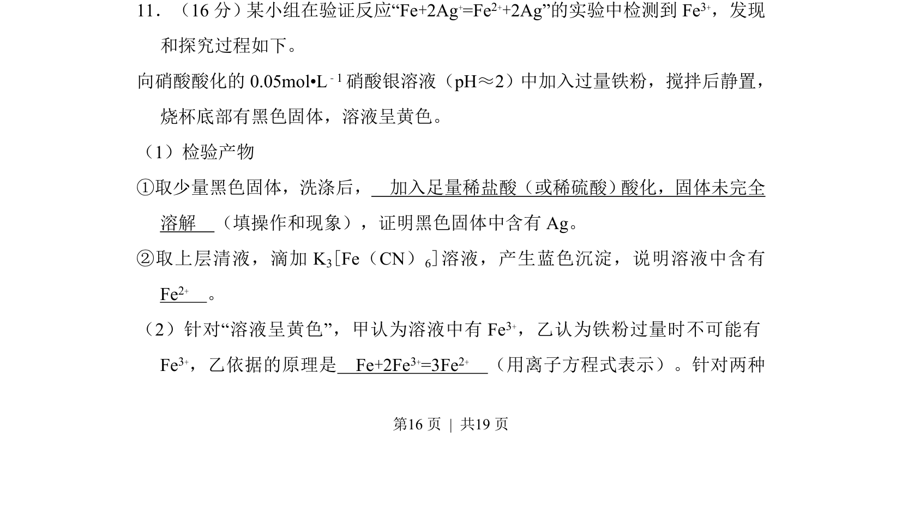
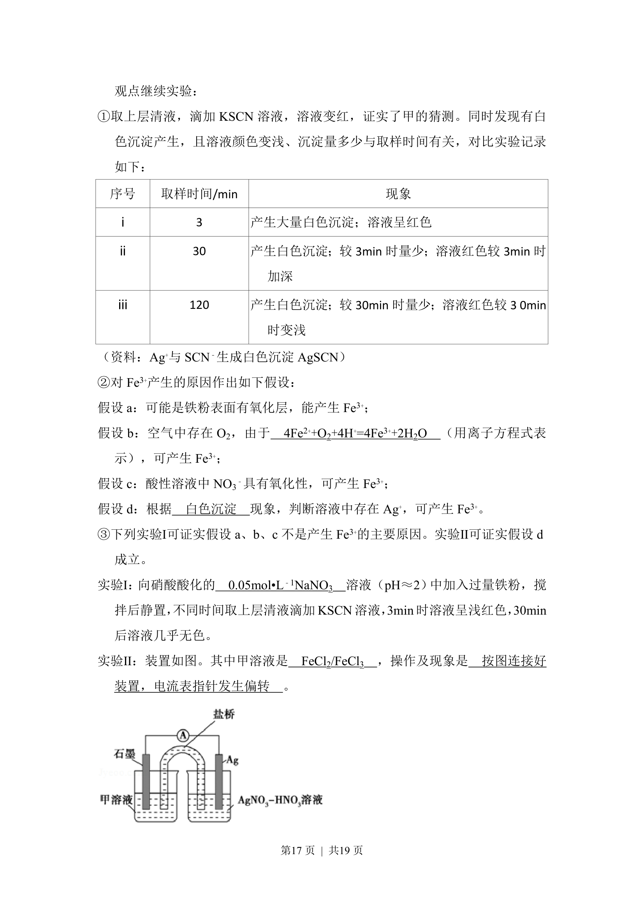
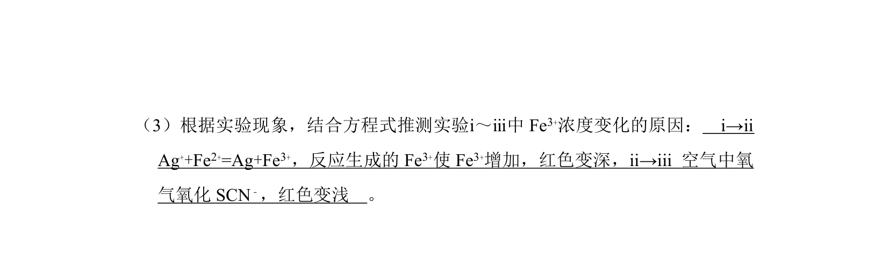
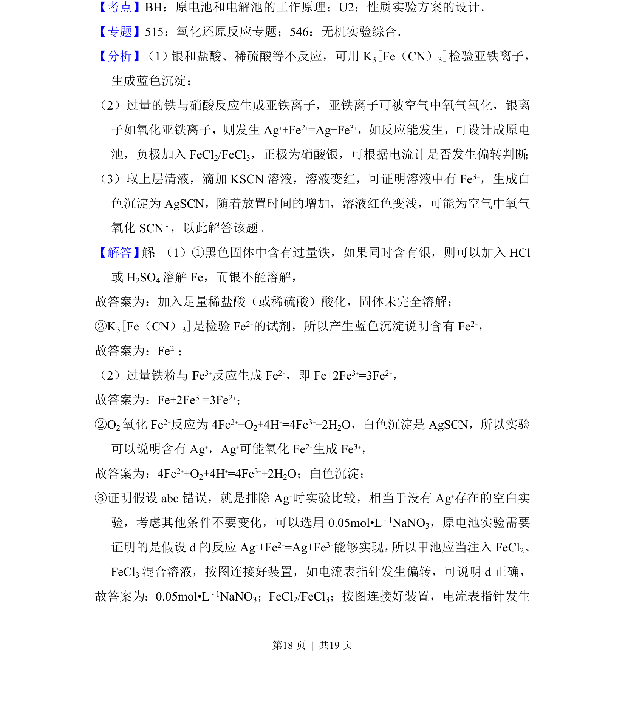
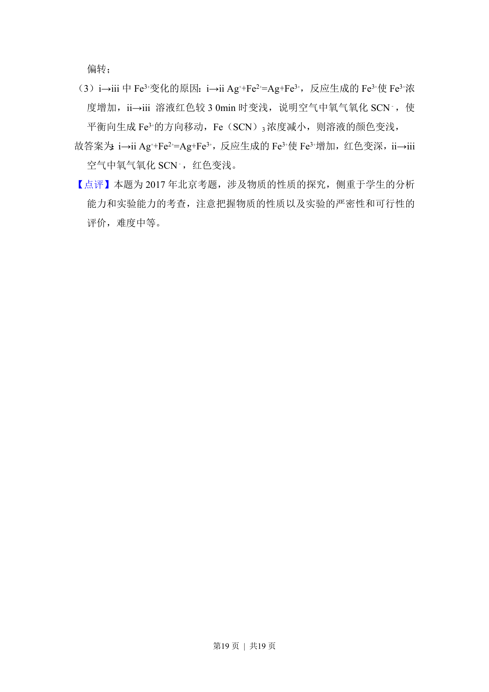

## 题面

## 摘要

探究Fe与Ag+反应中Fe3+的生成及产物的检验与原理分析

## 关联考点

- [[177-Fe离子检验|铁离子检验]]
- [[971-亚铁离子检验|亚铁离子检验]]
- [[银的检验]]
- [[170-离子方程式|离子方程式]]

## 答案与解析

> 📄 原 PDF 第 16 页：`素材/真题/北京/2008-2024·（北京）化学高考真题/2017年高考化学试卷（北京）（解析卷）.pdf`
