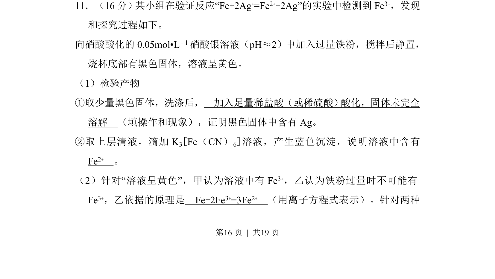
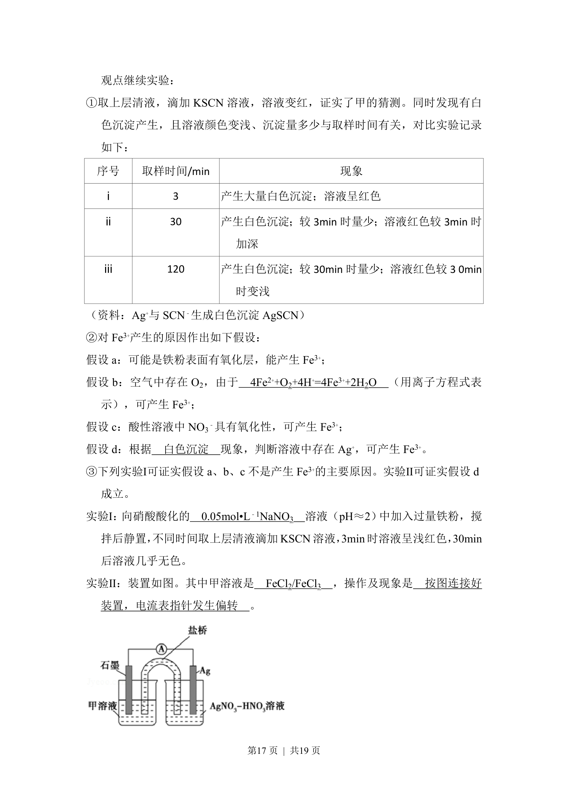
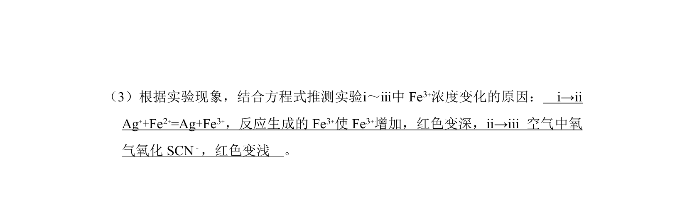
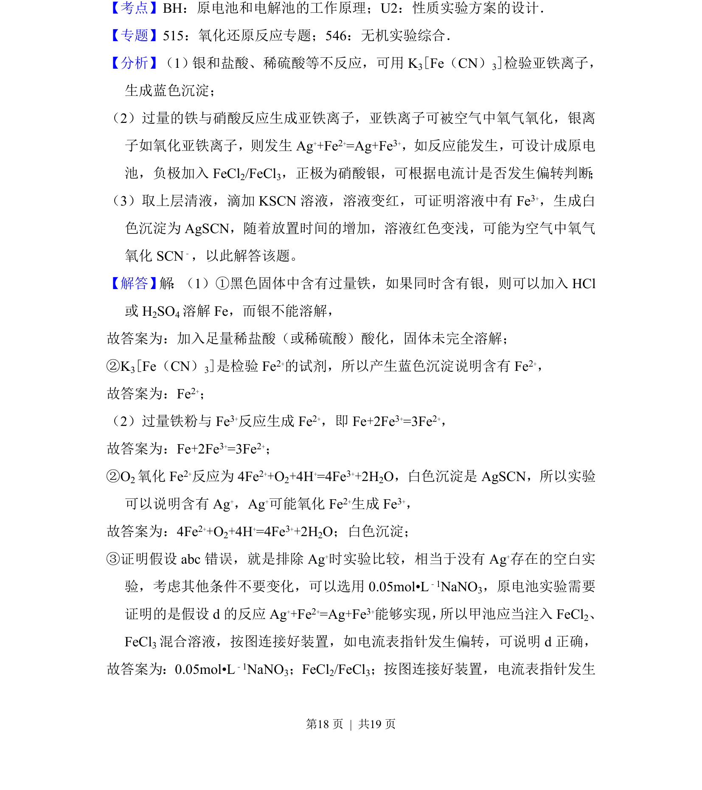
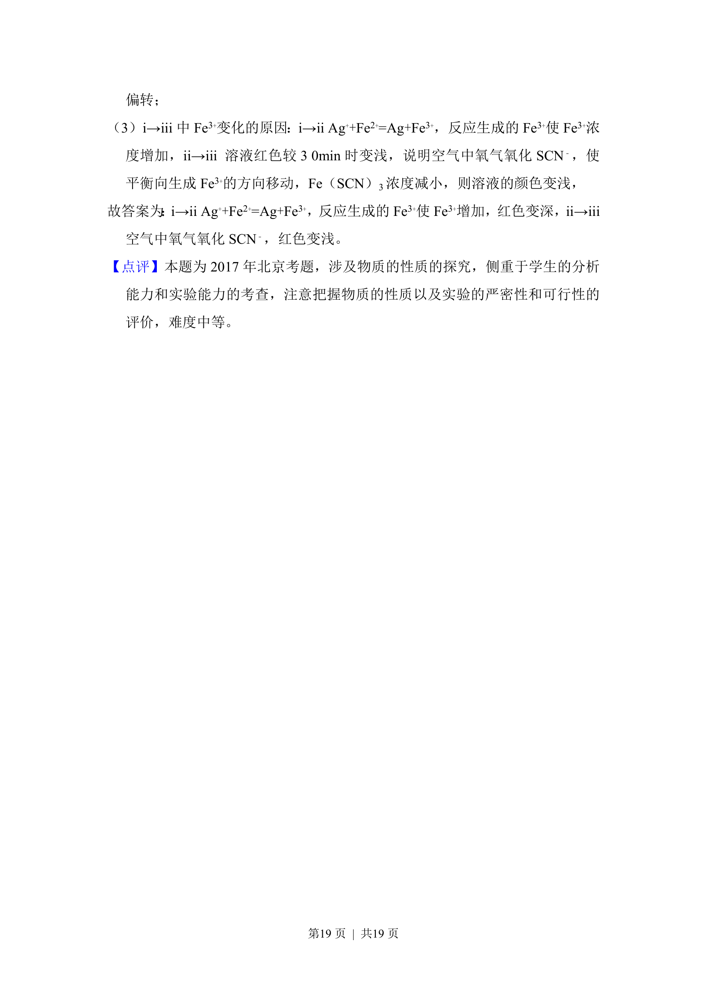

## 题面

## 摘要

探究Fe与Ag+反应中Fe3+的生成及产物的检验与原理分析

## 关联考点

- [[177-Fe离子检验|铁离子检验]]
- [[971-亚铁离子检验|亚铁离子检验]]
- [[银的检验]]
- [[170-离子方程式|离子方程式]]

## 答案与解析

> 📄 原 PDF 第 16 页：`素材/真题/北京/2008-2024·（北京）化学高考真题/2017年高考化学试卷（北京）（解析卷）.pdf`

<!-- 题干文本-start -->
## 题干文本
11．（16分）某小组在验证反应“Fe+2Ag+=Fe2++2Ag”的实验中检测到Fe 3+，发现
和探究过程如下。
向硝酸酸化的0.05mol•L ﹣1硝酸银溶液（pH≈2）中加入过量铁粉，搅拌后静置，
烧杯底部有黑色固体，溶液呈黄色。
（1）检验产物
①取少量黑色固体，洗涤后，　加入足量稀盐酸（或稀硫酸） 酸化，固体未完全
溶解　（填操作和现象），证明黑色固体中含有Ag。
②取上层清液，滴加K 3[Fe（CN） 6]溶液，产生蓝色沉淀，说明溶液中含有　
Fe2+　。
（2）针对“溶液呈黄色”，甲认为溶液中有Fe 3+，乙认为铁粉过量时不可能有
Fe3+，乙依据的原理是　Fe+2Fe 3+=3Fe2+　（用离子方程式表示）。针对两种
<!-- 题干文本-end -->

<!-- 解析文本-start -->
## 解析文本

<!-- 解析文本-end -->
