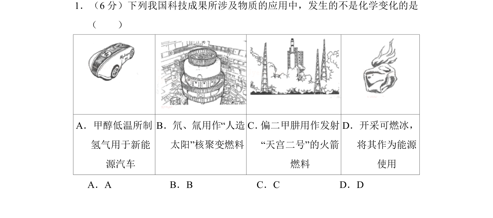
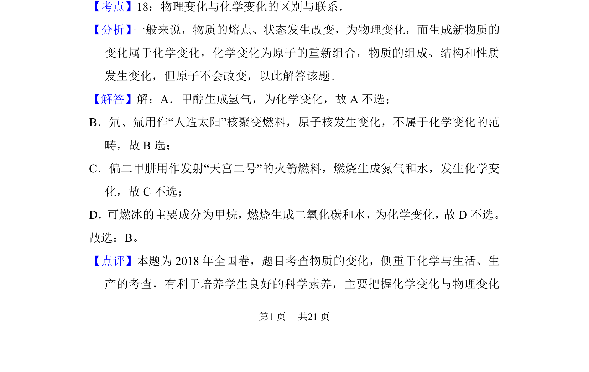

## 题面

## 摘要

考查物理变化与化学变化的区别，涉及甲醇制氢、核聚变、火箭燃料和可燃冰燃烧等实例。

## 关联考点

- [[物理变化与化学变化的区别]]
- [[核变化]]
- [[001-化学变化|化学反应]]

## 答案与解析

> 📄 原 PDF 第 1 页：`素材/真题/北京/2008-2024·（北京）化学高考真题/2018年高考化学试卷（北京）（解析卷）.pdf`
