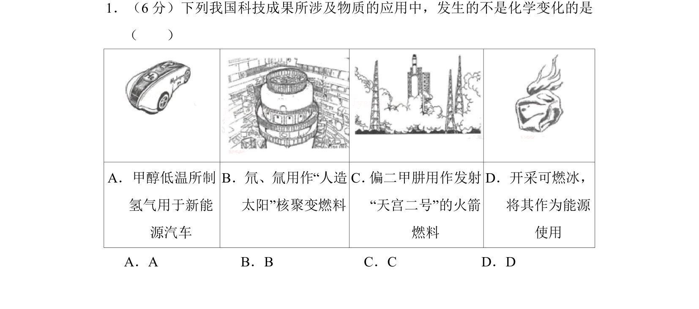
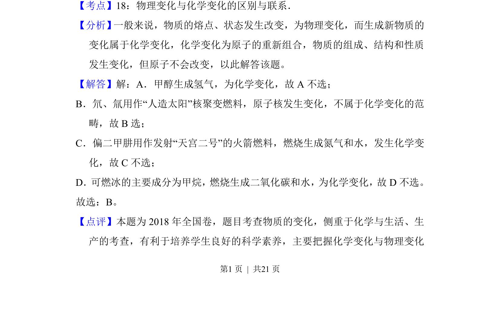

## 题面

## 摘要

考查物理变化与化学变化的区别，涉及甲醇制氢、核聚变、火箭燃料和可燃冰燃烧等实例。

## 关联考点

- [[物理变化与化学变化的区别]]
- [[核变化]]
- [[001-化学变化|化学反应]]

## 答案与解析

> 📄 原 PDF 第 1 页：`素材/真题/北京/2008-2024·（北京）化学高考真题/2018年高考化学试卷（北京）（解析卷）.pdf`

<!-- 题干文本-start -->
## 题干文本
1．（6分）下列我国科技成果所涉及物质的应用中，发生的不是化学变化的是
（　　） 
A．甲醇低温所制
氢气用于新能
源汽车
B．氘、氚用作“人造
太阳”核聚变燃料 
C． 偏二甲肼用作发射
“天宫二号”的火箭
燃料
D．开采可燃冰，
将其作为能源
使用
A．A B．B C．C D．D
<!-- 题干文本-end -->

<!-- 解析文本-start -->
## 解析文本
【考点】18：物理变化与化学变化的区别与联系．菁优网版权所有
【分析】 一般来说，物质的熔点、状态发生改变，为物理变化，而生成新物质的
变化属于化学变化，化学变化为原子的重新组合，物质的组成、结构和性质
发生变化，但原子不会改变，以此解答该题。
【解答】解：A．甲醇生成氢气，为化学变化，故A不选；
B．氘、氚用作“人造太阳”核聚变燃料，原子核发生变化，不属于化学变化的范
畴，故B选；
C．偏二甲肼用作发射“天宫二号”的火箭燃料，燃烧生成氮气和水，发生化学变
化，故C不选；
D．可燃冰的主要成分为甲烷，燃烧生成二氧化碳和水，为化学变化，故D不选。
故选：B。
【点评】本题为2018年全国卷，题目考查物质的变化，侧重于化学与生活、生
产的考查，有利于培养学生良好的科学素养，主要把握化学变化与物理变化
<!-- 解析文本-end -->
