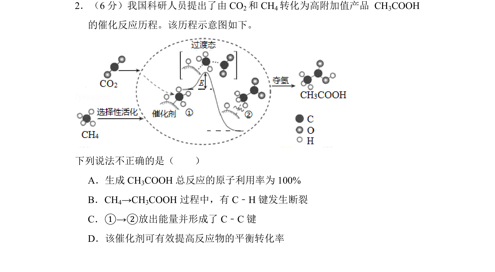
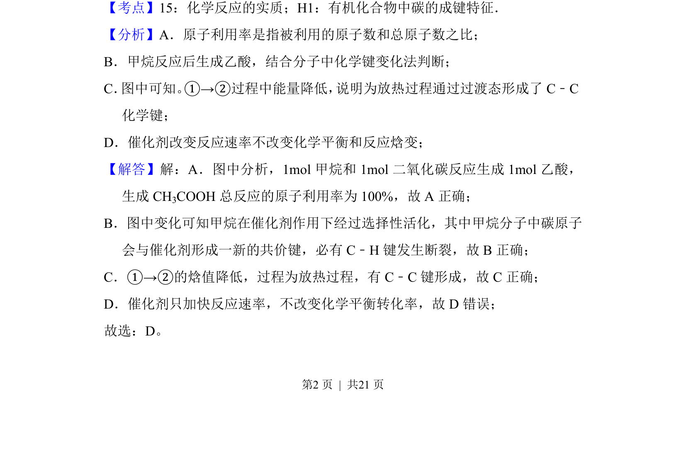
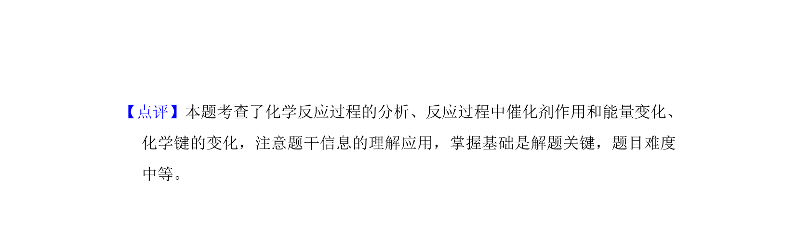

## 题面

## 摘要

本题考查催化反应历程示意图的分析，涉及原子利用率、化学键变化、能量变化及催化剂作用。

## 关联考点

- [[992-原子利用率|原子利用率]]
- [[化学键断裂与形成]]
- [[反应能量变化]]
- [[催化剂与平衡转化率]]

## 答案与解析

> 📄 原 PDF 第 2 页：`素材/真题/北京/2008-2024·（北京）化学高考真题/2018年高考化学试卷（北京）（解析卷）.pdf`
