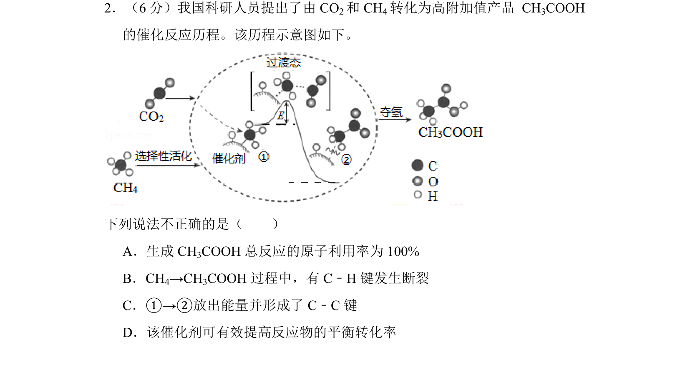
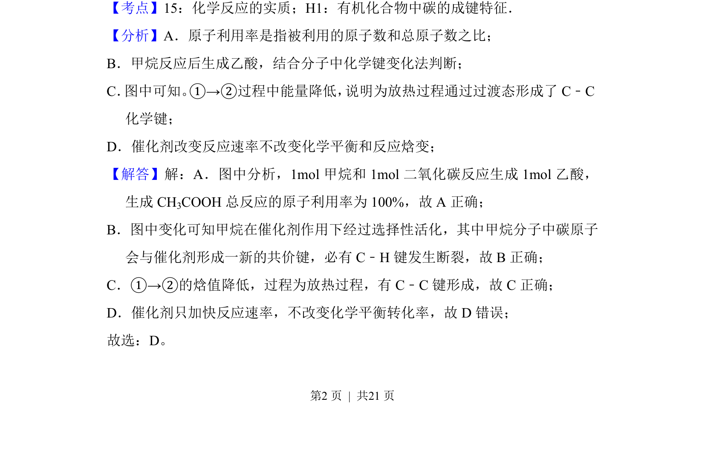
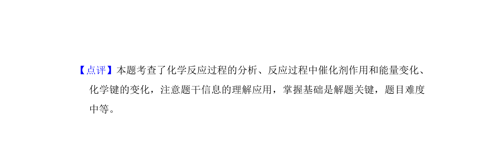

## 题面

## 摘要

本题考查催化反应历程示意图的分析，涉及原子利用率、化学键变化、能量变化及催化剂作用。

## 关联考点

- [[992-原子利用率|原子利用率]]
- [[化学键断裂与形成]]
- [[反应能量变化]]
- [[催化剂与平衡转化率]]

## 答案与解析

> 📄 原 PDF 第 2 页：`素材/真题/北京/2008-2024·（北京）化学高考真题/2018年高考化学试卷（北京）（解析卷）.pdf`

<!-- 题干文本-start -->
## 题干文本
2．（6分）我国科研人员提出了由CO 2和CH 4转化为高附加值产品 CH 3COOH
的催化反应历程。该历程示意图如下。
下列说法不正确的是（　　）
A．生成CH 3COOH总反应的原子利用率为100%
B．CH4→CH3COOH过程中，有C﹣H键发生断裂
C．①→②放出能量并形成了C﹣C键
D．该催化剂可有效提高反应物的平衡转化率
<!-- 题干文本-end -->

<!-- 解析文本-start -->
## 解析文本
【考点】15：化学反应的实质；H1：有机化合物中碳的成键特征．菁优网版权所有
【分析】A．原子利用率是指被利用的原子数和总原子数之比；
B．甲烷反应后生成乙酸，结合分子中化学键变化法判断；
C． 图中可知。①→②过程中能量降低， 说明为放热过程通过过渡态形成了C﹣C
化学键；
D．催化剂改变反应速率不改变化学平衡和反应焓变；
【解答】解：A．图中分析，1mol甲烷和1mol二氧化碳反应生成1mol乙酸，
生成CH 3COOH总反应的原子利用率为100%，故A正确；
B．图中变化可知甲烷在催化剂作用下经过选择性活化，其中甲烷分子中碳原子
会与催化剂形成一新的共价键，必有C﹣H键发生断裂，故B正确；
C．①→②的焓值降低，过程为放热过程，有C﹣C键形成，故C正确；
D．催化剂只加快反应速率，不改变化学平衡转化率，故D错误；
故选：D。
<!-- 解析文本-end -->
