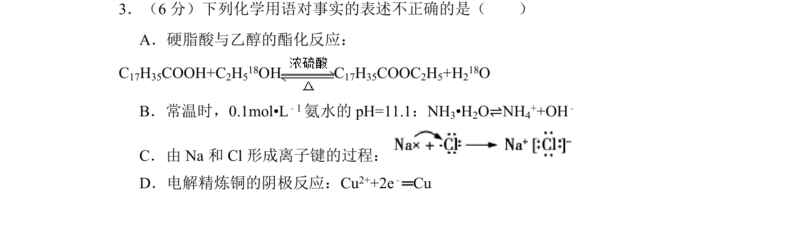
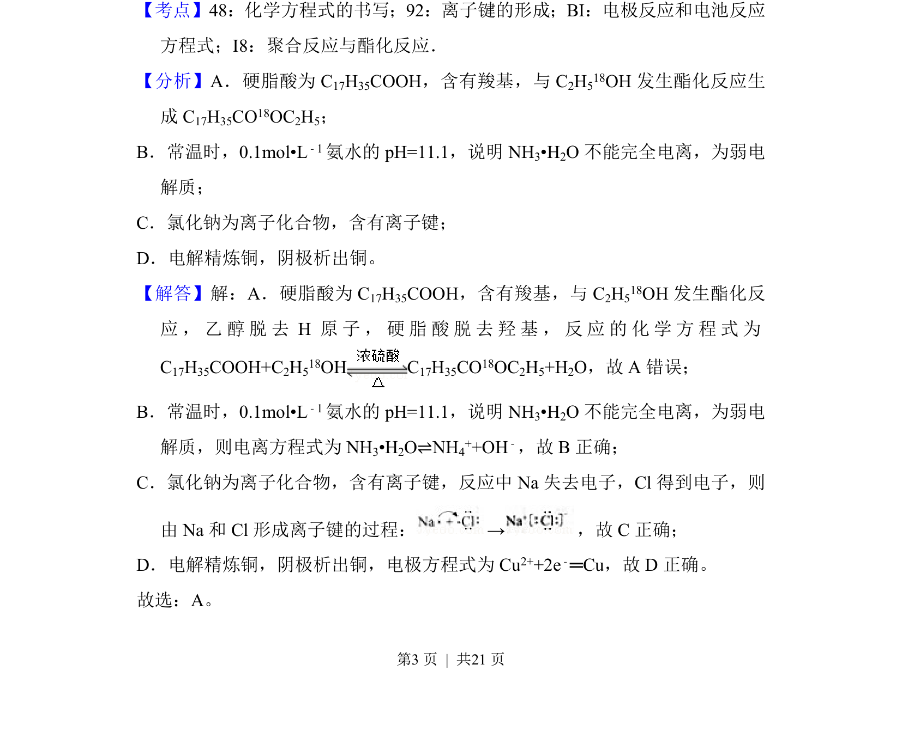
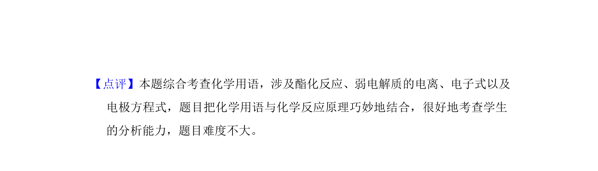

## 题面

## 摘要

考查酯化反应机理、弱电解质电离、离子键形成及电解精炼铜电极反应的化学用语正误判断

## 关联考点

- [[250-酯化反应|酯化反应]]
- [[322-弱电解质电离|弱电解质电离]]
- [[离子键形成]]
- [[793-电极反应|电极反应]]

## 答案与解析

> 📄 原 PDF 第 3 页：`素材/真题/北京/2008-2024·（北京）化学高考真题/2018年高考化学试卷（北京）（解析卷）.pdf`
