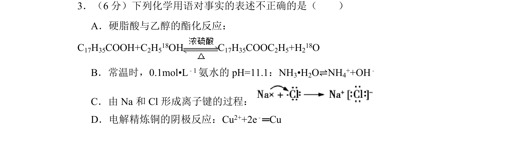
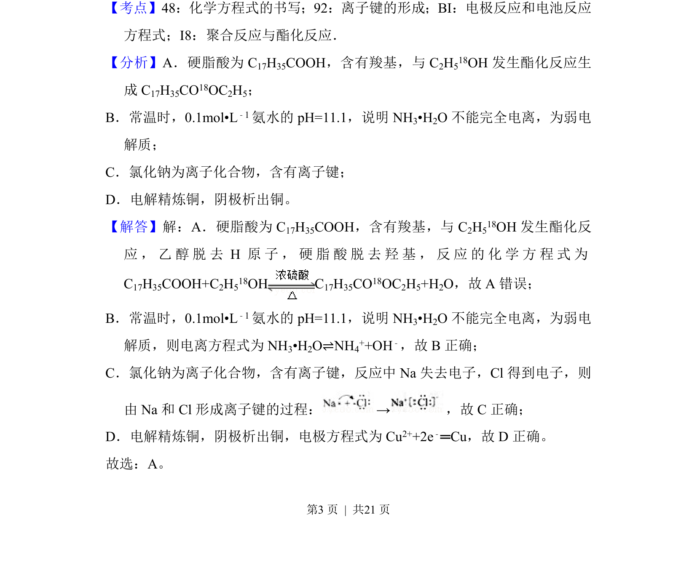
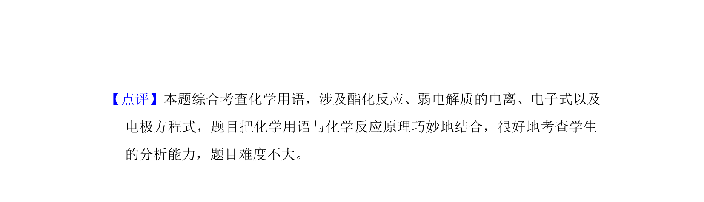

## 题面

## 摘要

考查酯化反应机理、弱电解质电离、离子键形成及电解精炼铜电极反应的化学用语正误判断

## 关联考点

- [[250-酯化反应|酯化反应]]
- [[322-弱电解质电离|弱电解质电离]]
- [[离子键形成]]
- [[793-电极反应|电极反应]]

## 答案与解析

> 📄 原 PDF 第 3 页：`素材/真题/北京/2008-2024·（北京）化学高考真题/2018年高考化学试卷（北京）（解析卷）.pdf`

<!-- 题干文本-start -->
## 题干文本
3．（6分）下列化学用语对事实的表述不正确的是（　　）
A．硬脂酸与乙醇的酯化反应：
C17H35COOH+C2H518OH C 17H35COOC2H5+H218O
B．常温时，0.1mol•L﹣1氨水的pH=11.1：NH 3•H2O⇌NH4++OH﹣
C．由Na和Cl形成离子键的过程：
D．电解精炼铜的阴极反应：Cu2++2e﹣═Cu
<!-- 题干文本-end -->

<!-- 解析文本-start -->
## 解析文本
【考点】48：化学方程式的书写；92：离子键的形成；BI：电极反应和电池反应
方程式；I8：聚合反应与酯化反应．菁优网版权所有
【分析】A．硬脂酸为C 17H35COOH，含有羧基，与C 2H518OH发生酯化反应生
成C 17H35CO18OC2H5；
B．常温时，0.1mol•L﹣1氨水的pH=11.1，说明NH 3•H2O不能完全电离，为弱电
解质；
C．氯化钠为离子化合物，含有离子键；
D．电解精炼铜，阴极析出铜。
【解答】解：A．硬脂酸为C 17H35COOH，含有羧基，与C 2H518OH发生酯化反
应，乙醇脱去H原子，硬脂酸脱去羟基，反应的化学方程式为
C17H35COOH+C2H518OH C 17H35CO18OC2H5+H2O，故A错误；
B．常温时，0.1mol•L﹣1氨水的pH=11.1，说明NH 3•H2O不能完全电离，为弱电
解质，则电离方程式为NH 3•H2O⇌NH4++OH﹣，故B正确；
C．氯化钠为离子化合物，含有离子键，反应中Na失去电子，Cl得到电子，则
由Na和Cl形成离子键的过程：→，故C正确；
D．电解精炼铜，阴极析出铜，电极方程式为Cu 2++2e﹣═Cu，故D正确。
故选：A。
<!-- 解析文本-end -->
