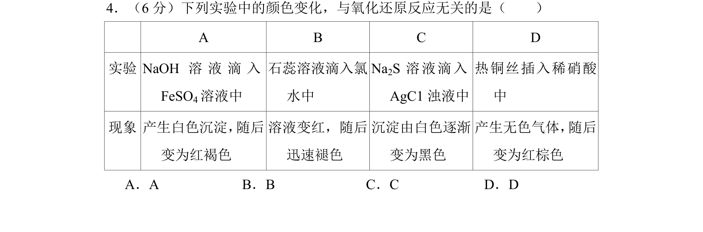
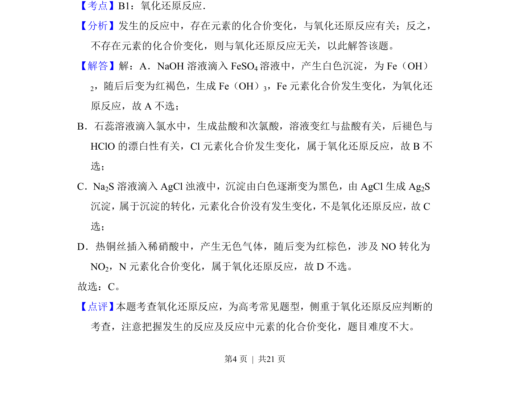

## 题面

## 摘要

通过实验现象判断反应是否属于氧化还原反应，重点考查元素化合价变化的分析。

## 关联考点

- [[162-氧化还原反应|氧化还原反应]]
- [[元素化合价]]
- [[330-沉淀转化|沉淀转化]]

## 答案与解析

> 📄 原 PDF 第 4 页：`素材/真题/北京/2008-2024·（北京）化学高考真题/2018年高考化学试卷（北京）（解析卷）.pdf`
