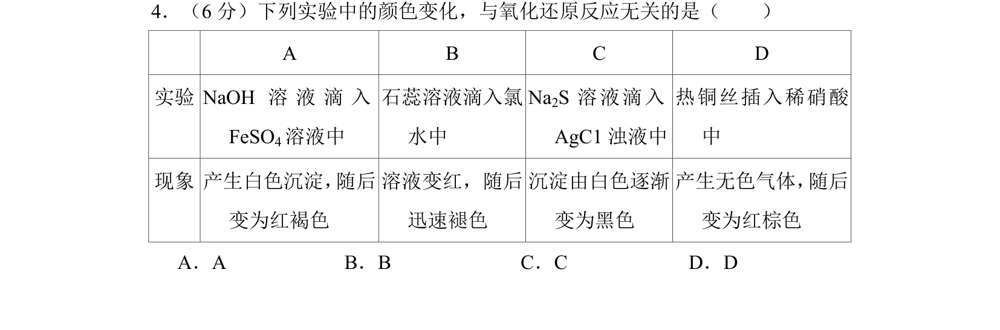
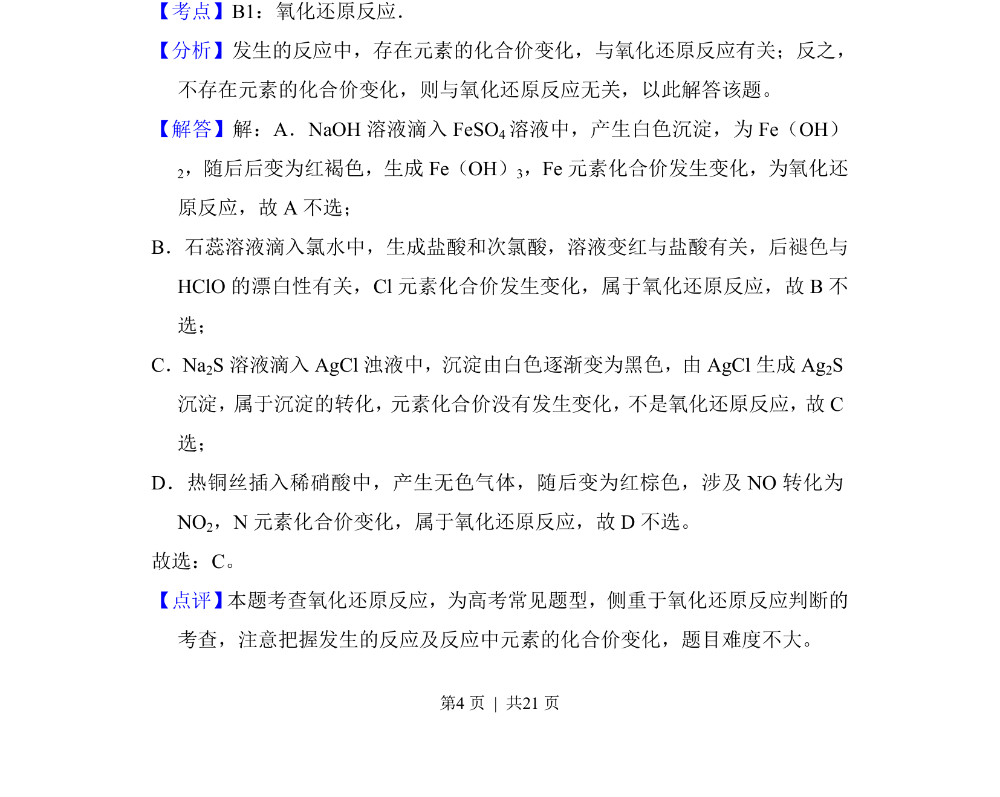

## 题面

## 摘要

通过实验现象判断反应是否属于氧化还原反应，重点考查元素化合价变化的分析。

## 关联考点

- [[162-氧化还原反应|氧化还原反应]]
- [[元素化合价]]
- [[330-沉淀转化|沉淀转化]]

## 答案与解析

> 📄 原 PDF 第 4 页：`素材/真题/北京/2008-2024·（北京）化学高考真题/2018年高考化学试卷（北京）（解析卷）.pdf`

<!-- 题干文本-start -->
## 题干文本
4．（6分）下列实验中的颜色变化，与氧化还原反应无关的是（　　）
A B C D
实验 NaOH溶 液 滴 入
FeSO4溶液中
石蕊溶液滴入氯
水中
Na2S溶液滴入
AgC1浊液中
热铜丝插入稀硝酸
中
现象 产生白色沉淀， 随后
变为红褐色
溶液变红，随后
迅速褪色
沉淀由白色逐渐
变为黑色
产生无色气体， 随后
变为红棕色
A．A B．B C．C D．D
<!-- 题干文本-end -->

<!-- 解析文本-start -->
## 解析文本
【考点】B1：氧化还原反应．菁优网版权所有
【分析】发生的反应中，存在元素的化合价变化，与氧化还原反应有关；反之，
不存在元素的化合价变化，则与氧化还原反应无关，以此解答该题。
【解答】解：A．NaOH溶液滴入FeSO 4溶液中，产生白色沉淀，为Fe（OH）
2，随后后变为红褐色，生成Fe（OH）3，Fe元素化合价发生变化，为氧化还
原反应，故A不选；
B．石蕊溶液滴入氯水中，生成盐酸和次氯酸，溶液变红与盐酸有关，后褪色与
HClO的漂白性有关，Cl元素化合价发生变化，属于氧化还原反应，故B不
选；
C．Na2S溶液滴入AgCl浊液中，沉淀由白色逐渐变为黑色，由AgCl生成Ag 2S
沉淀，属于沉淀的转化，元素化合价没有发生变化，不是氧化还原反应，故C
选；
D．热铜丝插入稀硝酸中，产生无色气体，随后变为红棕色，涉及NO转化为
NO2，N元素化合价变化，属于氧化还原反应，故D不选。
故选：C。
【点评】 本题考查氧化还原反应，为高考常见题型，侧重于氧化还原反应判断的
考查，注意把握发生的反应及反应中元素的化合价变化，题目难度不大。
<!-- 解析文本-end -->
