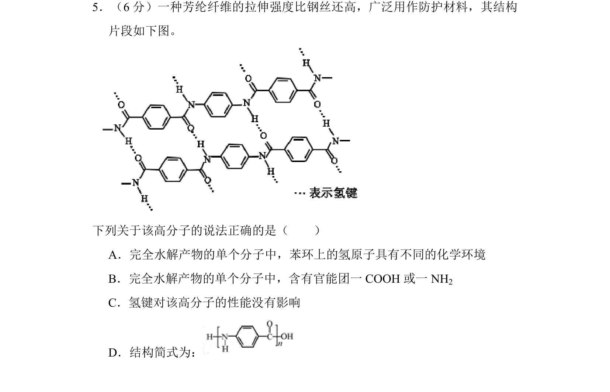
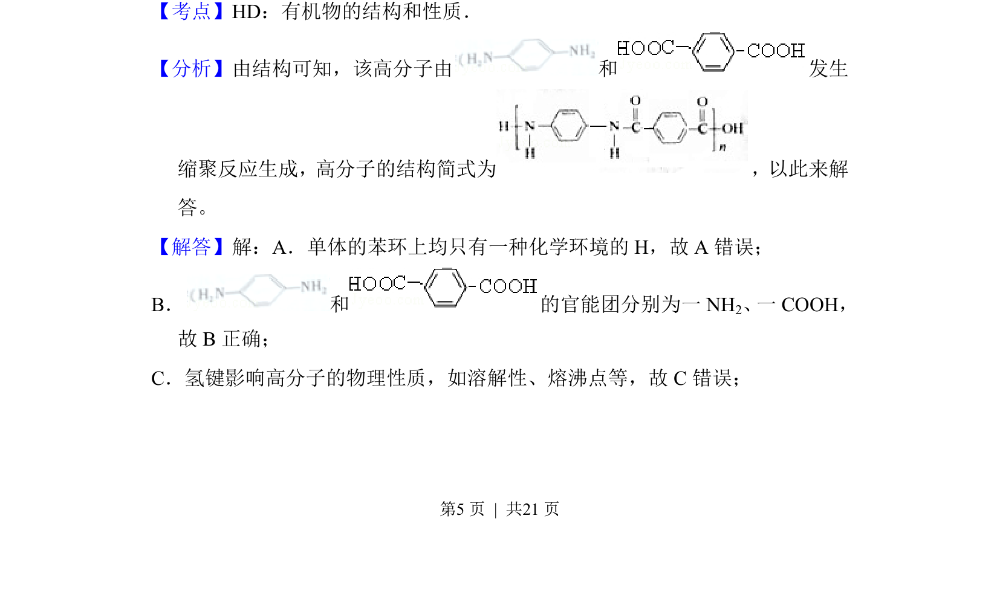
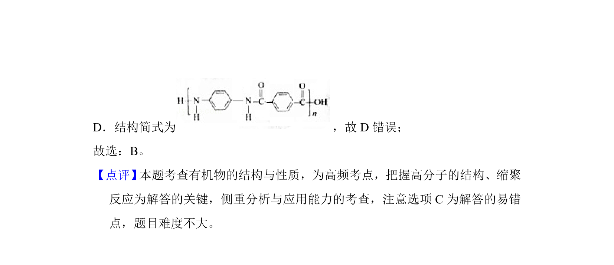

## 题面

## 摘要

考查芳纶纤维高分子的结构、水解产物及官能团、氢键对性能的影响。

## 关联考点

- [[714-有机物的结构和性质|有机物的结构和性质]]
- [[500-缩聚反应|缩聚反应]]
- [[448-官能团|官能团]]
- [[435-氢键|氢键]]

## 答案与解析

> 📄 原 PDF 第 5 页：`素材/真题/北京/2008-2024·（北京）化学高考真题/2018年高考化学试卷（北京）（解析卷）.pdf`
