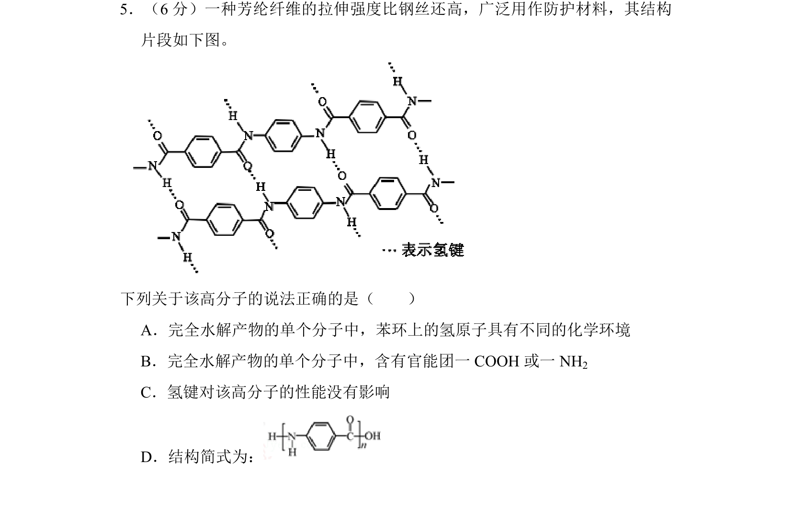
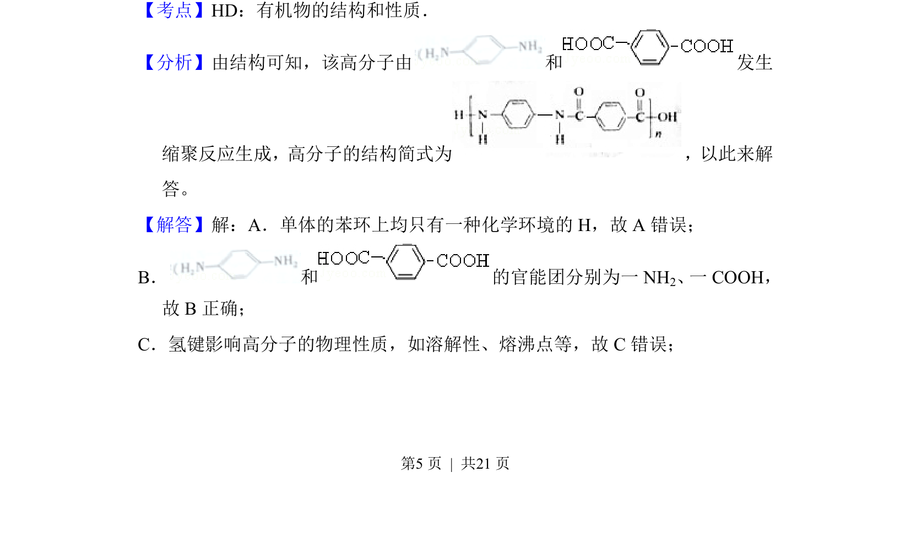
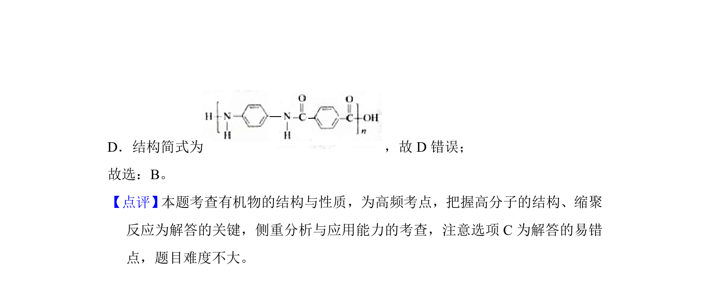

## 题面

## 摘要

考查芳纶纤维高分子的结构、水解产物及官能团、氢键对性能的影响。

## 关联考点

- [[714-有机物的结构和性质|有机物的结构和性质]]
- [[500-缩聚反应|缩聚反应]]
- [[448-官能团|官能团]]
- [[435-氢键|氢键]]

## 答案与解析

> 📄 原 PDF 第 5 页：`素材/真题/北京/2008-2024·（北京）化学高考真题/2018年高考化学试卷（北京）（解析卷）.pdf`

<!-- 题干文本-start -->
## 题干文本
5．（6分）一种芳纶纤维的拉伸强度比钢丝还高，广泛用作防护材料，其结构
片段如下图。
下列关于该高分子的说法正确的是（　　）
A．完全水解产物的单个分子中，苯环上的氢原子具有不同的化学环境
B．完全水解产物的单个分子中，含有官能团一COOH或一NH 2
C．氢键对该高分子的性能没有影响
D．结构简式为：
<!-- 题干文本-end -->

<!-- 解析文本-start -->
## 解析文本
【考点】HD：有机物的结构和性质．菁优网版权所有
【分析】由结构可知，该高分子由 和 发生
缩聚反应生成，高分子的结构简式为 ，以此来解
答。
【解答】解：A．单体的苯环上均只有一种化学环境的H，故A错误；
B． 和 的官能团分别为一NH 2、 一COOH，
故B正确；
C．氢键影响高分子的物理性质，如溶解性、熔沸点等，故C错误；
<!-- 解析文本-end -->
