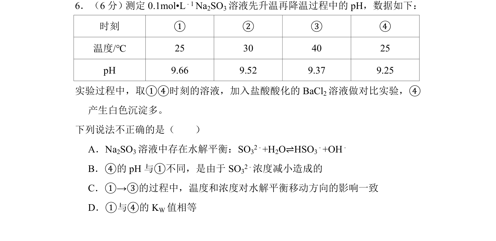
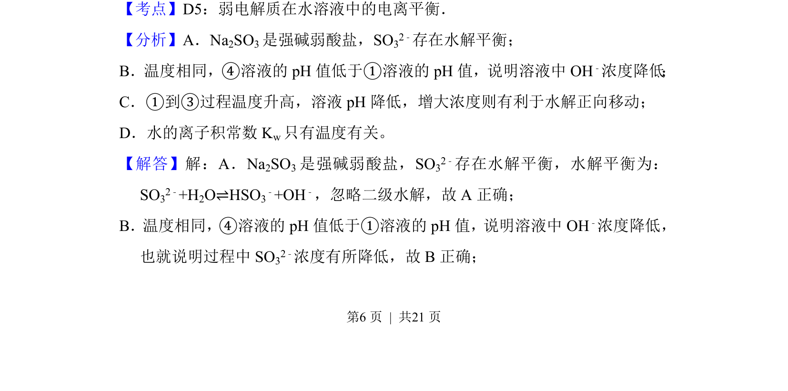
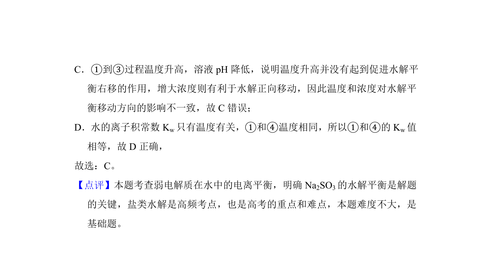

## 题面

## 摘要

考查Na₂SO₃溶液升温后降温过程中pH变化及水解平衡影响因素分析。

## 关联考点

- [[盐类水解平衡]]
- [[温度对水解平衡的影响]]
- [[741-水的离子积常数|水的离子积常数]]
- [[浓度对水解平衡的影响]]

## 答案与解析

> 📄 原 PDF 第 6 页：`素材/真题/北京/2008-2024·（北京）化学高考真题/2018年高考化学试卷（北京）（解析卷）.pdf`
