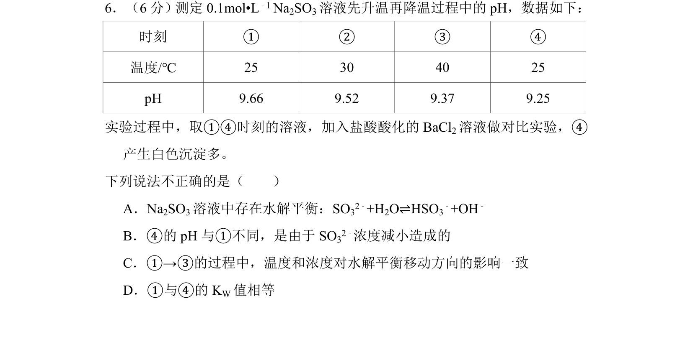
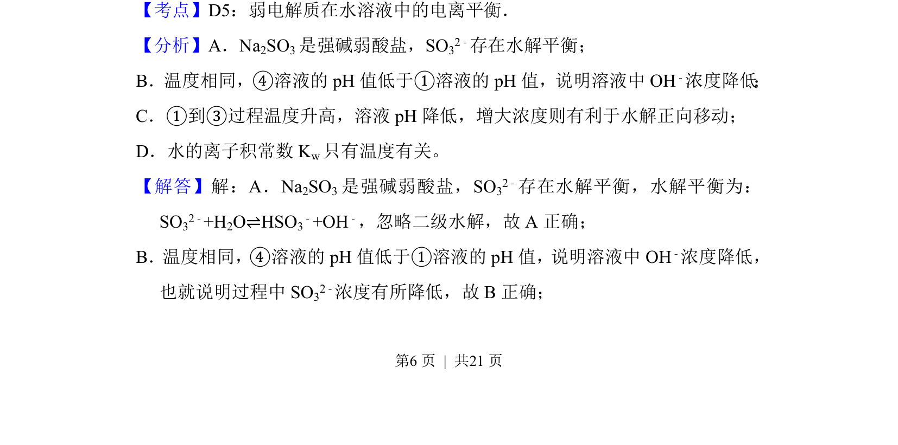
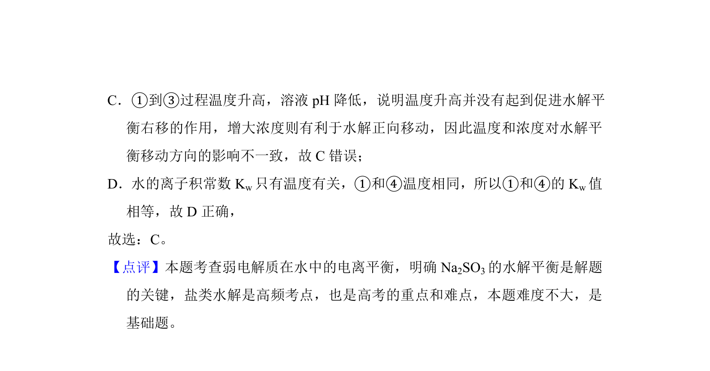

## 题面

## 摘要

考查Na₂SO₃溶液升温后降温过程中pH变化及水解平衡影响因素分析。

## 关联考点

- [[盐类水解平衡]]
- [[温度对水解平衡的影响]]
- [[741-水的离子积常数|水的离子积常数]]
- [[浓度对水解平衡的影响]]

## 答案与解析

> 📄 原 PDF 第 6 页：`素材/真题/北京/2008-2024·（北京）化学高考真题/2018年高考化学试卷（北京）（解析卷）.pdf`

<!-- 题干文本-start -->
## 题干文本
6．（6分）测定0.1mol•L ﹣1 Na2SO3溶液先升温再降温过程中的pH，数据如下：
时刻 ① ② ③ ④
温度/℃ 25 30 40 25
pH 9.66 9.52 9.37 9.25
实验过程中，取①④时刻的溶液，加入盐酸酸化的BaCl 2溶液做对比实验，④
产生白色沉淀多。
下列说法不正确的是（　　）
A．Na2SO3溶液中存在水解平衡：SO32﹣+H2O⇌HSO3
﹣+OH﹣
B．④的pH与①不同，是由于SO 32﹣浓度减小造成的
C．①→③的过程中，温度和浓度对水解平衡移动方向的影响一致
D．①与④的K W值相等
<!-- 题干文本-end -->

<!-- 解析文本-start -->
## 解析文本
【考点】D5：弱电解质在水溶液中的电离平衡．菁优网版权所有
【分析】A．Na2SO3是强碱弱酸盐，SO32﹣存在水解平衡；
B．温度相同，④溶液的pH值低于①溶液的pH值，说明溶液中OH ﹣浓度降低 ；
C．①到③过程温度升高，溶液pH降低，增大浓度则有利于水解正向移动；
D．水的离子积常数K w只有温度有关。
【解答】解：A．Na 2SO3是强碱弱酸盐，SO 32﹣存在水解平衡，水解平衡为：
SO32﹣+H2O⇌HSO3
﹣+OH﹣，忽略二级水解，故A正确；
B．温度相同，④溶液的pH值低于①溶液的pH值，说明溶液中OH ﹣浓度降低，
也就说明过程中SO 32﹣浓度有所降低，故B正确；
<!-- 解析文本-end -->
