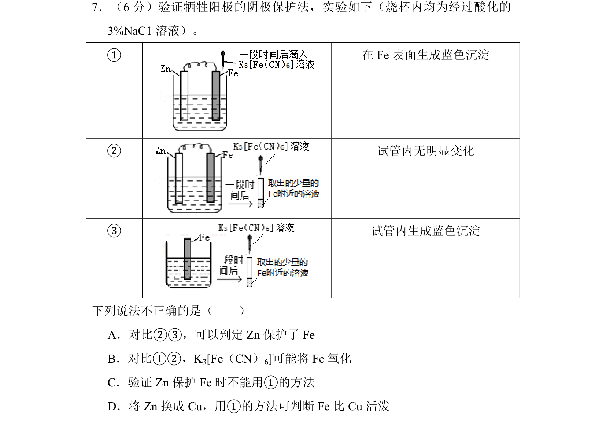
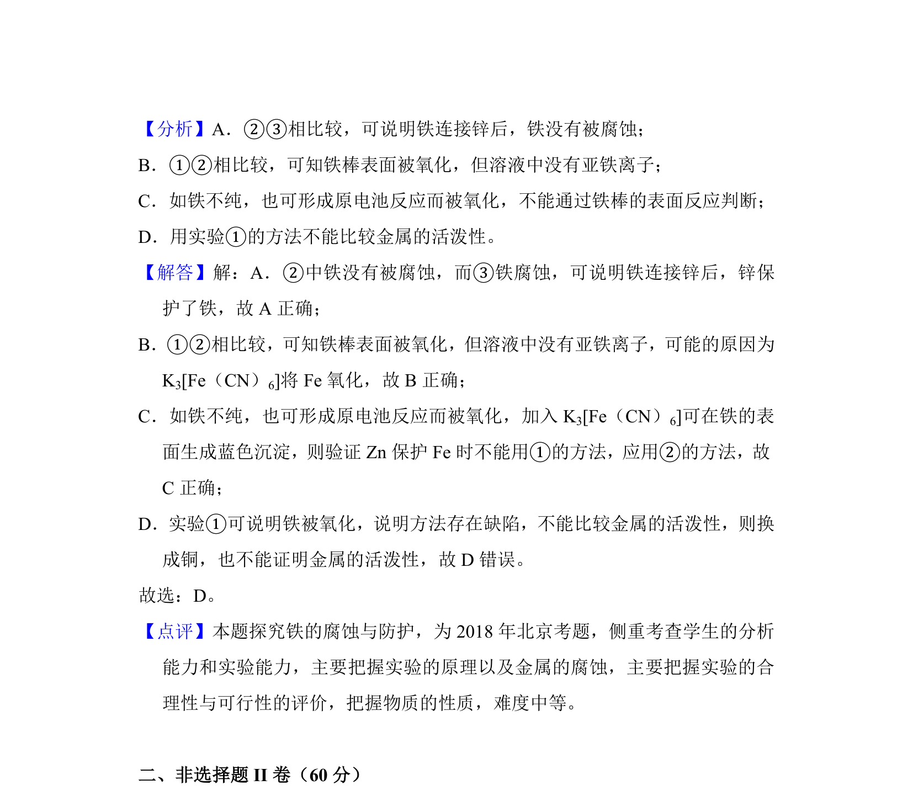

## 题面

## 摘要

考查牺牲阳极的阴极保护法及原电池原理的实验分析，包含现象判断与电极保护验证。

## 关联考点

- [[642-原电池工作原理|原电池工作原理]]
- [[牺牲阳极的阴极保护法]]
- [[188-电化学腐蚀|电化学腐蚀]]

## 答案与解析

> 📄 原 PDF 第 7 页：`素材/真题/北京/2008-2024·（北京）化学高考真题/2018年高考化学试卷（北京）（解析卷）.pdf`
