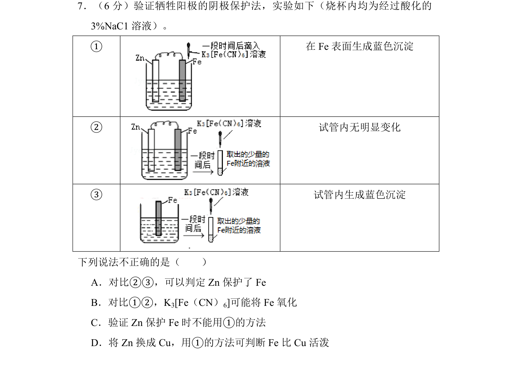
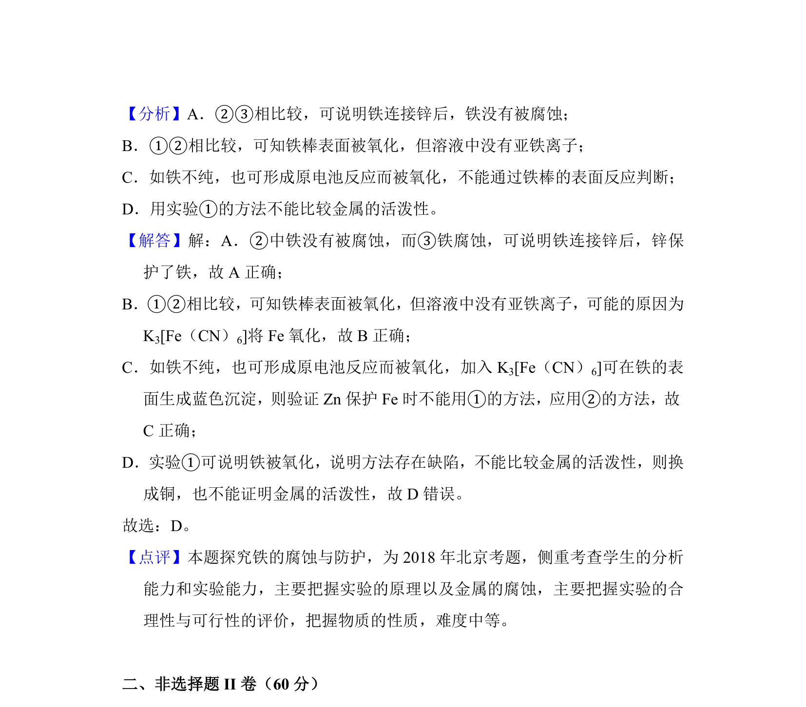

## 题面

## 摘要

考查牺牲阳极的阴极保护法及原电池原理的实验分析，包含现象判断与电极保护验证。

## 关联考点

- [[642-原电池工作原理|原电池工作原理]]
- [[牺牲阳极的阴极保护法]]
- [[188-电化学腐蚀|电化学腐蚀]]

## 答案与解析

> 📄 原 PDF 第 7 页：`素材/真题/北京/2008-2024·（北京）化学高考真题/2018年高考化学试卷（北京）（解析卷）.pdf`

<!-- 题干文本-start -->
## 题干文本
7．（6分）验证牺牲阳极的阴极保护法，实验如下（烧杯内均为经过酸化的
3%NaC1溶液）。
①
 在Fe表面生成蓝色沉淀
②
 试管内无明显变化
③
 试管内生成蓝色沉淀
下列说法不正确的是（　　）
A．对比②③，可以判定Zn保护了Fe
B．对比①②，K3[Fe（CN）6]可能将Fe氧化
C．验证Zn保护Fe时不能用①的方法
D．将Zn换成Cu，用①的方法可判断Fe比Cu活泼
<!-- 题干文本-end -->

<!-- 解析文本-start -->
## 解析文本
【考点】BH：原电池和电解池的工作原理．菁优网版权所有
<!-- 解析文本-end -->
