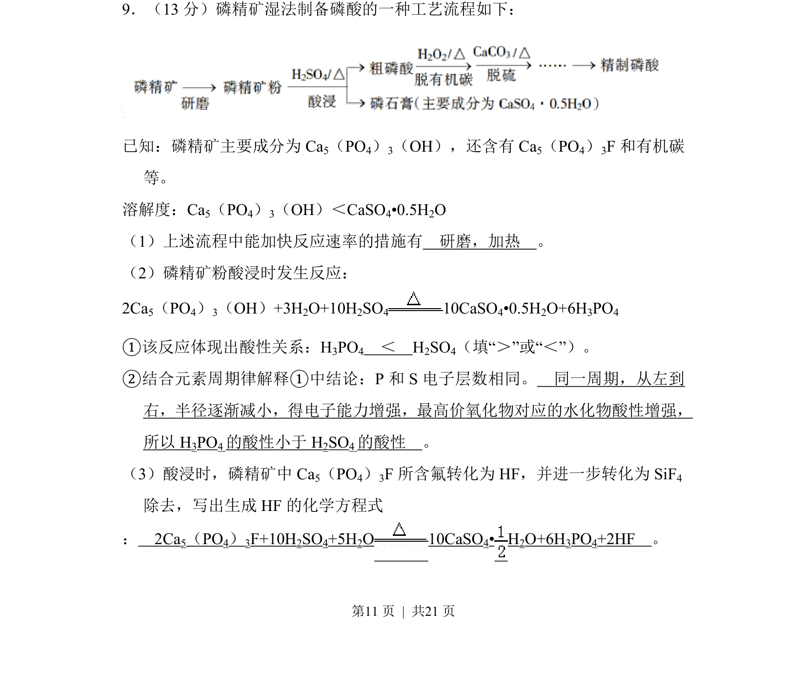
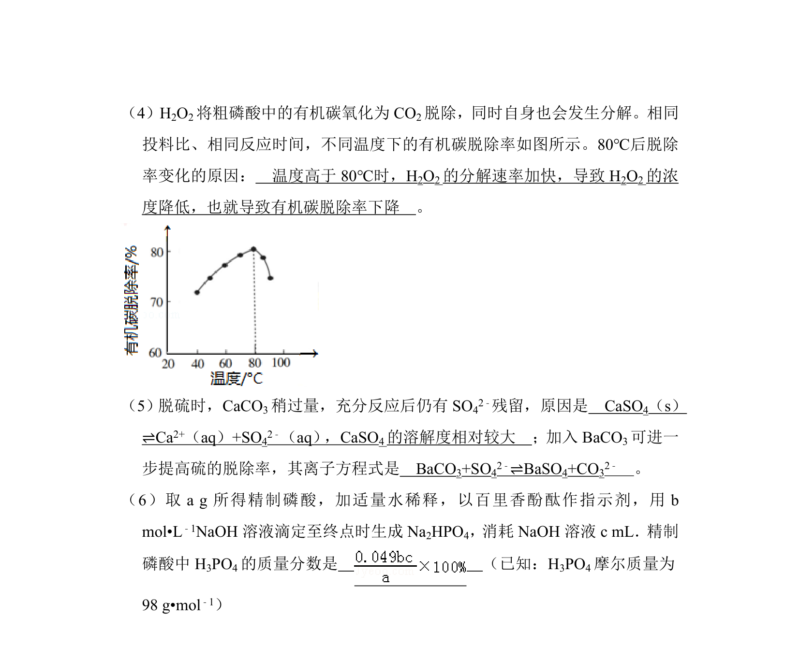
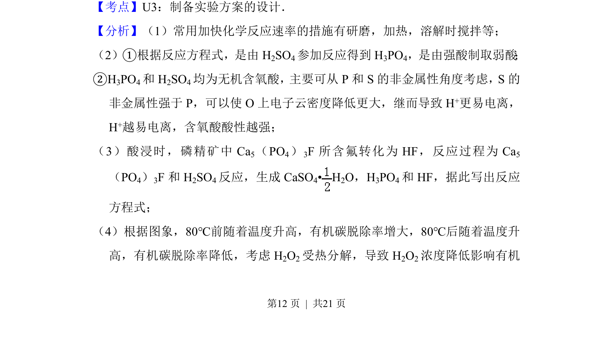
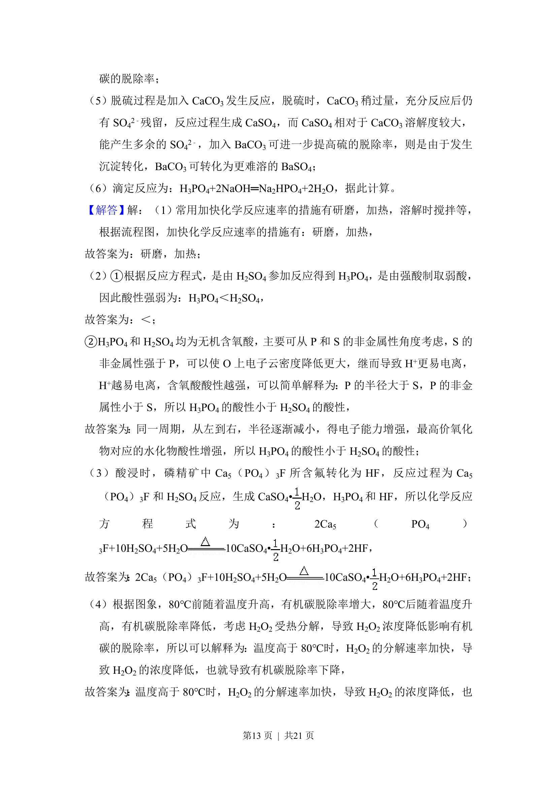
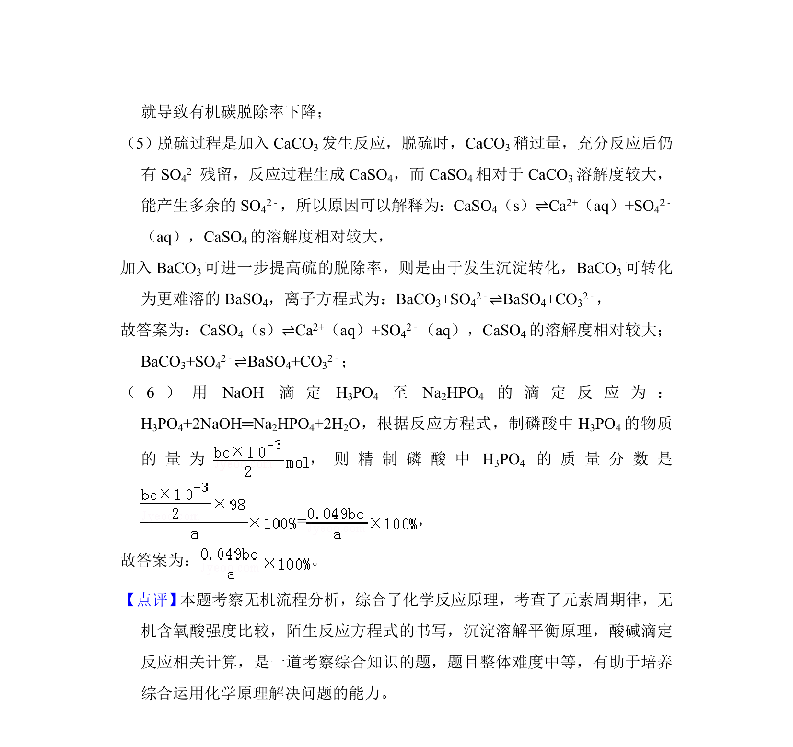

## 题面

## 摘要

该题考查磷精矿湿法制磷酸流程中的反应速率、酸性比较及方程式的书写。

## 关联考点

- [[化学反应速率影响因素]]
- [[酸性强弱比较]]
- [[252-元素周期律|元素周期律]]
- [[621-化学方程式书写|化学方程式书写]]

## 答案与解析

> 📄 原 PDF 第 11 页：`素材/真题/北京/2008-2024·（北京）化学高考真题/2018年高考化学试卷（北京）（解析卷）.pdf`
