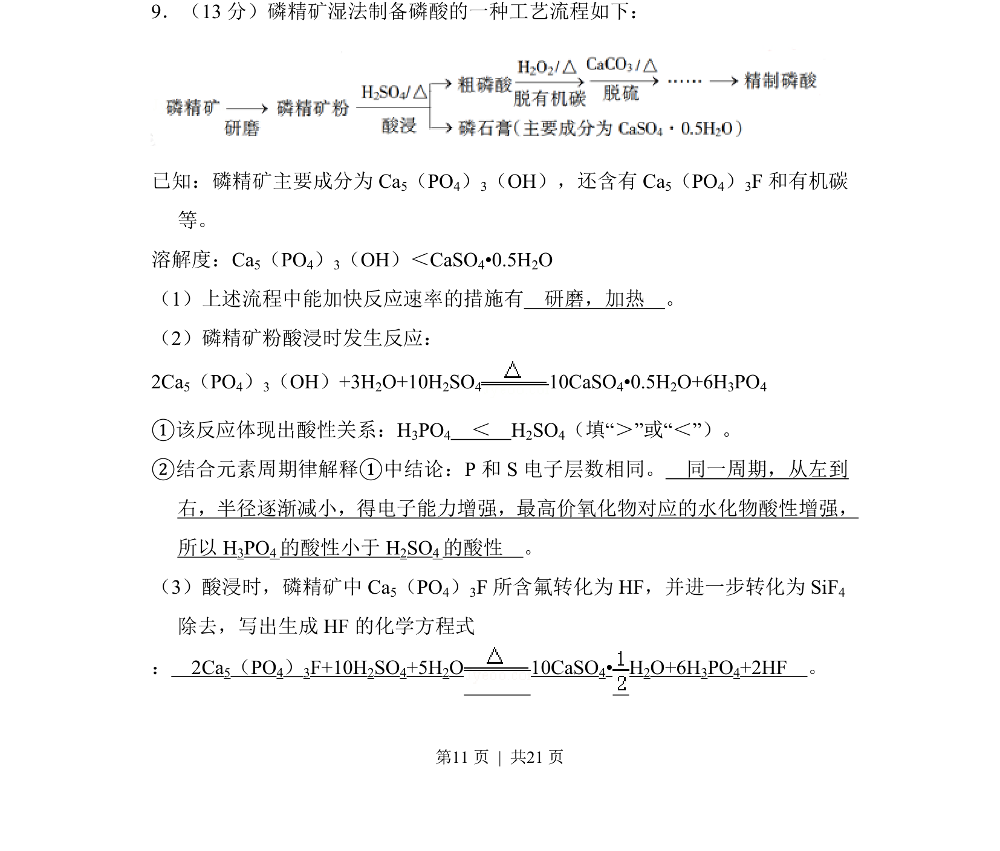
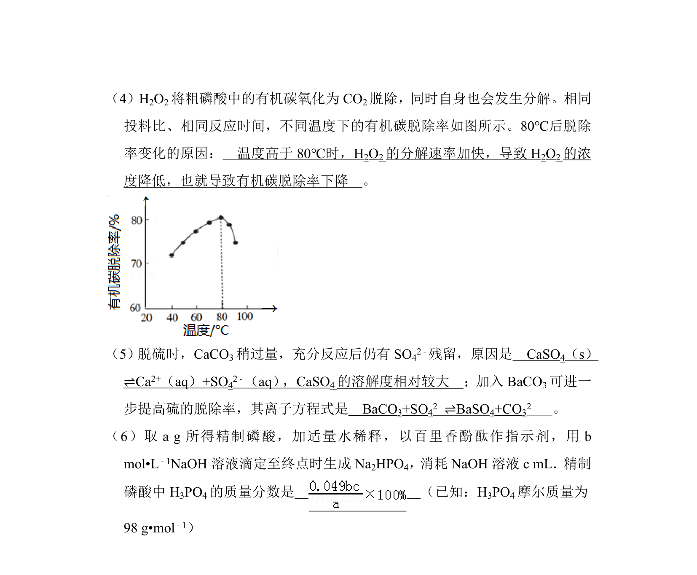
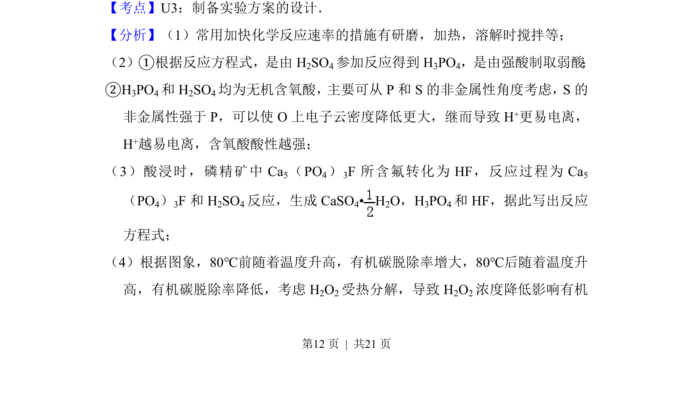
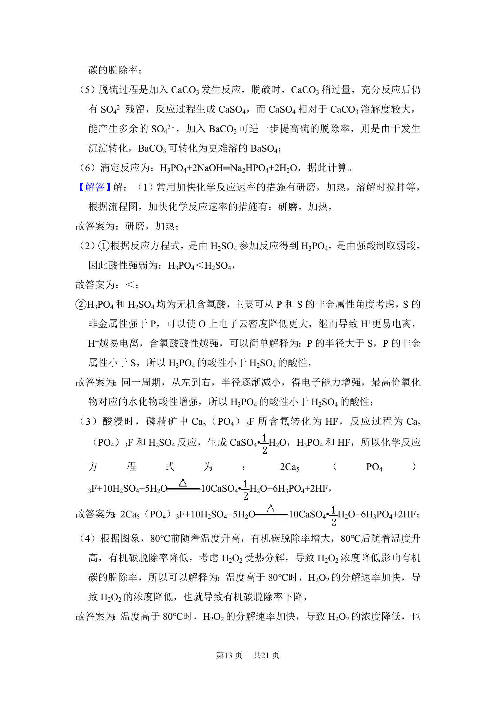
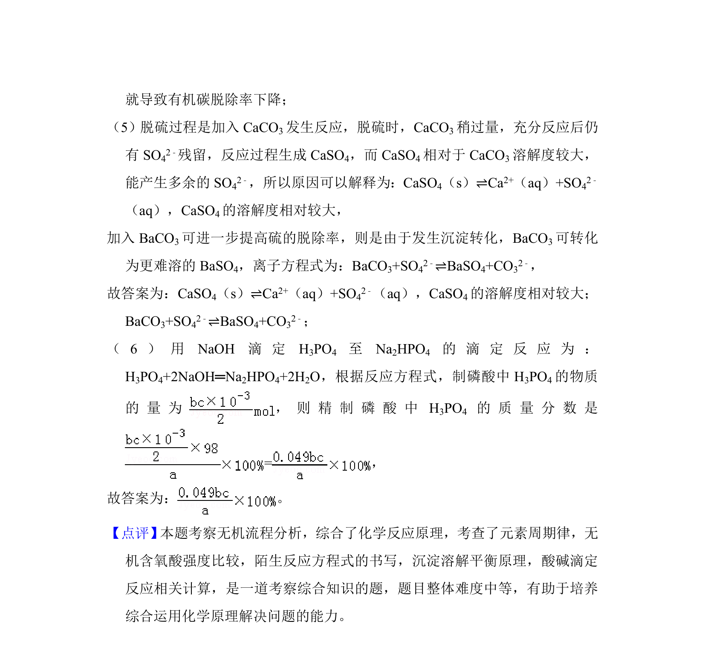

## 题面

## 摘要

该题考查磷精矿湿法制磷酸流程中的反应速率、酸性比较及方程式的书写。

## 关联考点

- [[974-化学反应速率影响因素|化学反应速率影响因素]]
- [[酸性强弱比较]]
- [[252-元素周期律|元素周期律]]
- [[976-化学方程式的书写|化学方程式书写]]

## 答案与解析

> 📄 原 PDF 第 11 页：`素材/真题/北京/2008-2024·（北京）化学高考真题/2018年高考化学试卷（北京）（解析卷）.pdf`

<!-- 题干文本-start -->
## 题干文本
9．（13分）磷精矿湿法制备磷酸的一种工艺流程如下：
已知：磷精矿主要成分为Ca 5（PO4）3（OH），还含有Ca 5（PO4）3F和有机碳
等。
溶解度：Ca5（PO4）3（OH）＜CaSO4•0.5H2O
（1）上述流程中能加快反应速率的措施有　研磨，加热　。
（2）磷精矿粉酸浸时发生反应：
2Ca5（PO4）3（OH）+3H2O+10H2SO4 10CaSO4•0.5H2O+6H3PO4
①该反应体现出酸性关系：H3PO4　＜　H2SO4（填“＞”或“＜”）。
②结合元素周期律解释①中结论：P和S电子层数相同。　同一周期，从左到
右，半径逐渐减小，得电子能力增强，最高价氧化物对应的水化物酸性增强，
所以H 3PO4的酸性小于H 2SO4的酸性　。
（3）酸浸时，磷精矿中Ca 5（PO4）3F所含氟转化为HF，并进一步转化为SiF 4
除去，写出生成HF的化学方程式
：　2Ca5（PO4）3F+10H2SO4+5H2O 10CaSO4• H2O+6H3PO4+2HF　。
<!-- 题干文本-end -->

<!-- 解析文本-start -->
## 解析文本

<!-- 解析文本-end -->
