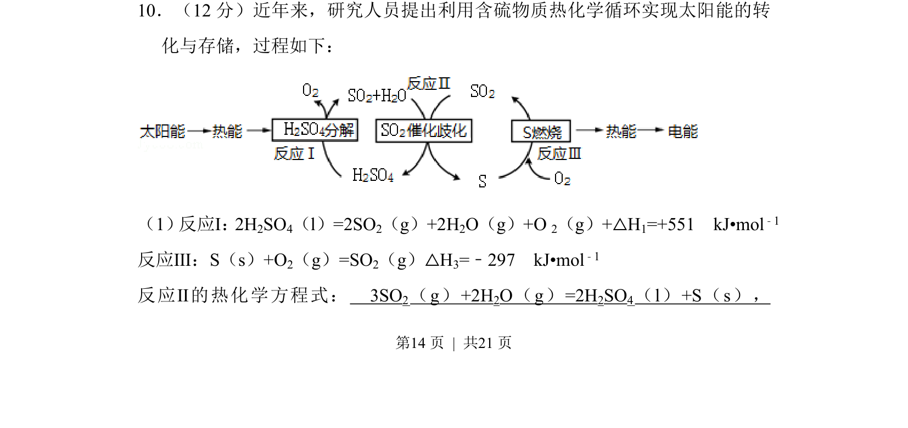
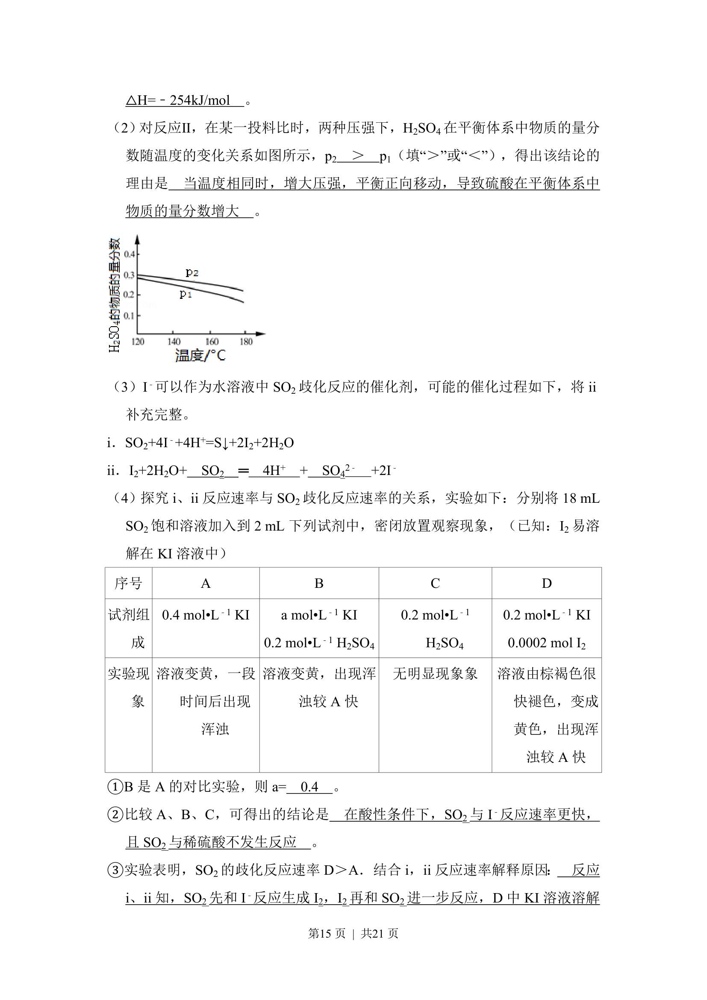
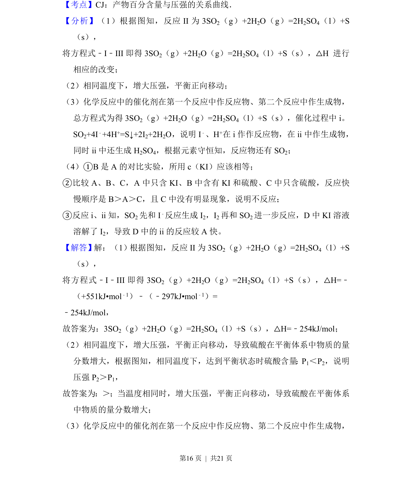
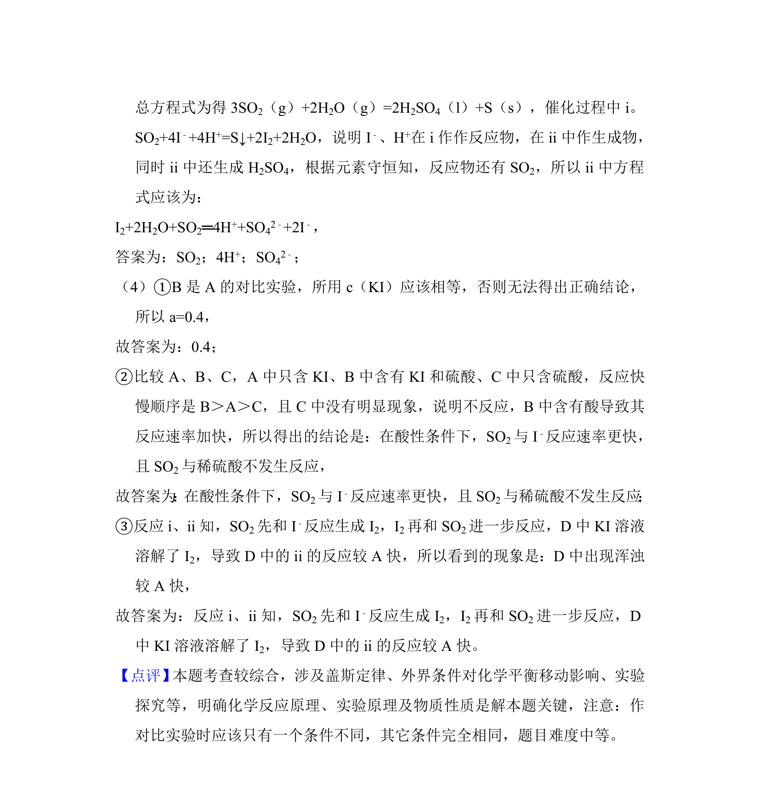

## 题面

## 摘要

考查含硫物质热化学循环中盖斯定律的应用，通过已知反应焓变计算目标反应热化学方程式。

## 关联考点

- [[309-热化学方程式|热化学方程式]]
- [[311-盖斯定律|盖斯定律]]
- [[768-热化学方程式与反应热计算|反应热计算]]
- [[△H]]

## 答案与解析

> 📄 原 PDF 第 14 页：`素材/真题/北京/2008-2024·（北京）化学高考真题/2018年高考化学试卷（北京）（解析卷）.pdf`
