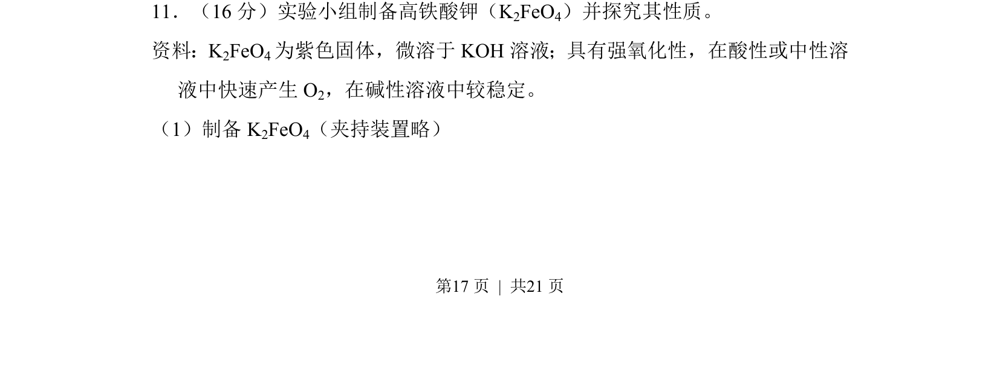
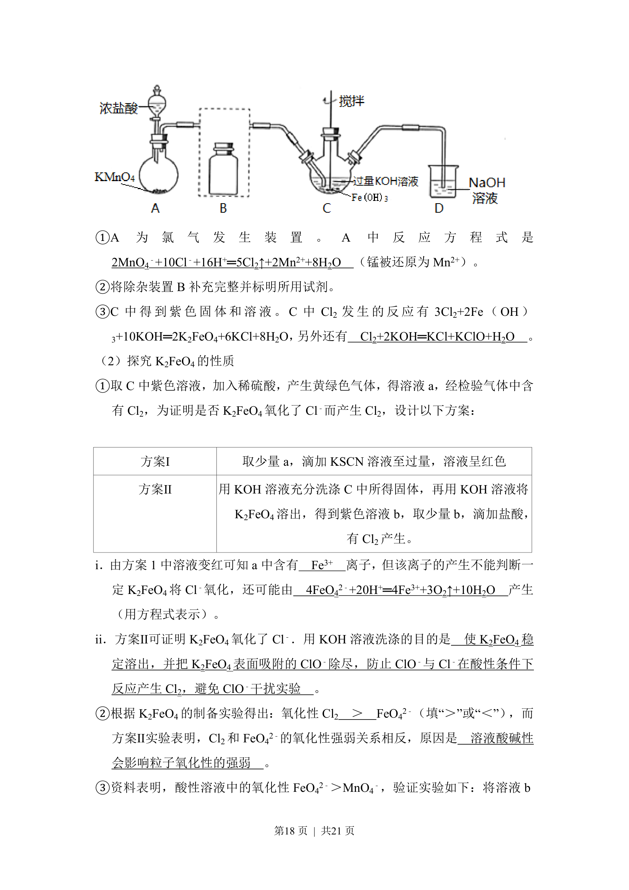
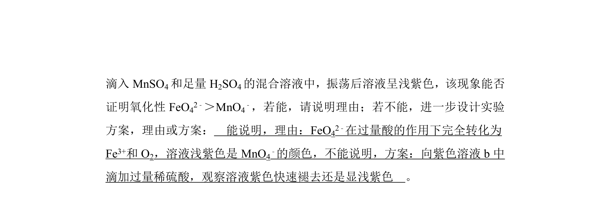
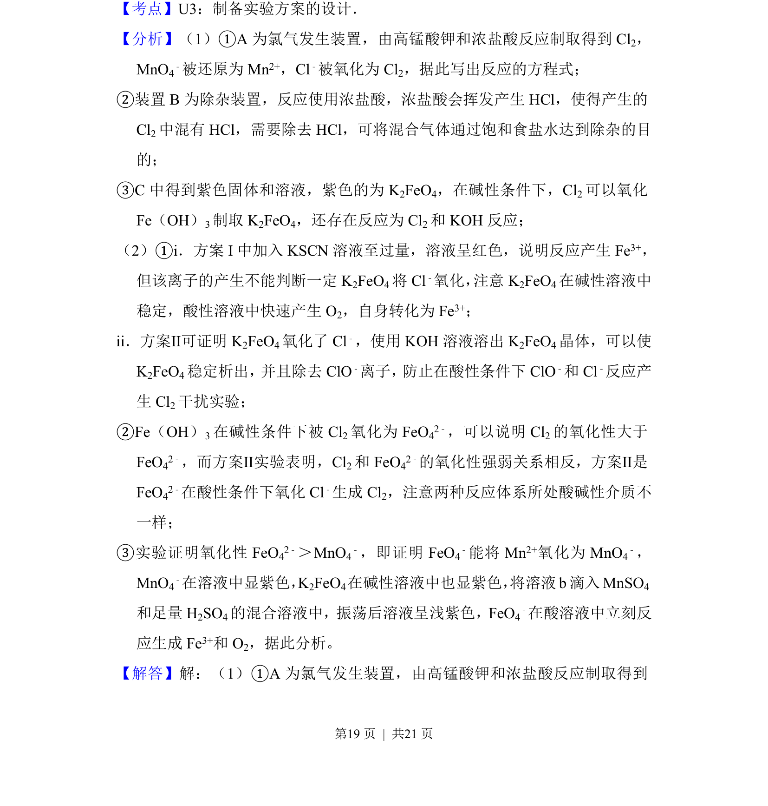
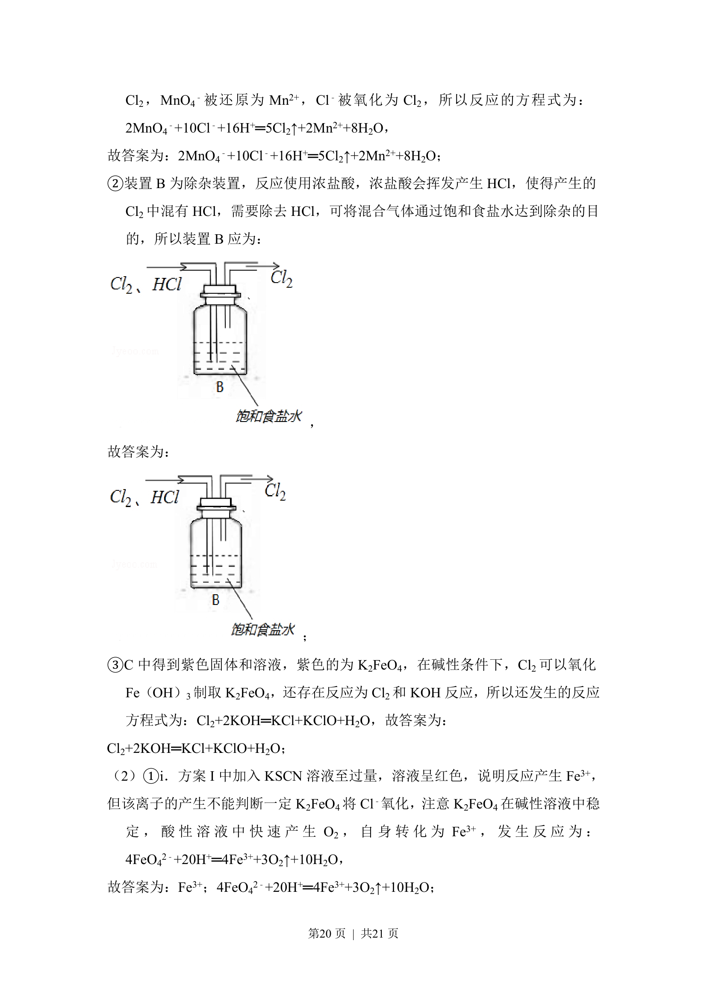
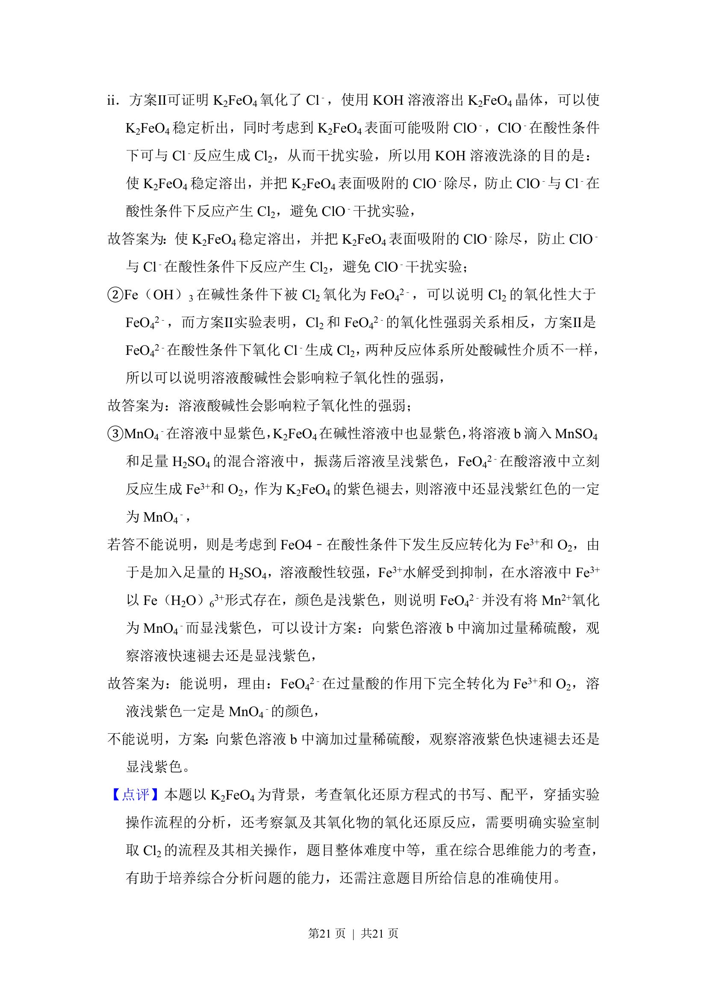

## 题面

## 摘要

制备高铁酸钾并探究其氧化性和稳定性。

## 关联考点

- [[高铁酸钾制备]]
- [[686-强氧化性|强氧化性]]
- [[稳定性与pH关系]]
- [[482-实验设计|实验探究]]

## 答案与解析

> 📄 原 PDF 第 17 页：`素材/真题/北京/2008-2024·（北京）化学高考真题/2018年高考化学试卷（北京）（解析卷）.pdf`
