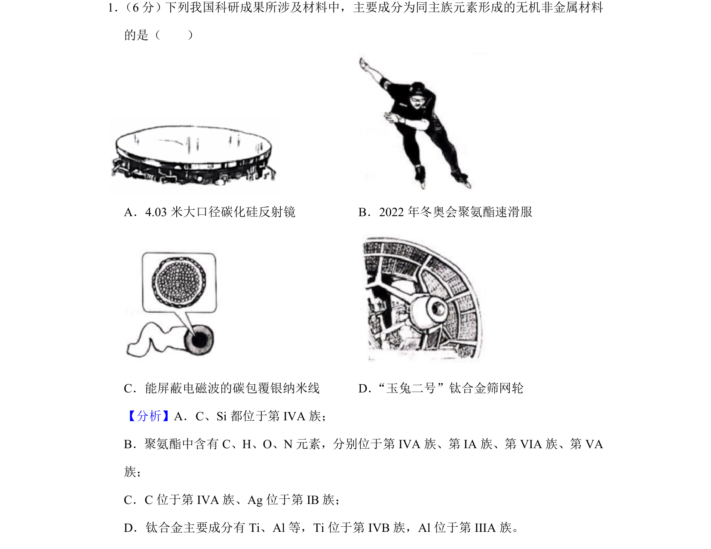
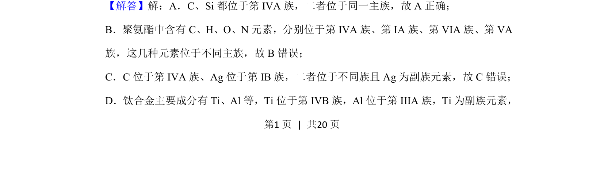
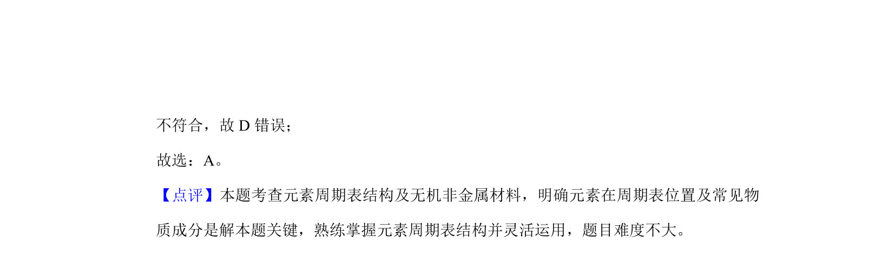

## 题面

## 摘要

考查同主族元素形成的无机非金属材料识别，分析碳化硅、聚氨酯等材料的元素所属主族。

## 关联考点

- [[元素周期表主族]]
- [[696-无机非金属材料|无机非金属材料]]
- [[材料成分]]

## 答案与解析

> 📄 原 PDF 第 1 页：`素材/真题/北京/2008-2024·（北京）化学高考真题/2019年高考化学试卷（北京）（解析卷）.pdf`
