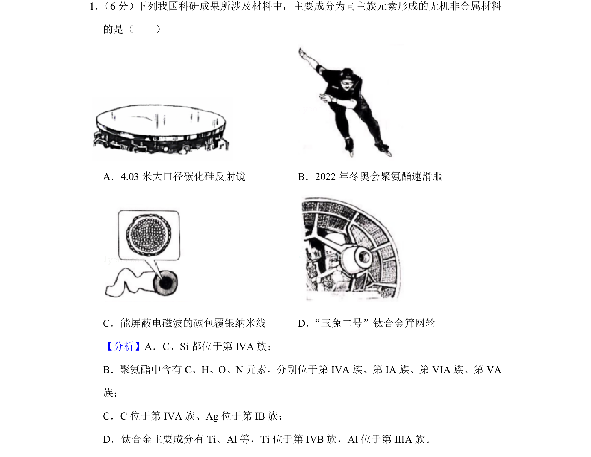
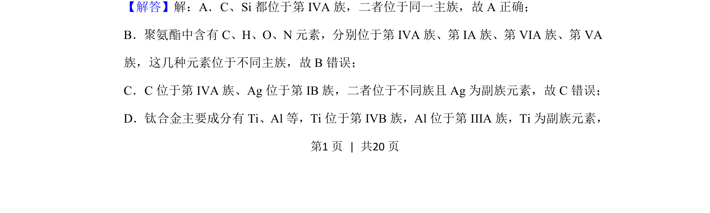
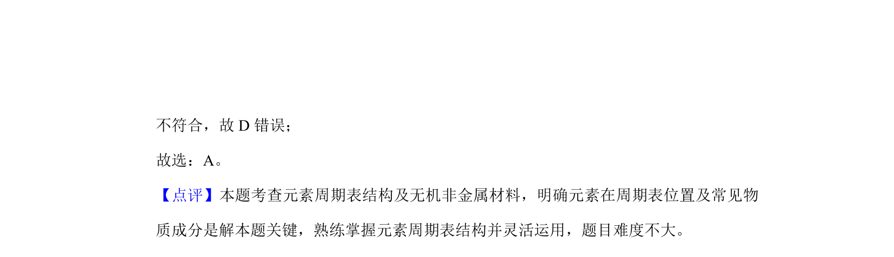

## 题面

## 摘要

考查同主族元素形成的无机非金属材料识别，分析碳化硅、聚氨酯等材料的元素所属主族。

## 关联考点

- [[元素周期表主族]]
- [[696-无机非金属材料|无机非金属材料]]
- [[材料成分]]

## 答案与解析

> 📄 原 PDF 第 1 页：`素材/真题/北京/2008-2024·（北京）化学高考真题/2019年高考化学试卷（北京）（解析卷）.pdf`

<!-- 题干文本-start -->
## 题干文本
1． （6分）下列我国科研成果所涉及材料中，主要成分为同主族元素形成的无机非金属材料
的是（　　）
A．4.03米大口径碳化硅反射镜B．2022年冬奥会聚氨酯速滑服
C．能屏蔽电磁波的碳包覆银纳米线D．“玉兔二号”钛合金筛网轮
<!-- 题干文本-end -->

<!-- 解析文本-start -->
## 解析文本
【分析】A．C、Si都位于第IVA族；
B．聚氨酯中含有C、H、O、N元素，分别位于第IVA族、第IA族、第VIA族、第VA
族；
C．C位于第IVA族、Ag位于第IB族；
D．钛合金主要成分有Ti、Al等，Ti位于第IVB族，Al位于第IIIA族。
【解答】解：A．C、Si都位于第IVA族，二者位于同一主族，故A正确；
B．聚氨酯中含有C、H、O、N元素，分别位于第IVA族、第IA族、第VIA族、第VA
族，这几种元素位于不同主族，故B错误；
C．C位于第IVA族、Ag位于第IB族，二者位于不同族且Ag为副族元素，故C错误；
D．钛合金主要成分有Ti、Al等，Ti位于第IVB族，Al位于第IIIA族，Ti为副族元素，
<!-- 解析文本-end -->
