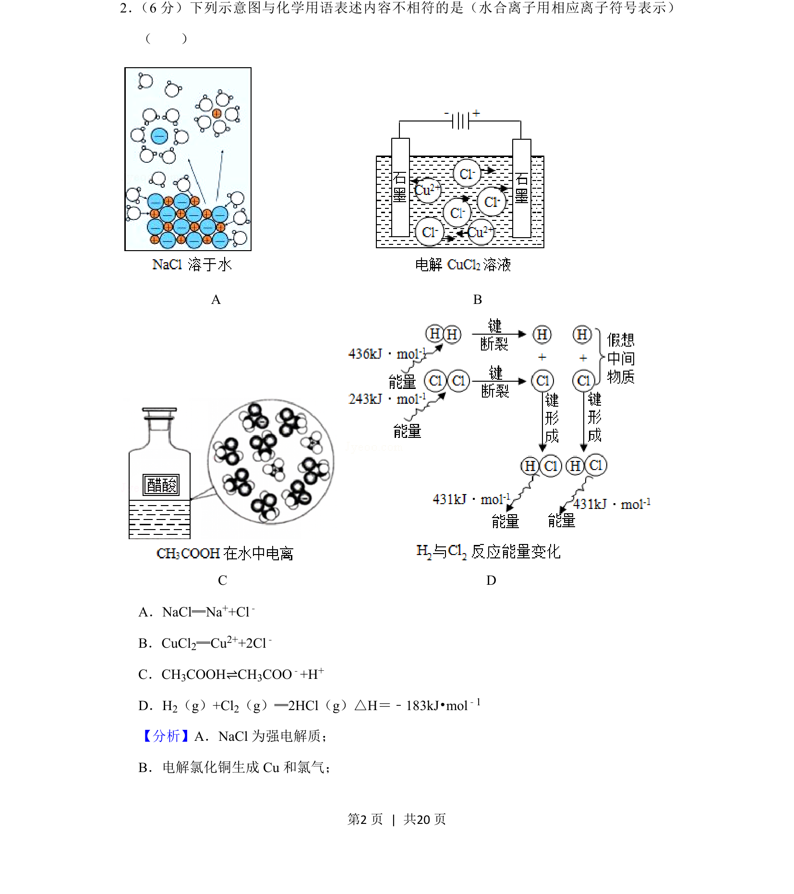
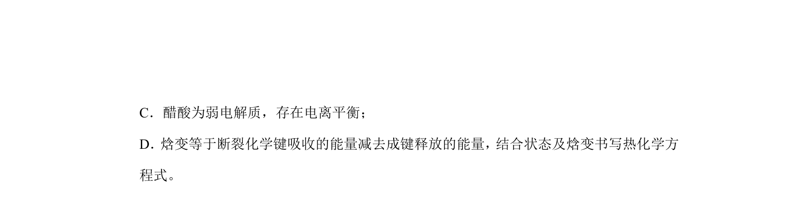
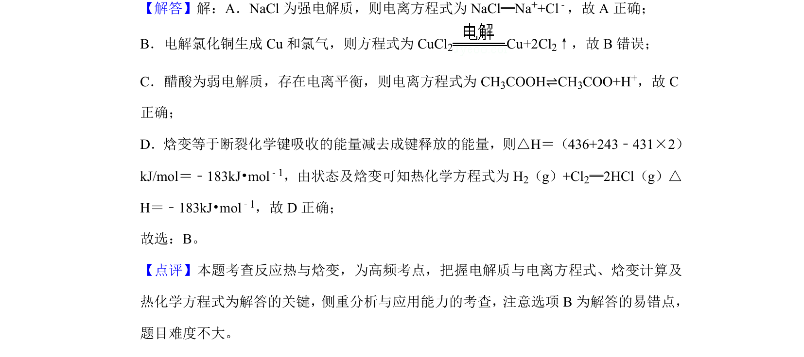

## 题面

## 摘要

判断示意图与化学用语的匹配性

## 关联考点

- [[166-电离|电解质电离]]
- [[367-电解原理|电解原理]]
- [[309-热化学方程式|热化学方程式]]

## 答案与解析

> 📄 原 PDF 第 2 页：`素材/真题/北京/2008-2024·（北京）化学高考真题/2019年高考化学试卷（北京）（解析卷）.pdf`

<!-- 题干文本-start -->
## 题干文本
2． （6分）下列示意图与化学用语表述内容不相符的是（水合离子用相应离子符号表示）
（　　）
             A                                    B       
              C                                     D        
A．NaCl═Na++Cl﹣
B．CuCl2═Cu2++2Cl﹣
C．CH3COOH⇌CH3COO﹣+H+
D．H2（g）+Cl2（g）═2HCl（g）△H＝﹣183kJ•mol﹣1
<!-- 题干文本-end -->

<!-- 解析文本-start -->
## 解析文本
【分析】A．NaCl为强电解质；
B．电解氯化铜生成Cu和氯气；
<!-- 解析文本-end -->
