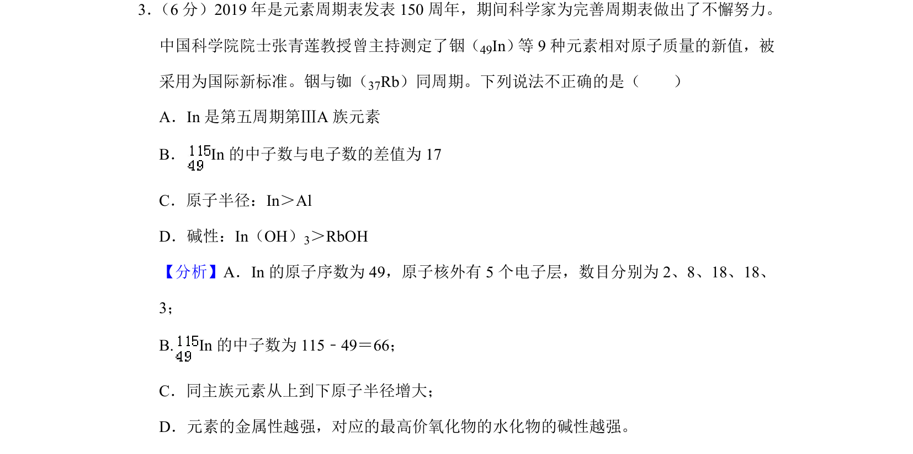
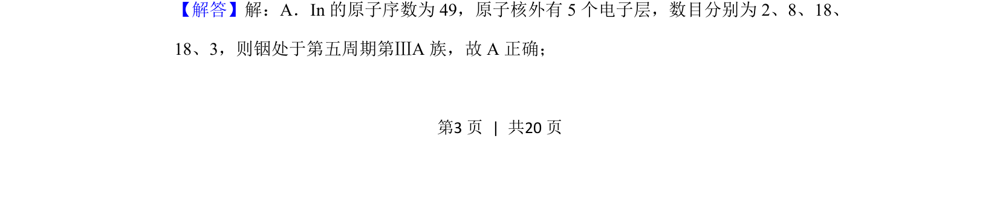
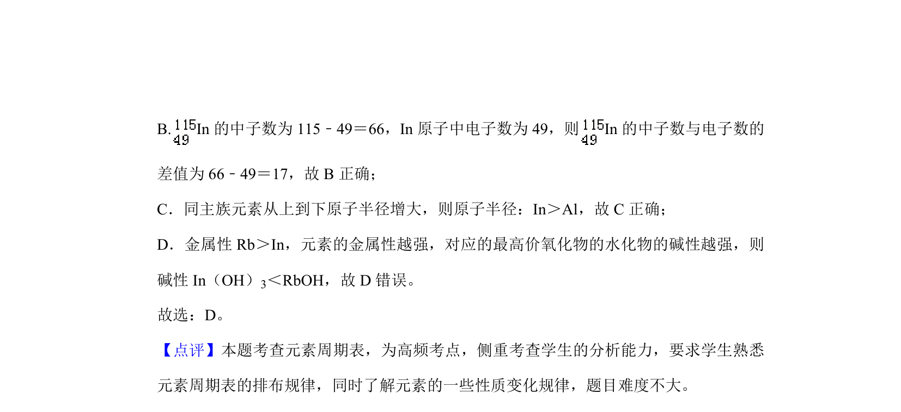

## 题面

## 摘要

考查In元素在周期表中的位置、原子结构及元素周期律的应用。

## 关联考点

- [[253-元素周期表|元素周期表]]
- [[426-原子结构|原子结构]]
- [[252-元素周期律|元素周期律]]
- [[金属性]]

## 答案与解析

> 📄 原 PDF 第 3 页：`素材/真题/北京/2008-2024·（北京）化学高考真题/2019年高考化学试卷（北京）（解析卷）.pdf`
