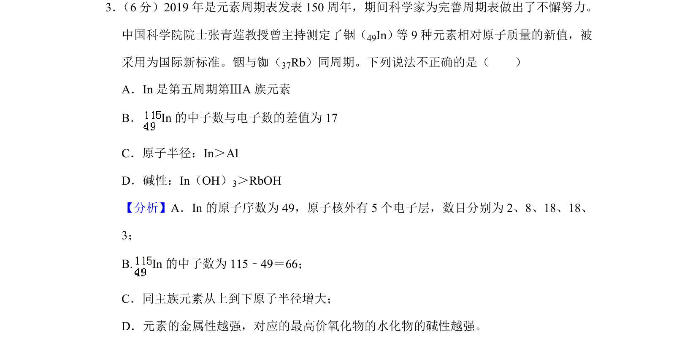
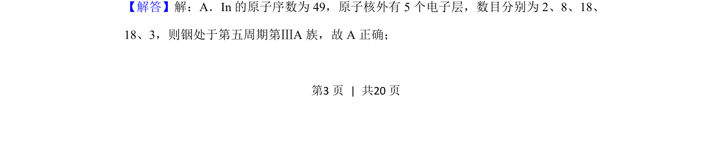
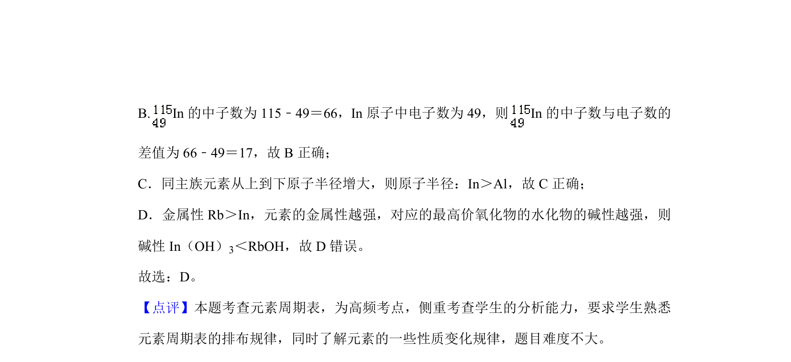

## 题面

## 摘要

考查In元素在周期表中的位置、原子结构及元素周期律的应用。

## 关联考点

- [[253-元素周期表|元素周期表]]
- [[426-原子结构|原子结构]]
- [[252-元素周期律|元素周期律]]
- [[986-金属性|金属性]]

## 答案与解析

> 📄 原 PDF 第 3 页：`素材/真题/北京/2008-2024·（北京）化学高考真题/2019年高考化学试卷（北京）（解析卷）.pdf`

<!-- 题干文本-start -->
## 题干文本
3． （6分）2019年是元素周期表发表150周年，期间科学家为完善周期表做出了不懈努力。
中国科学院院士张青莲教授曾主持测定了铟（49In） 等9种元素相对原子质量的新值，被
采用为国际新标准。铟与铷（37Rb）同周期。下列说法不正确的是（　　）
A．In是第五周期第ⅢA族元素
B．In的中子数与电子数的差值为17
C．原子半径：In＞Al
D．碱性：In（OH）3＞RbOH
<!-- 题干文本-end -->

<!-- 解析文本-start -->
## 解析文本
【分析】A．In的原子序数为49，原子核外有5个电子层，数目分别为2、8、18、18、
3；
B. In的中子数为115﹣49＝66；
C．同主族元素从上到下原子半径增大；
D．元素的金属性越强，对应的最高价氧化物的水化物的碱性越强。
【解答】解：A．In的原子序数为49，原子核外有5个电子层，数目分别为2、8、18、
18、3，则铟处于第五周期第ⅢA族，故A正确；
<!-- 解析文本-end -->
