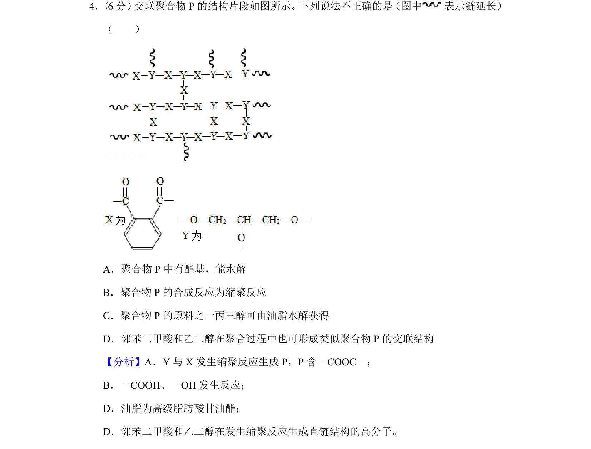
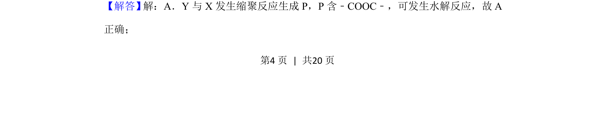
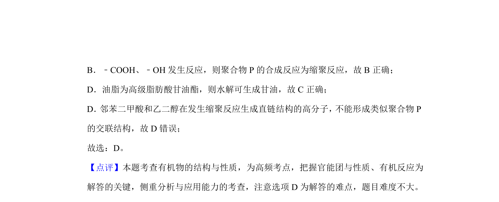

## 题面

## 摘要

考查交联聚合物的结构、水解性质及缩聚反应，涉及酯基水解与交联结构判断。

## 关联考点

- [[酯基水解]]
- [[500-缩聚反应|缩聚反应]]
- [[748-油脂水解|油脂水解]]
- [[交联聚合物]]

## 答案与解析

> 📄 原 PDF 第 4 页：`素材/真题/北京/2008-2024·（北京）化学高考真题/2019年高考化学试卷（北京）（解析卷）.pdf`
