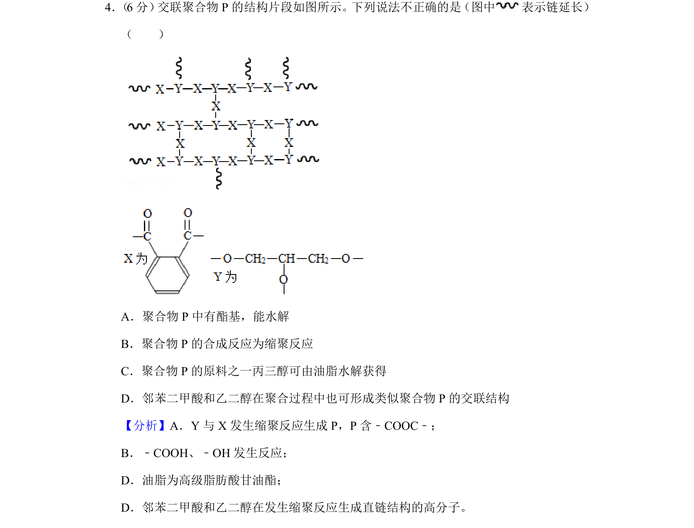
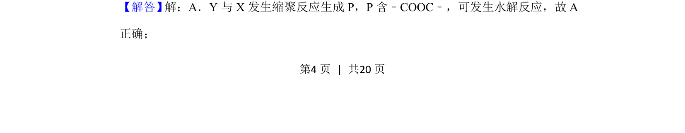
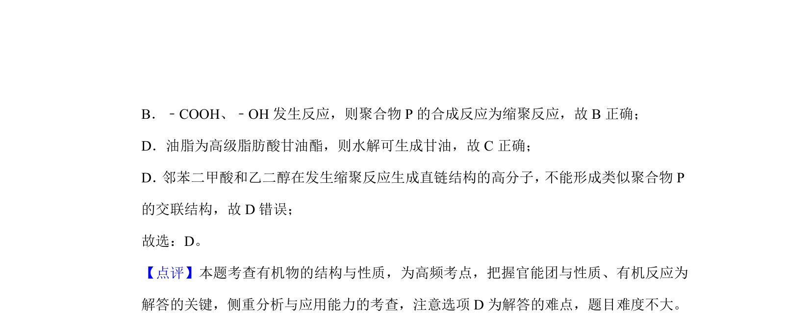

## 题面

## 摘要

考查交联聚合物的结构、水解性质及缩聚反应，涉及酯基水解与交联结构判断。

## 关联考点

- [[酯基水解]]
- [[500-缩聚反应|缩聚反应]]
- [[748-油脂水解|油脂水解]]
- [[交联聚合物]]

## 答案与解析

> 📄 原 PDF 第 4 页：`素材/真题/北京/2008-2024·（北京）化学高考真题/2019年高考化学试卷（北京）（解析卷）.pdf`

<!-- 题干文本-start -->
## 题干文本
4． （6分） 交联聚合物P的结构片段如图所示。下列说法不正确的是（图中 表示链延长）
（　　）
A．聚合物P中有酯基，能水解
B．聚合物P的合成反应为缩聚反应
C．聚合物P的原料之一丙三醇可由油脂水解获得
D．邻苯二甲酸和乙二醇在聚合过程中也可形成类似聚合物P的交联结构
<!-- 题干文本-end -->

<!-- 解析文本-start -->
## 解析文本
【分析】A．Y与X发生缩聚反应生成P，P含﹣COOC﹣；
B．﹣COOH、﹣OH发生反应；
D．油脂为高级脂肪酸甘油酯；
D．邻苯二甲酸和乙二醇在发生缩聚反应生成直链结构的高分子。
【解答】 解：A．Y与X发生缩聚反应生成P，P含﹣COOC﹣，可发生水解反应，故A
正确；
<!-- 解析文本-end -->
