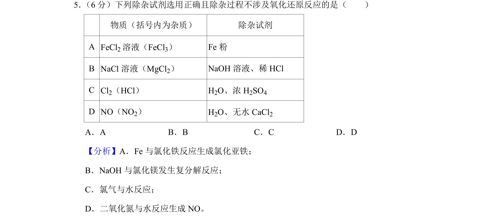
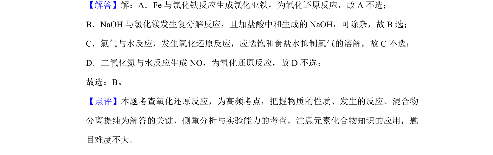

## 题面

## 摘要

考查物质除杂试剂的选择及是否涉及氧化还原反应。

## 关联考点

- [[988-除杂|除杂]]
- [[162-氧化还原反应|氧化还原反应]]
- [[964-铁及其化合物|铁及其化合物]]
- [[201-氯气性质|氯气性质]]
- [[978-氮氧化物|氮氧化物]]

## 答案与解析

> 📄 原 PDF 第 5 页：`素材/真题/北京/2008-2024·（北京）化学高考真题/2019年高考化学试卷（北京）（解析卷）.pdf`
