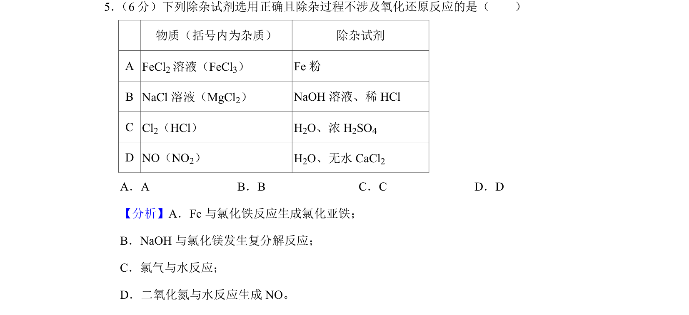
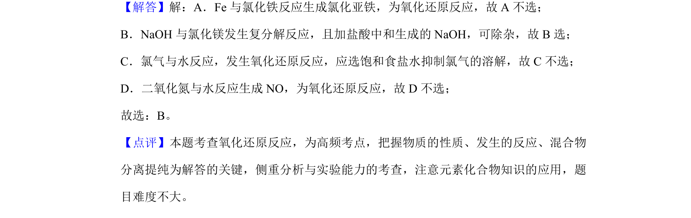

## 题面

## 摘要

考查物质除杂试剂的选择及是否涉及氧化还原反应。

## 关联考点

- [[988-除杂|除杂]]
- [[162-氧化还原反应|氧化还原反应]]
- [[964-铁及其化合物|铁及其化合物]]
- [[201-氯气性质|氯气性质]]
- [[978-氮氧化物|氮氧化物]]

## 答案与解析

> 📄 原 PDF 第 5 页：`素材/真题/北京/2008-2024·（北京）化学高考真题/2019年高考化学试卷（北京）（解析卷）.pdf`

<!-- 题干文本-start -->
## 题干文本
5． （6分）下列除杂试剂选用正确且除杂过程不涉及氧化还原反应的是（　　）
物质（括号内为杂质） 除杂试剂
A FeCl2溶液（FeCl3） Fe粉
B NaCl溶液（MgCl 2） NaOH溶液、稀HCl
C Cl2（HCl） H2O、浓H 2SO4
D NO（NO2） H2O、无水CaCl 2
A．A B．B C．C D．D
<!-- 题干文本-end -->

<!-- 解析文本-start -->
## 解析文本
【分析】A．Fe与氯化铁反应生成氯化亚铁；
B．NaOH与氯化镁发生复分解反应；
C．氯气与水反应；
D．二氧化氮与水反应生成NO。
【解答】解：A．Fe与氯化铁反应生成氯化亚铁，为氧化还原反应，故A不选；
B．NaOH与氯化镁发生复分解反应，且加盐酸中和生成的NaOH，可除杂，故B选；
C．氯气与水反应，发生氧化还原反应，应选饱和食盐水抑制氯气的溶解，故C不选；
D．二氧化氮与水反应生成NO，为氧化还原反应，故D不选；
故选：B。
【点评】本题考查氧化还原反应，为高频考点，把握物质的性质、发生的反应、混合物
分离提纯为解答的关键，侧重分析与实验能力的考查，注意元素化合物知识的应用，题
目难度不大。
<!-- 解析文本-end -->
