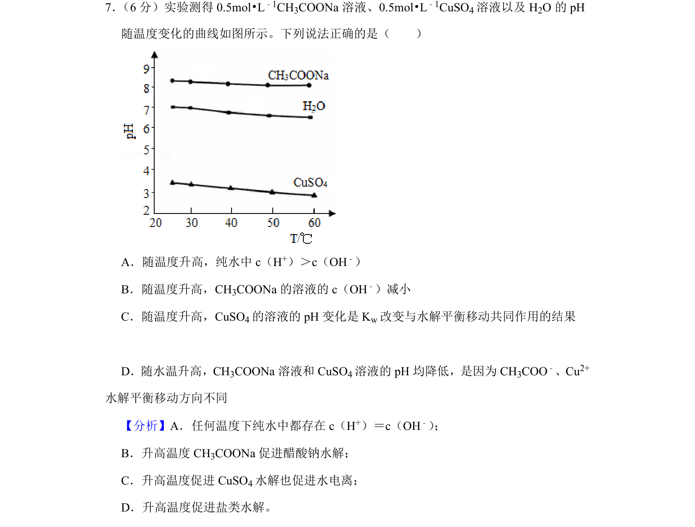
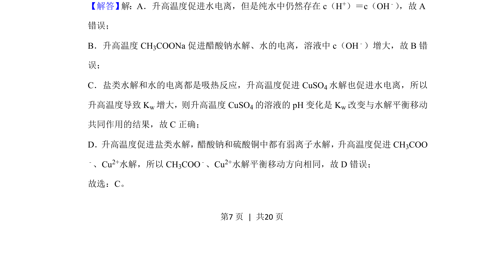
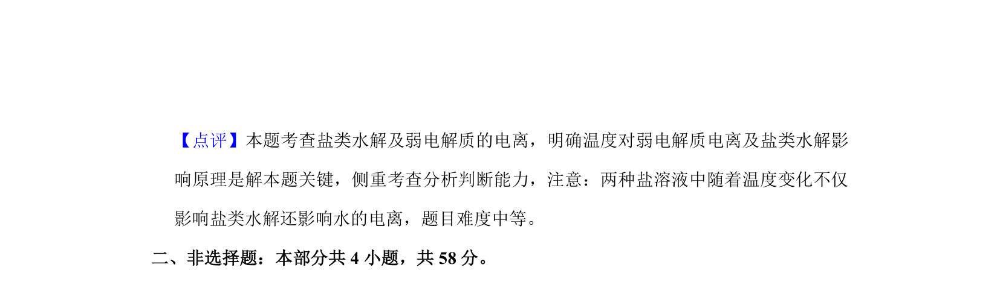

## 题面

## 摘要

温度对纯水、CH3COONa和CuSO4溶液pH的影响，涉及水电离与盐类水解平衡移动。

## 关联考点

- [[338-离子积常数Kw|水的离子积]]
- [[336-盐类水解|盐类水解]]
- [[温度对平衡的影响]]
- [[pH变化]]

## 答案与解析

> 📄 原 PDF 第 7 页：`素材/真题/北京/2008-2024·（北京）化学高考真题/2019年高考化学试卷（北京）（解析卷）.pdf`
