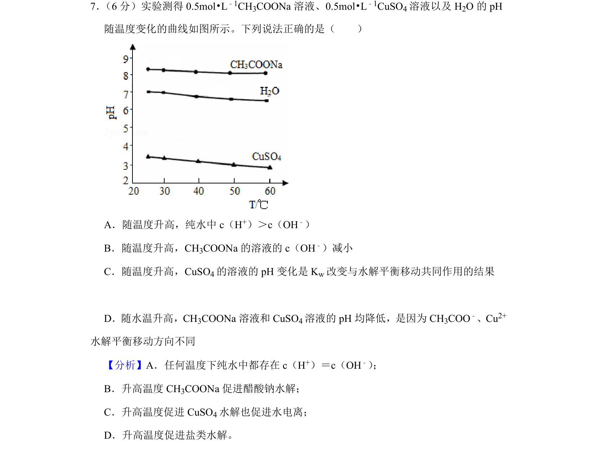
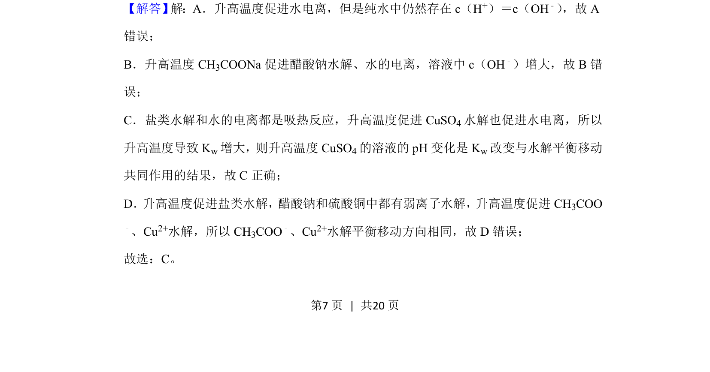
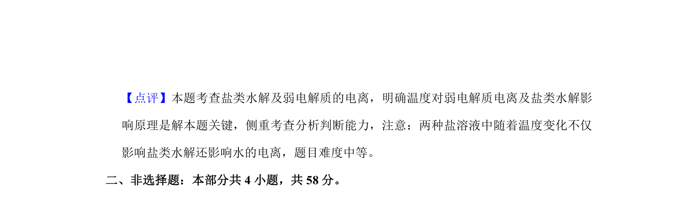

## 题面

## 摘要

温度对纯水、CH3COONa和CuSO4溶液pH的影响，涉及水电离与盐类水解平衡移动。

## 关联考点

- [[338-离子积常数Kw|水的离子积]]
- [[336-盐类水解|盐类水解]]
- [[温度对平衡的影响]]
- [[pH变化]]

## 答案与解析

> 📄 原 PDF 第 7 页：`素材/真题/北京/2008-2024·（北京）化学高考真题/2019年高考化学试卷（北京）（解析卷）.pdf`

<!-- 题干文本-start -->
## 题干文本
7． （6分）实验测得0.5mol•L﹣1CH3COONa溶液、0.5mol•L ﹣1CuSO4溶液以及H 2O的pH
随温度变化的曲线如图所示。下列说法正确的是（　　）
A．随温度升高，纯水中c（H +）＞c（OH﹣）
B．随温度升高，CH3COONa的溶液的c（OH ﹣）减小
C．随温度升高，CuSO4的溶液的pH变化是K w改变与水解平衡移动共同作用的结果
D．随水温升高，CH3COONa溶液和CuSO 4溶液的pH均降低，是因为CH 3COO﹣、Cu2+
水解平衡移动方向不同
<!-- 题干文本-end -->

<!-- 解析文本-start -->
## 解析文本
【分析】A．任何温度下纯水中都存在c（H +）＝c（OH﹣） ；
B．升高温度CH 3COONa促进醋酸钠水解；
C．升高温度促进CuSO 4水解也促进水电离；
D．升高温度促进盐类水解。
【解答】 解：A．升高温度促进水电离，但是纯水中仍然存在c（H+）＝c（OH﹣） ，故A
错误；
B．升高温度CH 3COONa促进醋酸钠水解、水的电离，溶液中c（OH ﹣）增大，故B错
误；
C．盐类水解和水的电离都是吸热反应，升高温度促进CuSO 4水解也促进水电离，所以
升高温度导致K w增大，则升高温度CuSO4的溶液的pH变化是K w改变与水解平衡移动
共同作用的结果，故C正确；
D．升高温度促进盐类水解，醋酸钠和硫酸铜中都有弱离子水解，升高温度促进CH3COO
﹣、Cu2+水解，所以CH 3COO﹣、Cu2+水解平衡移动方向相同，故D错误；
故选：C。
<!-- 解析文本-end -->
