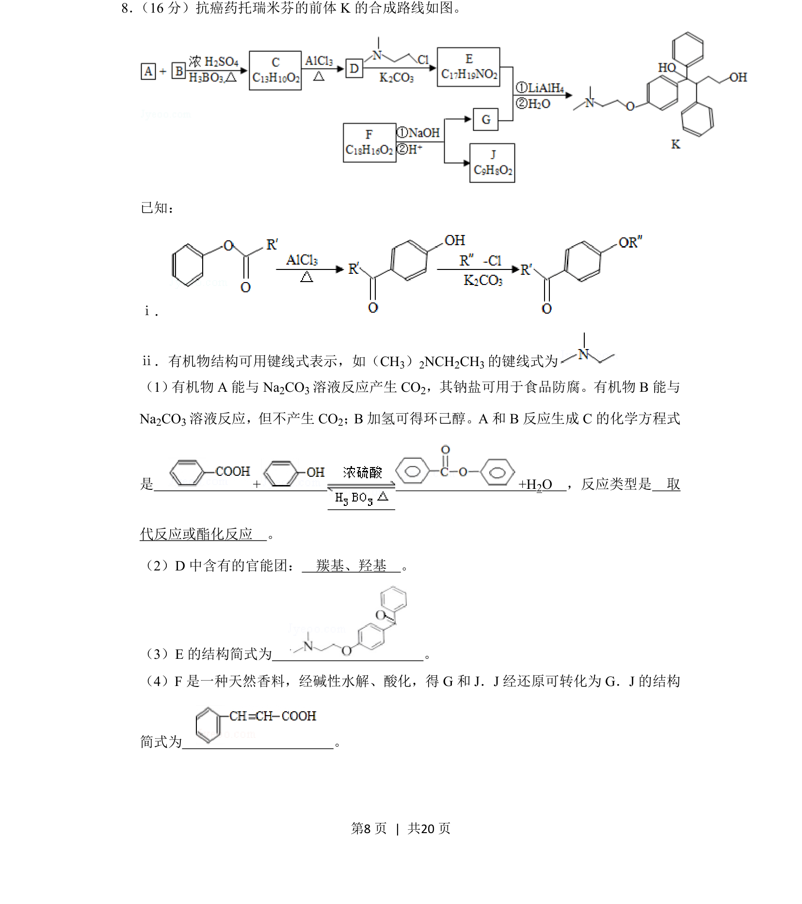
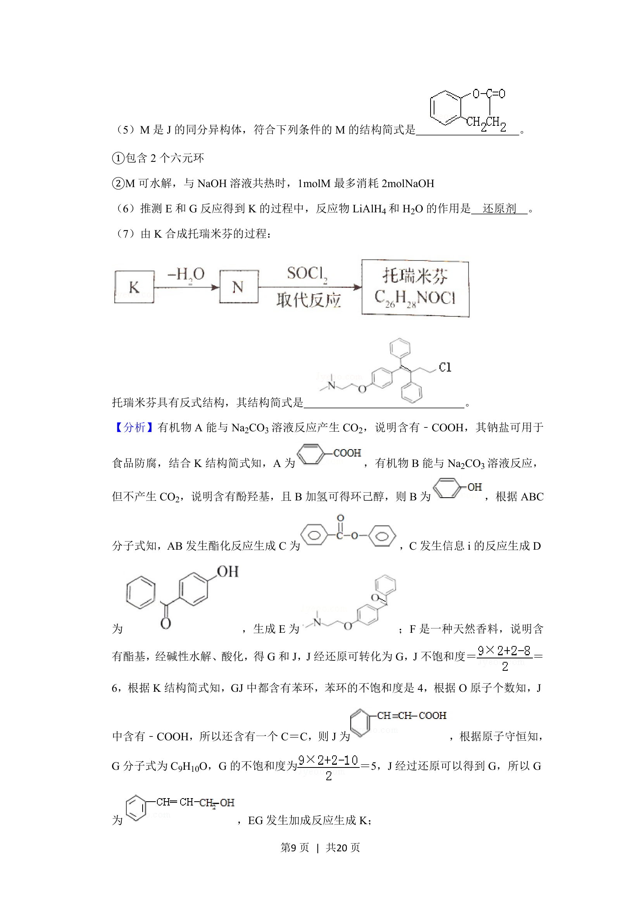
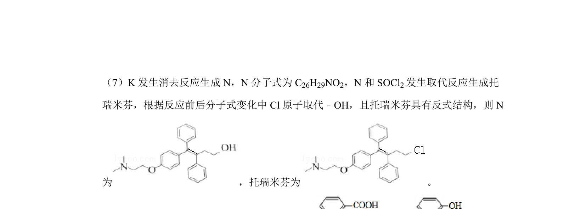
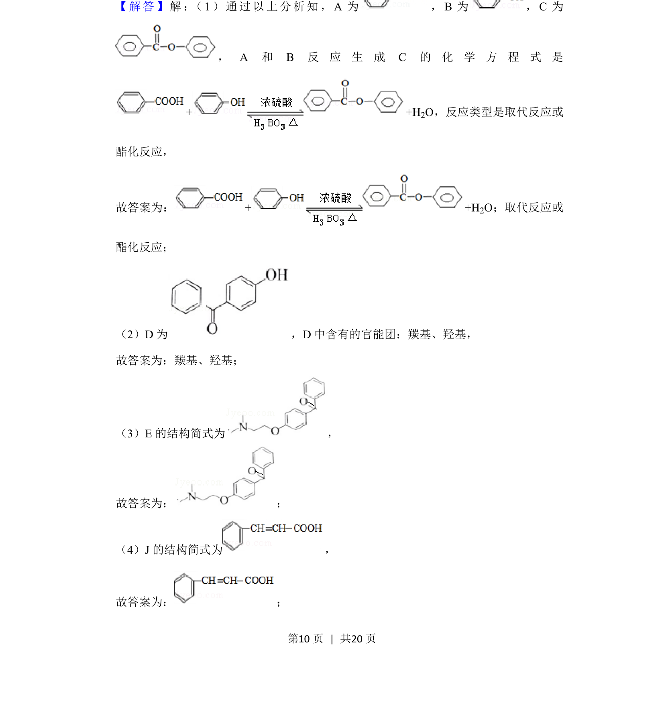
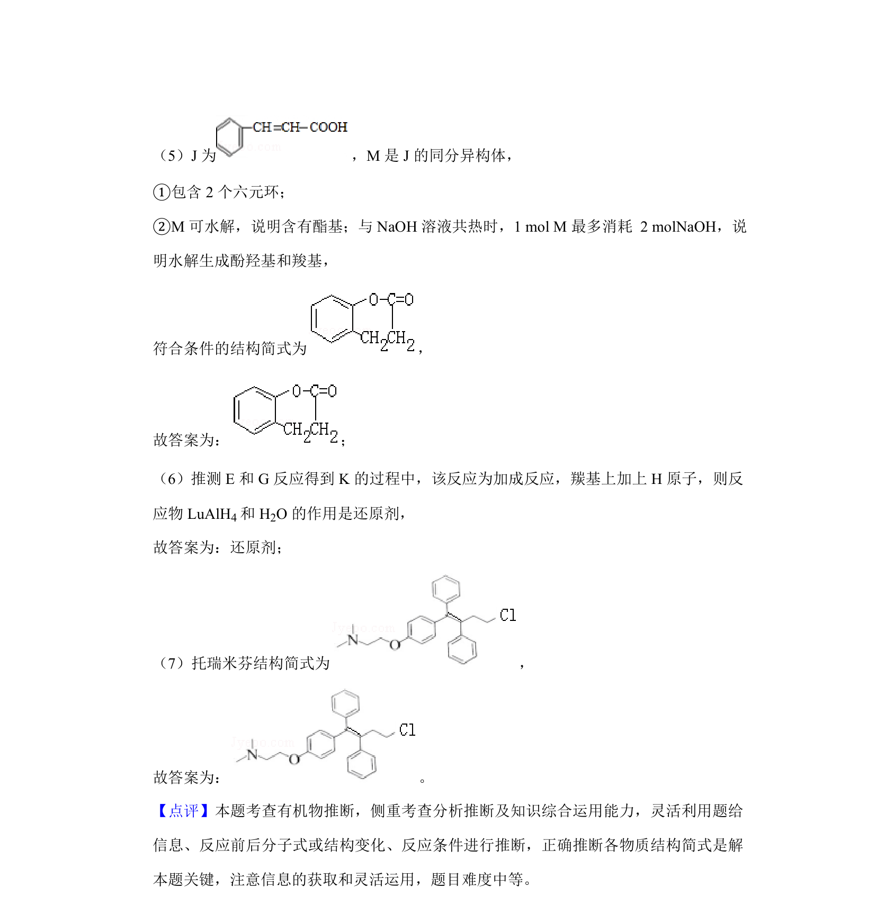

## 题面

## 摘要

有机合成路线推断，涉及官能团性质、反应类型及结构简式的书写。

## 关联考点

- [[271-化学合成|有机合成]]
- [[448-官能团|官能团]]
- [[646-反应类型|反应类型]]
- [[817-结构简式|结构简式]]

## 答案与解析

> 📄 原 PDF 第 8 页：`素材/真题/北京/2008-2024·（北京）化学高考真题/2019年高考化学试卷（北京）（解析卷）.pdf`

<!-- 题干文本-start -->
## 题干文本
8． （16分）抗癌药托瑞米芬的前体K的合成路线如图。
已知：
ⅰ．
ⅱ．有机物结构可用键线式表示，如（CH3）2NCH2CH3的键线式为
（1） 有机物A能与Na2CO3溶液反应产生CO 2，其钠盐可用于食品防腐。有机物B能与
Na2CO3溶液反应，但不产生CO 2；B加氢可得环己醇。A和B反应生成C的化学方程式
是　+ +H2O　，反应类型是　取
代反应或酯化反应　。
（2）D中含有的官能团：　羰基、羟基　。
（3）E的结构简式为　 　。
（4）F是一种天然香料，经碱性水解、酸化，得G和J．J经还原可转化为G．J的结构
简式为　 　。
<!-- 题干文本-end -->

<!-- 解析文本-start -->
## 解析文本

<!-- 解析文本-end -->
