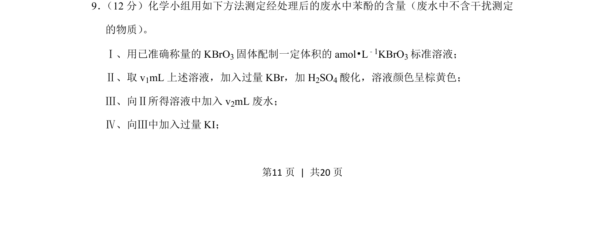
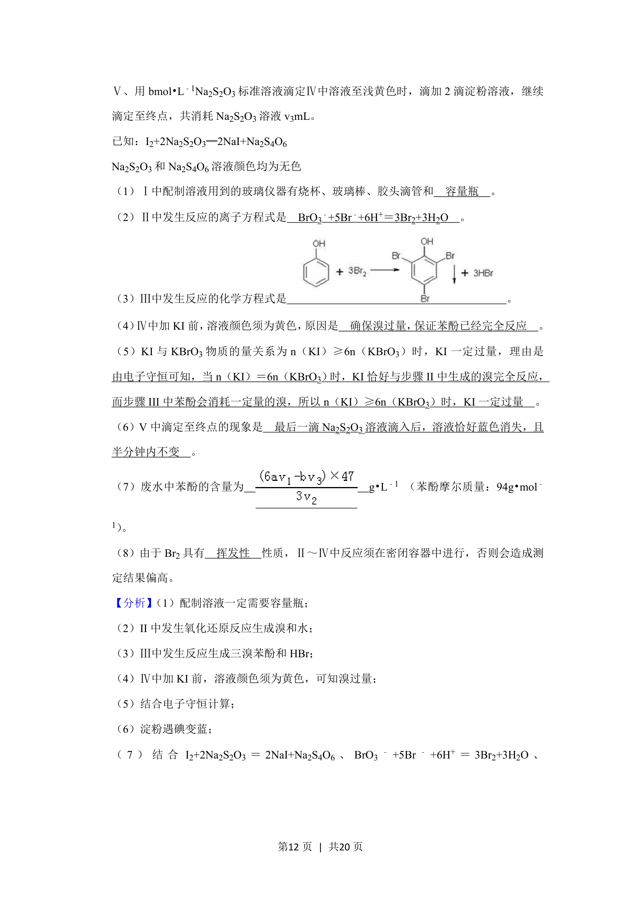
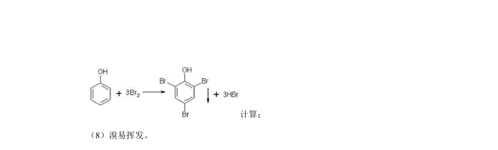
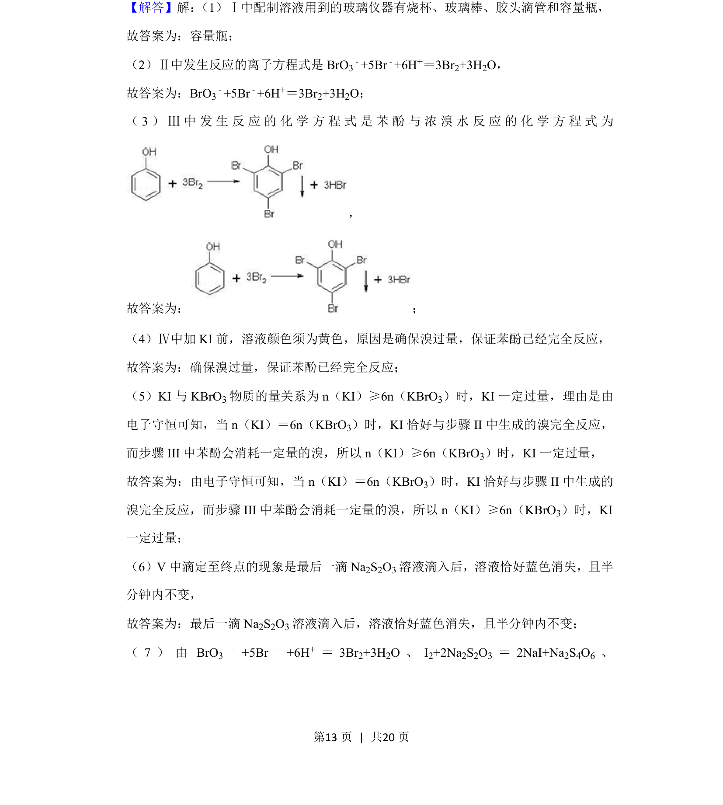
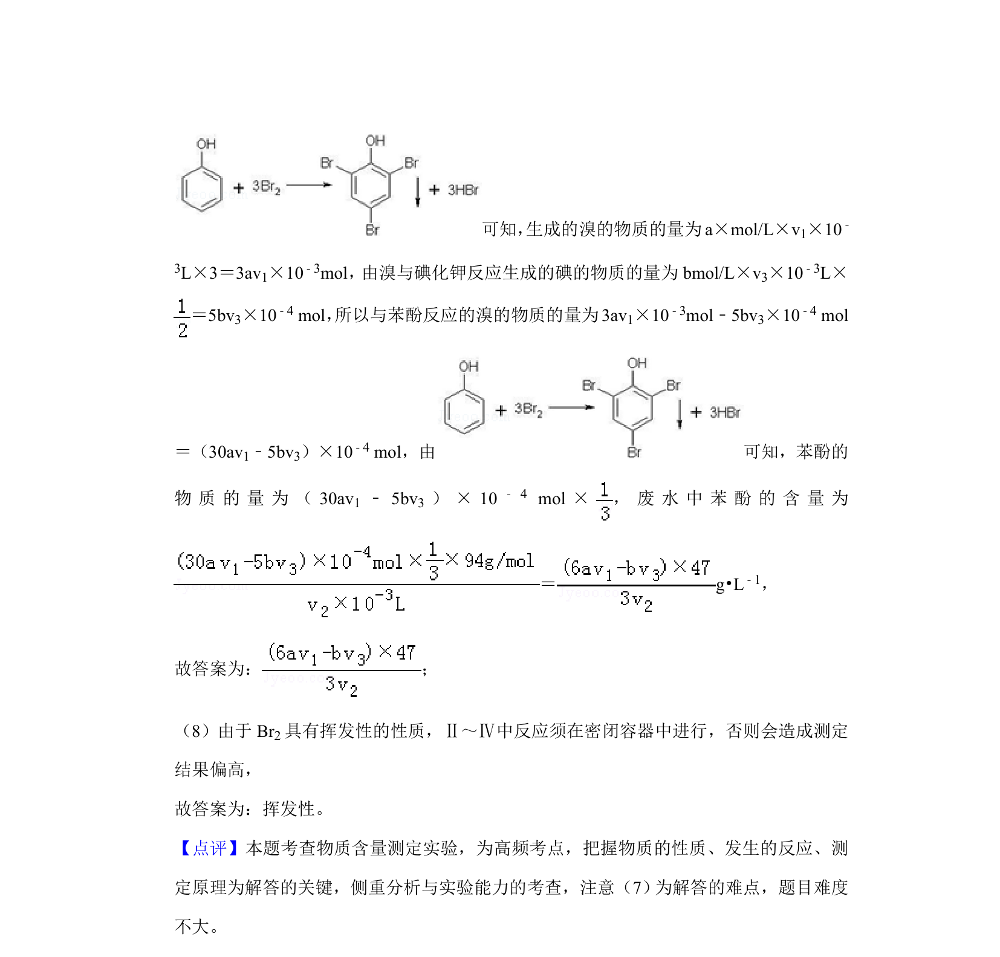

## 题面

## 摘要

测定废水中苯酚含量的定量分析实验流程，涉及标准溶液配制、溴量法氧化还原滴定原理。

## 关联考点

- [[溴量法]]
- [[苯酚含量测定]]
- [[548-氧化还原滴定|氧化还原滴定]]
- [[539-定量分析|定量分析]]

## 答案与解析

> 📄 原 PDF 第 11 页：`素材/真题/北京/2008-2024·（北京）化学高考真题/2019年高考化学试卷（北京）（解析卷）.pdf`
