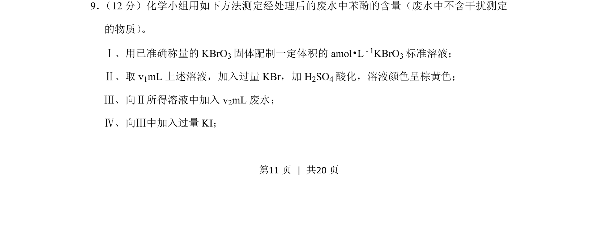
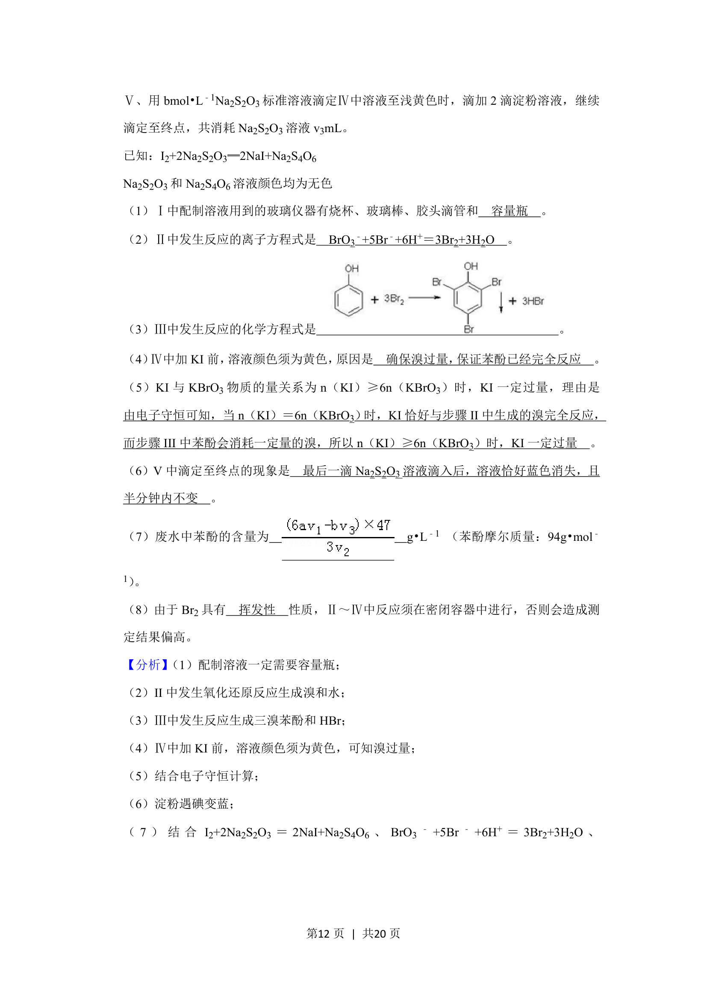
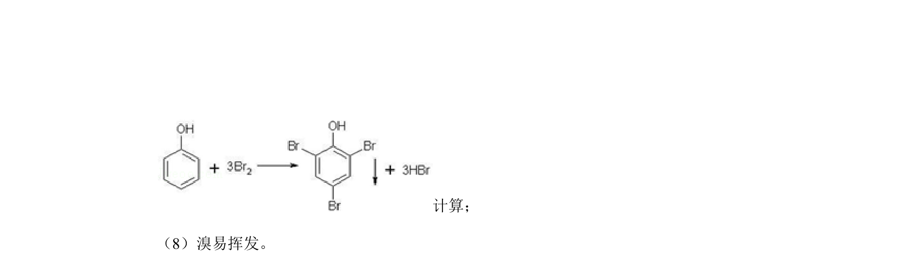
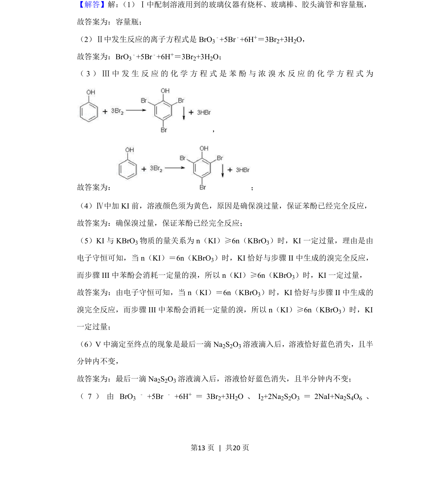
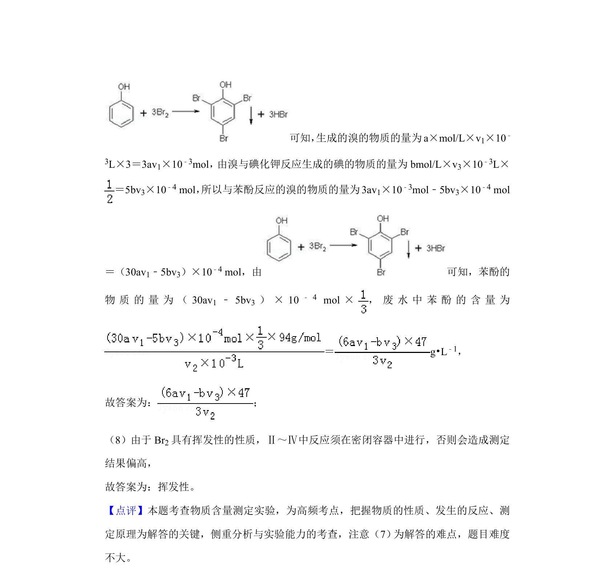

## 题面

## 摘要

测定废水中苯酚含量的定量分析实验流程，涉及标准溶液配制、溴量法氧化还原滴定原理。

## 关联考点

- [[溴量法]]
- [[苯酚含量测定]]
- [[548-氧化还原滴定|氧化还原滴定]]
- [[539-定量分析|定量分析]]

## 答案与解析

> 📄 原 PDF 第 11 页：`素材/真题/北京/2008-2024·（北京）化学高考真题/2019年高考化学试卷（北京）（解析卷）.pdf`

<!-- 题干文本-start -->
## 题干文本
9． （12分）化学小组用如下方法测定经处理后的废水中苯酚的含量（废水中不含干扰测定
的物质） 。
Ⅰ、用已准确称量的KBrO 3固体配制一定体积的amol•L ﹣1KBrO3标准溶液；
Ⅱ、取v 1mL上述溶液，加入过量KBr，加H 2SO4酸化，溶液颜色呈棕黄色；
Ⅲ、向Ⅱ所得溶液中加入v 2mL废水；
Ⅳ、向Ⅲ中加入过量KI；
<!-- 题干文本-end -->

<!-- 解析文本-start -->
## 解析文本

<!-- 解析文本-end -->
