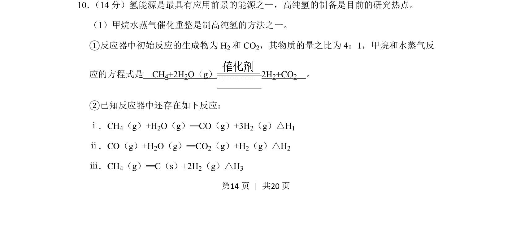
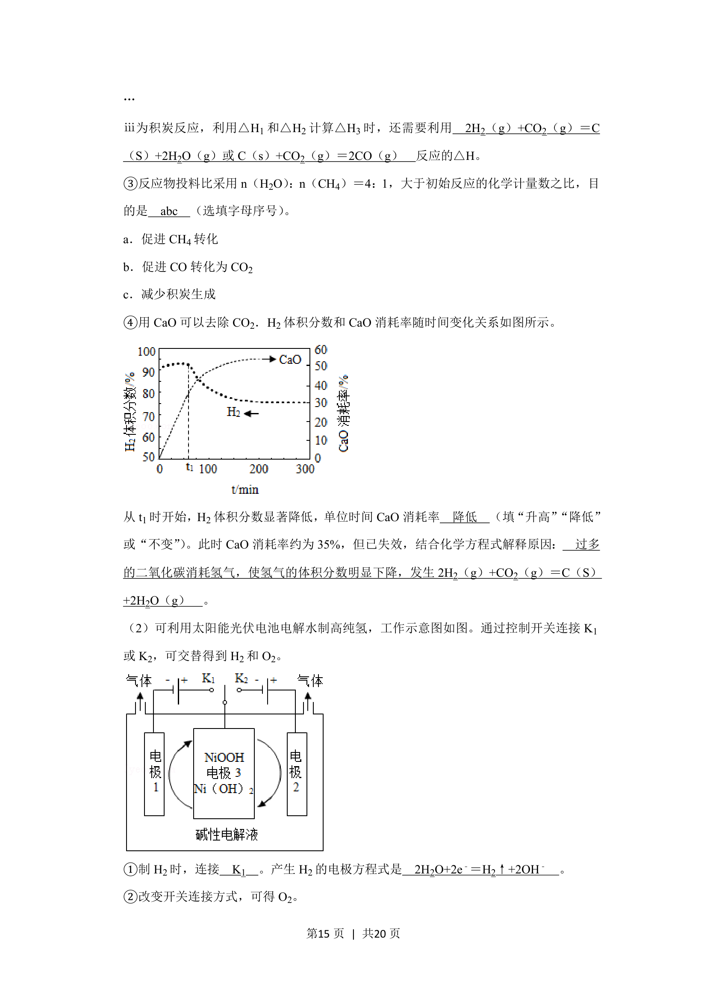
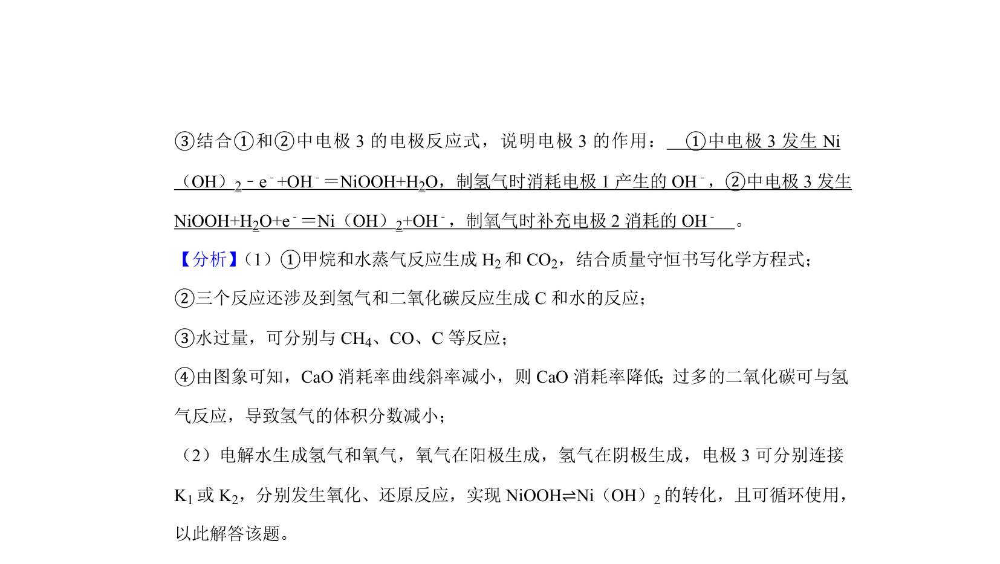
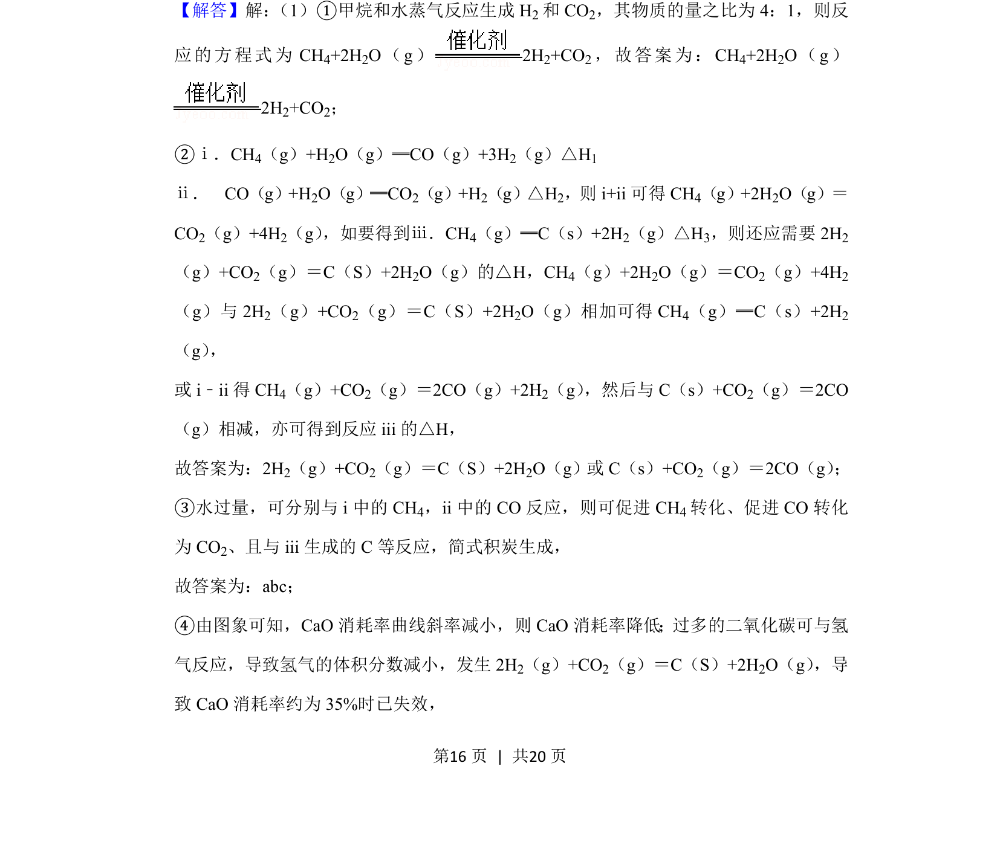
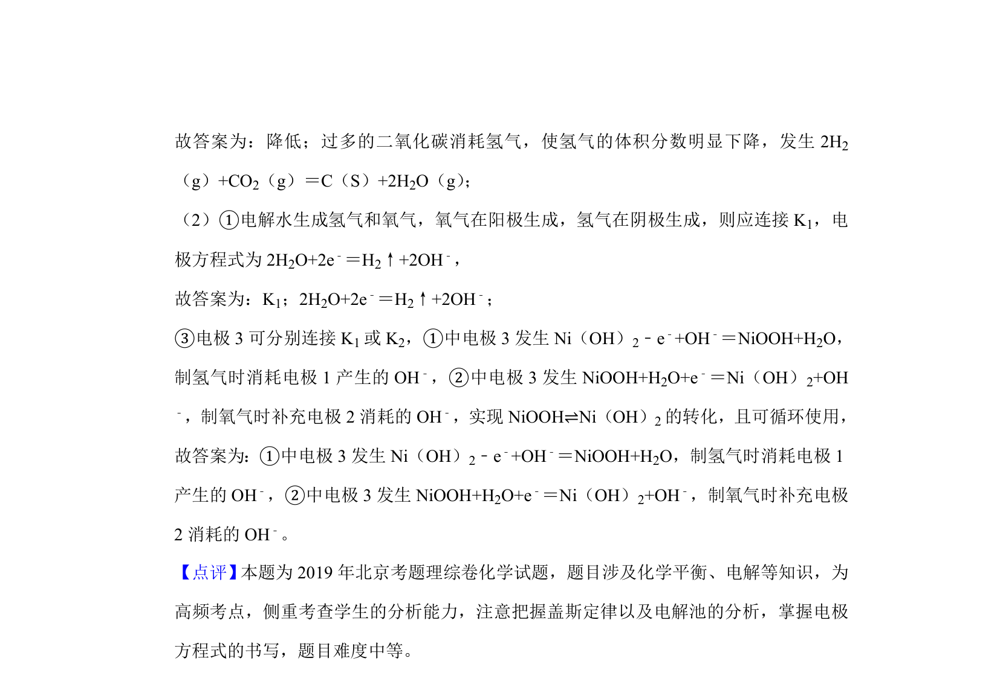

## 题面

## 摘要

甲烷水蒸气催化重整制高纯氢的反应方程式书写与热化学方程式分析。

## 关联考点

- [[621-化学方程式书写|化学方程式书写]]
- [[309-热化学方程式|热化学方程式]]
- [[反应物与生成物计量关系]]

## 答案与解析

> 📄 原 PDF 第 14 页：`素材/真题/北京/2008-2024·（北京）化学高考真题/2019年高考化学试卷（北京）（解析卷）.pdf`
