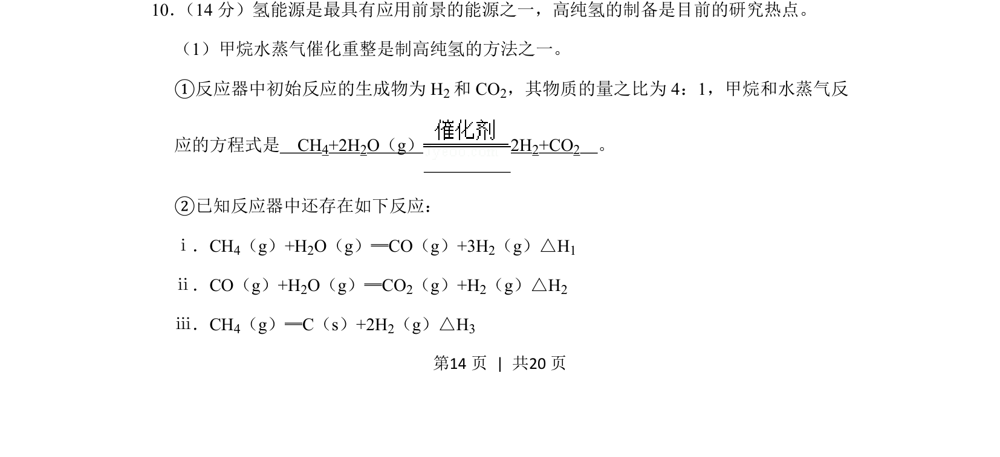
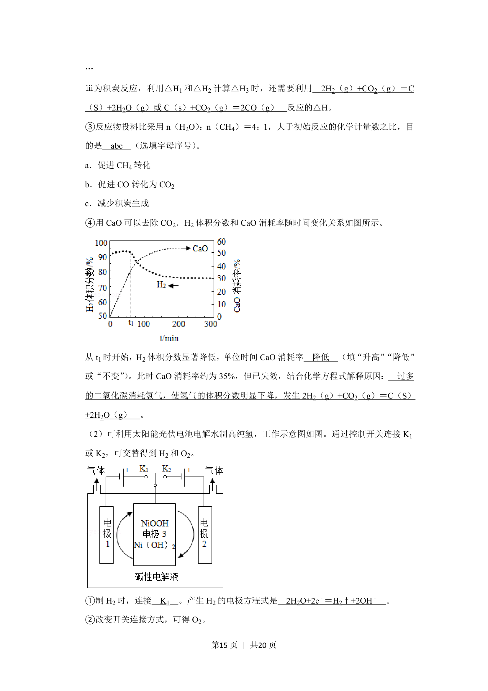
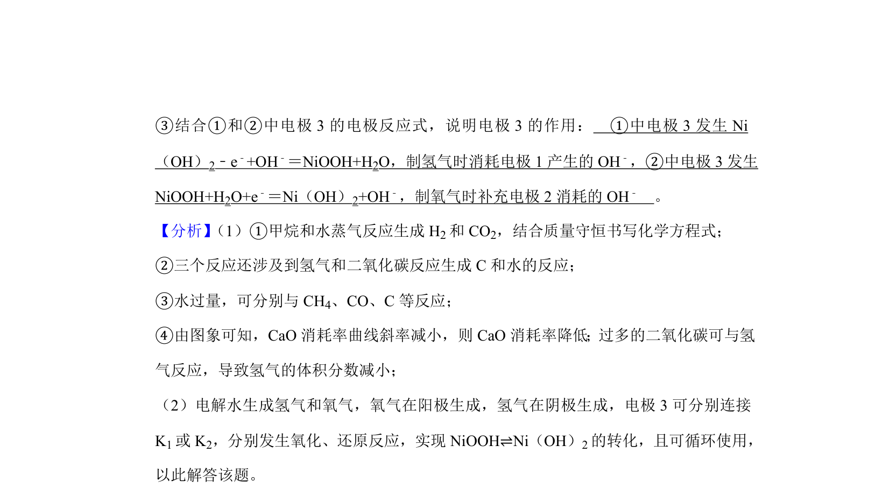
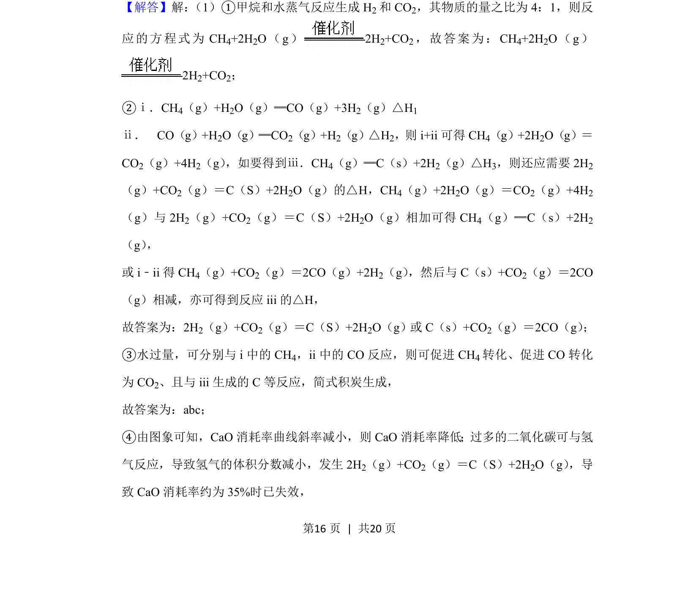
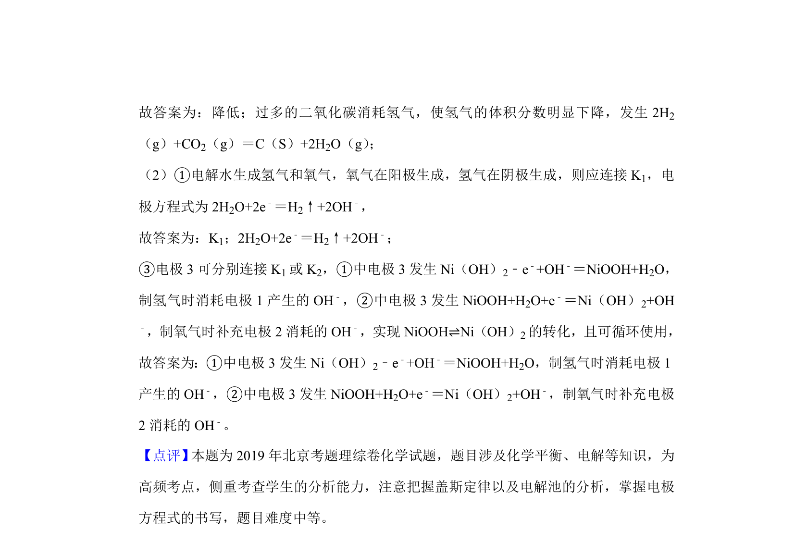

## 题面

## 摘要

甲烷水蒸气催化重整制高纯氢的反应方程式书写与热化学方程式分析。

## 关联考点

- [[976-化学方程式的书写|化学方程式书写]]
- [[309-热化学方程式|热化学方程式]]
- [[反应物与生成物计量关系]]

## 答案与解析

> 📄 原 PDF 第 14 页：`素材/真题/北京/2008-2024·（北京）化学高考真题/2019年高考化学试卷（北京）（解析卷）.pdf`

<!-- 题干文本-start -->
## 题干文本
10． （14分）氢能源是最具有应用前景的能源之一，高纯氢的制备是目前的研究热点。
（1）甲烷水蒸气催化重整是制高纯氢的方法之一。
①反应器中初始反应的生成物为H 2和CO 2，其物质的量之比为4：1，甲烷和水蒸气反
应的方程式是　CH4+2H2O（g） 2H2+CO2　。
②已知反应器中还存在如下反应：
ⅰ．CH4（g）+H2O（g）═CO（g）+3H2（g）△H1
ⅱ．CO（g）+H2O（g）═CO2（g）+H2（g）△H2
ⅲ．CH4（g）═C（s）+2H2（g）△H3
<!-- 题干文本-end -->

<!-- 解析文本-start -->
## 解析文本

<!-- 解析文本-end -->
