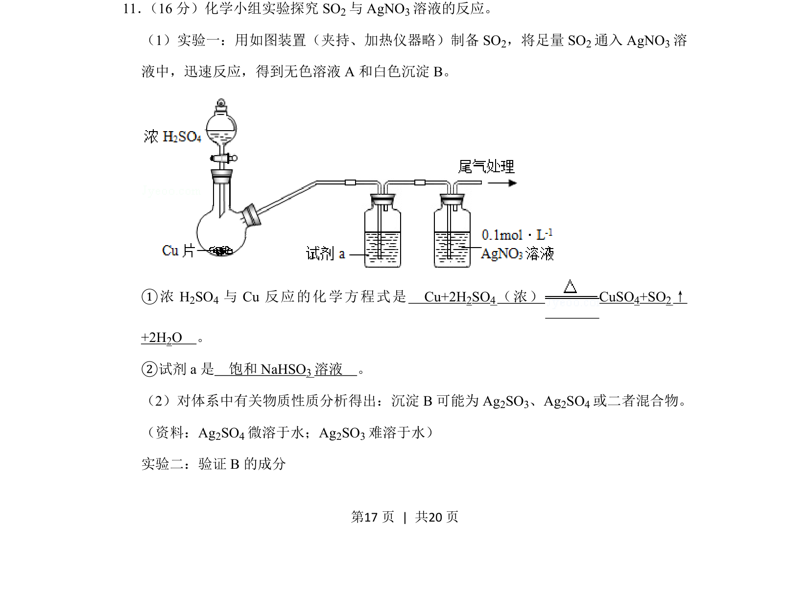
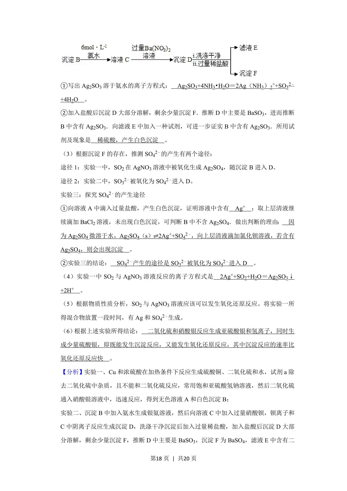
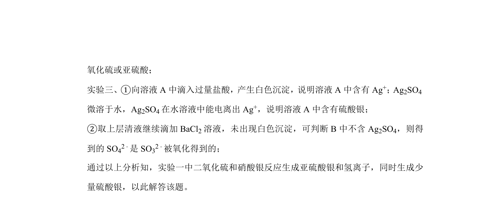
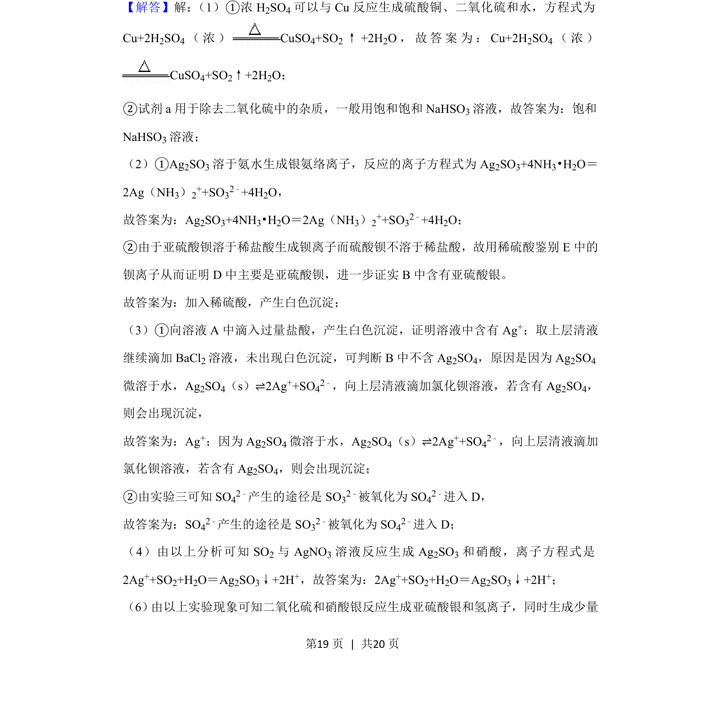
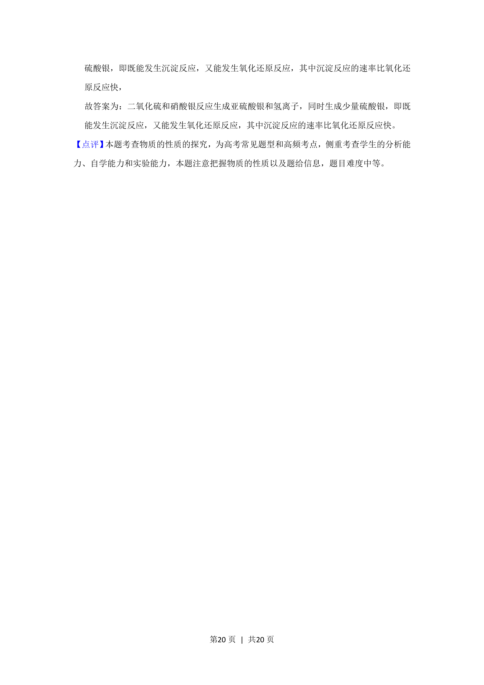

## 题面

## 摘要

探究SO2与AgNO3溶液反应，考查SO2的实验室制备、除杂及白色沉淀成分的验证。

## 关联考点

- [[二氧化硫的制备与性质]]
- [[物质分离与除杂]]
- [[328-沉淀溶解平衡|沉淀溶解平衡]]
- [[482-实验设计|实验探究]]

## 答案与解析

> 📄 原 PDF 第 17 页：`素材/真题/北京/2008-2024·（北京）化学高考真题/2019年高考化学试卷（北京）（解析卷）.pdf`
