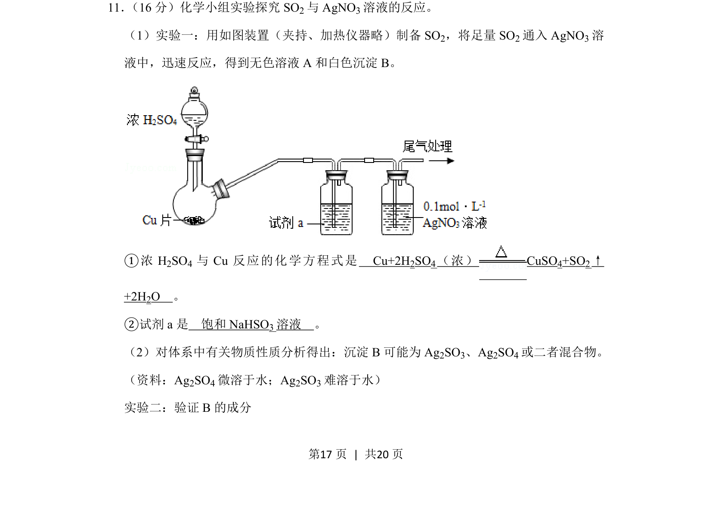
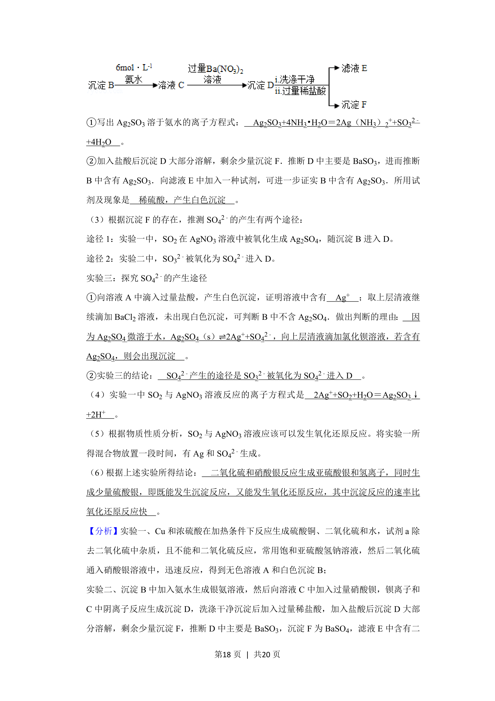
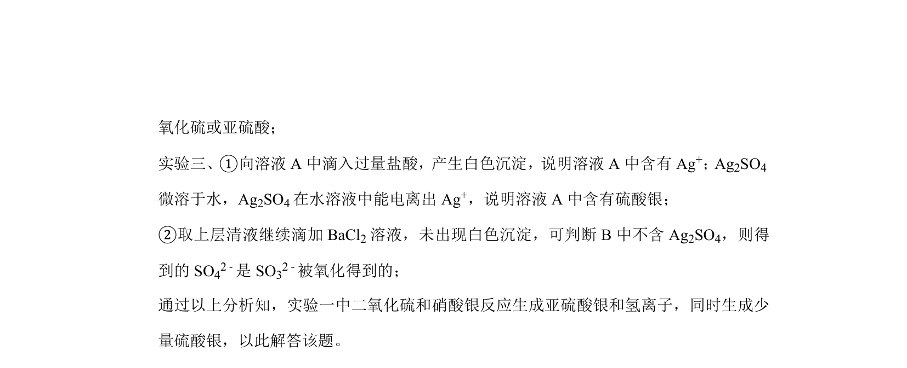
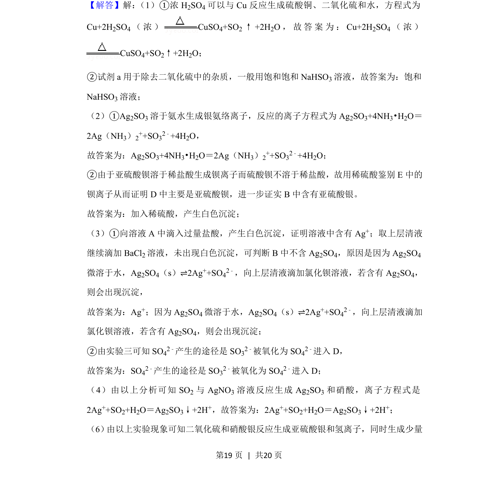
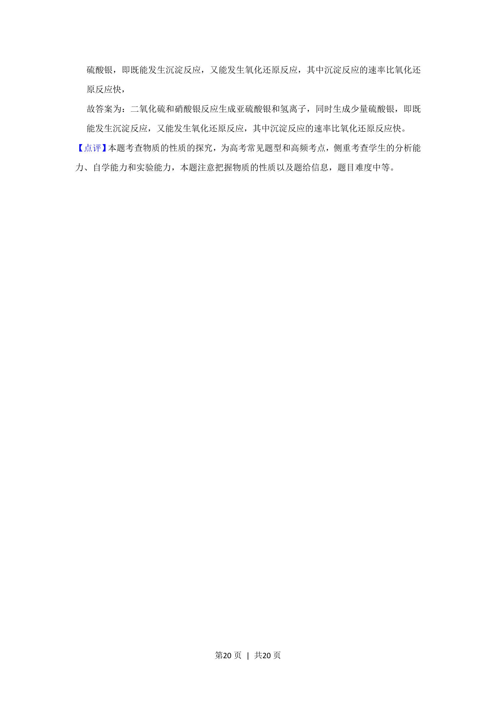

## 题面

## 摘要

探究SO2与AgNO3溶液反应，考查SO2的实验室制备、除杂及白色沉淀成分的验证。

## 关联考点

- [[二氧化硫的制备与性质]]
- [[物质分离与除杂]]
- [[328-沉淀溶解平衡|沉淀溶解平衡]]
- [[482-实验设计|实验探究]]

## 答案与解析

> 📄 原 PDF 第 17 页：`素材/真题/北京/2008-2024·（北京）化学高考真题/2019年高考化学试卷（北京）（解析卷）.pdf`

<!-- 题干文本-start -->
## 题干文本
11． （16分）化学小组实验探究SO2与AgNO 3溶液的反应。
（1）实验一：用如图装置（夹持、加热仪器略）制备SO 2，将足量SO 2通入AgNO 3溶
液中，迅速反应，得到无色溶液A和白色沉淀B。
①浓H 2SO4 与Cu反应的化学方程式是　Cu+2H 2SO4（浓） CuSO4+SO2↑
+2H2O　。
②试剂a是　饱和NaHSO 3溶液　。
（2）对体系中有关物质性质分析得出：沉淀B可能为Ag 2SO3、Ag2SO4或二者混合物。
（资料：Ag2SO4微溶于水；Ag2SO3难溶于水）
实验二：验证B的成分
<!-- 题干文本-end -->

<!-- 解析文本-start -->
## 解析文本

<!-- 解析文本-end -->
