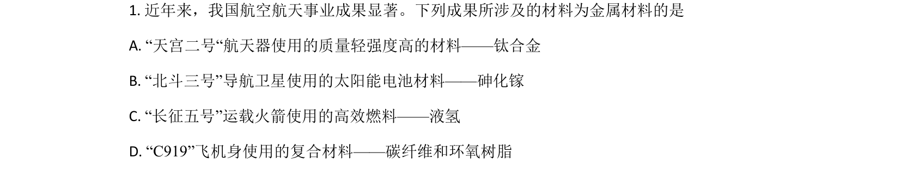
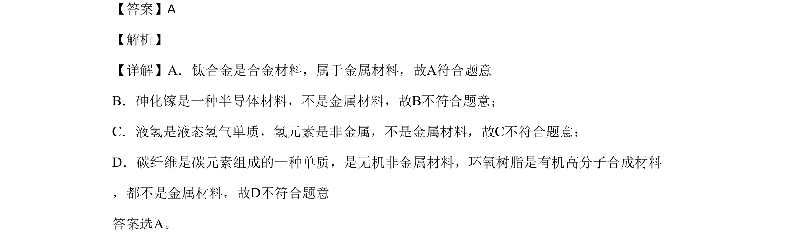

## 题面

## 摘要

考查金属材料与无机非金属材料的区分。

## 关联考点

- [[857-金属材料|金属材料]]
- [[093-合金|合金]]
- [[696-无机非金属材料|无机非金属材料]]

## 答案与解析

> 📄 原 PDF 第 1 页：`素材/真题/北京/2008-2024·（北京）化学高考真题/2020年高考化学试卷（北京）（解析卷）.pdf`

<!-- 题干文本-start -->
## 题干文本
1. 近年来，我国航空航天事业成果显著。下列成果所涉及的材料为金属材料的是
A. “天宫二号“航天器使用的质量轻强度高的材料——钛合金
B. “北斗三号”导航卫星使用的太阳能电池材料——砷化镓
C. “长征五号”运载火箭使用的高效燃料——液氢
D. “C919”飞机身使用的复合材料——碳纤维和环氧树脂
<!-- 题干文本-end -->

<!-- 解析文本-start -->
## 解析文本
【答案】A
【解析】
【详解】A．钛合金是合金材料，属于金属材料，故A符合题意
B．砷化镓是一种半导体材料，不是金属材料，故B不符合题意；
C．液氢是液态氢气单质，氢元素是非金属，不是金属材料，故C不符合题意；
D．碳纤维是碳元素组成的一种单质，是无机非金属材料，环氧树脂是有机高分子合成材料
，都不是金属材料，故D不符合题意
答案选A。
<!-- 解析文本-end -->
