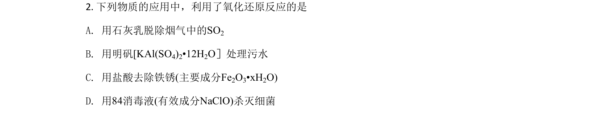
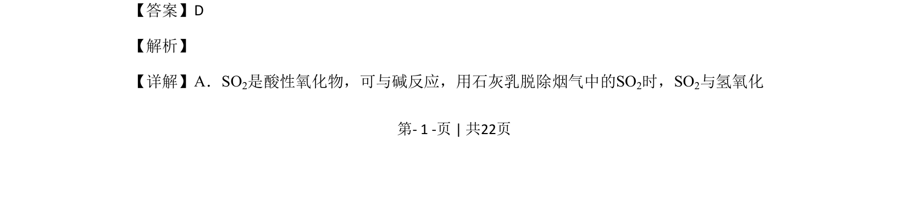
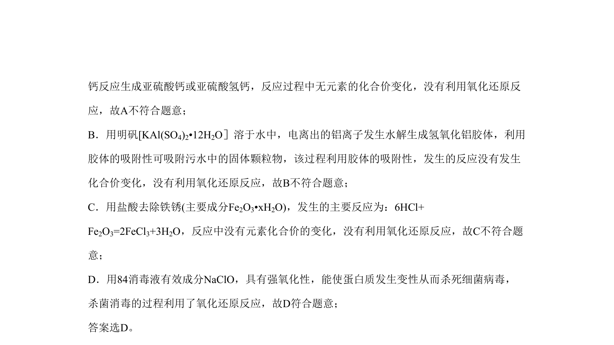

## 题面

## 摘要

该题考查氧化还原反应在生产生活中的应用判断。

## 关联考点

- [[162-氧化还原反应|氧化还原反应]]
- [[985-酸性氧化物|酸性氧化物]]
- [[336-盐类水解|盐类水解]]
- [[次氯酸钠氧化性]]

## 答案与解析

> 📄 原 PDF 第 1 页：`素材/真题/北京/2008-2024·（北京）化学高考真题/2020年高考化学试卷（北京）（解析卷）.pdf`
