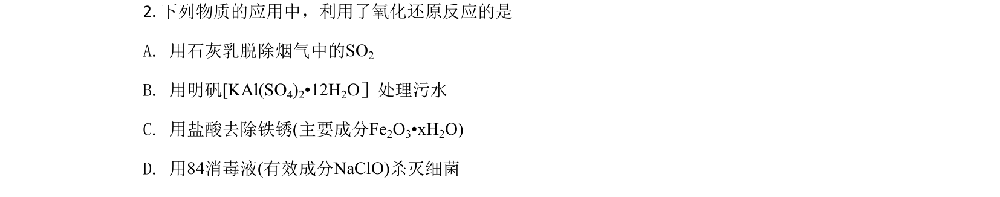
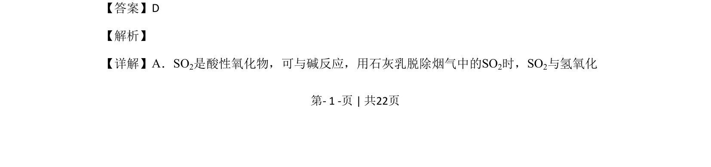
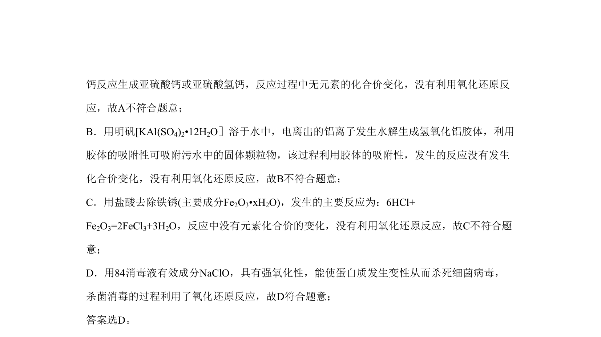

## 题面

## 摘要

该题考查氧化还原反应在生产生活中的应用判断。

## 关联考点

- [[162-氧化还原反应|氧化还原反应]]
- [[985-酸性氧化物|酸性氧化物]]
- [[336-盐类水解|盐类水解]]
- [[次氯酸钠氧化性]]

## 答案与解析

> 📄 原 PDF 第 1 页：`素材/真题/北京/2008-2024·（北京）化学高考真题/2020年高考化学试卷（北京）（解析卷）.pdf`

<!-- 题干文本-start -->
## 题干文本
2. 下列物质的应用中，利用了氧化还原反应的是
A. 用石灰乳脱除烟气中的SO2
B. 用明矾[KAl(SO4)2•12H2O］处理污水
C. 用盐酸去除铁锈(主要成分Fe2O3•xH2O)
D. 用84消毒液(有效成分NaClO)杀灭细菌
<!-- 题干文本-end -->

<!-- 解析文本-start -->
## 解析文本
【答案】D
【解析】
【详解】A．SO2是酸性氧化物，可与碱反应，用石灰乳脱除烟气中的SO2时，SO2与氢氧化
<!-- 解析文本-end -->
