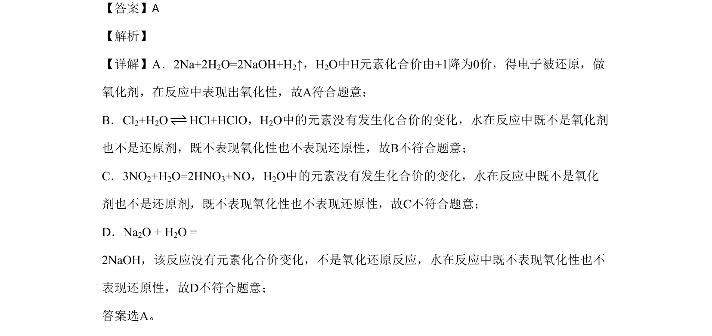

## 题面

## 摘要

考查水在不同化学反应中是否作氧化剂表现氧化性，根据化合价变化判断。

## 关联考点

- [[162-氧化还原反应|氧化还原反应]]
- [[160-氧化剂|氧化剂]]
- [[水的氧化性]]

## 答案与解析

> 📄 原 PDF 第 2 页：`素材/真题/北京/2008-2024·（北京）化学高考真题/2020年高考化学试卷（北京）（解析卷）.pdf`

<!-- 题干文本-start -->
## 题干文本
3. 水与下列物质反应时，水表现出氧化性的是
A. Na B. Cl2 C. NO2 D. Na2O
<!-- 题干文本-end -->

<!-- 解析文本-start -->
## 解析文本
【答案】A
【解析】
【详解】A．2Na+2H2O=2NaOH+H2↑，H2O中H元素化合价由+1降为0价，得电子被还原，做
氧化剂，在反应中表现出氧化性，故A符合题意；
B．Cl2+H2OHCl+HClO，H2O中的元素没有发生化合价的变化，水在反应中既不是氧化剂
也不是还原剂，既不表现氧化性也不表现还原性，故B不符合题意；
C．3NO2+H2O=2HNO3+NO，H2O中的元素没有发生化合价的变化，水在反应中既不是氧化
剂也不是还原剂，既不表现氧化性也不表现还原性，故C不符合题意；
D．Na2O + H2O = 
2NaOH，该反应没有元素化合价变化，不是氧化还原反应，水在反应中既不表现氧化性也不
表现还原性，故D不符合题意；
答案选A。
<!-- 解析文本-end -->
