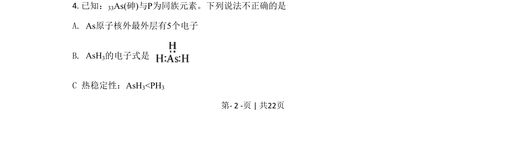
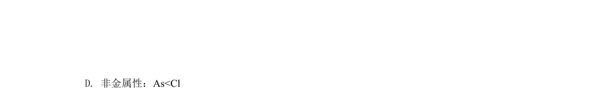
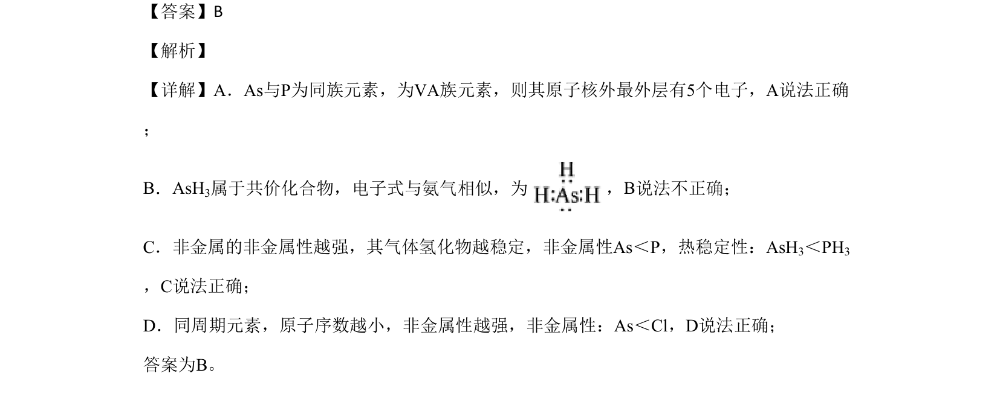

## 题面

## 摘要

考查As与P同族元素性质，判断原子结构、电子式、氢化物稳定性和非金属性递变正误

## 关联考点

- [[252-元素周期律|元素周期律]]
- [[非金属性比较]]
- [[266-电子式|电子式]]
- [[氢化物稳定性]]

## 答案与解析

> 📄 原 PDF 第 2 页：`素材/真题/北京/2008-2024·（北京）化学高考真题/2020年高考化学试卷（北京）（解析卷）.pdf`
