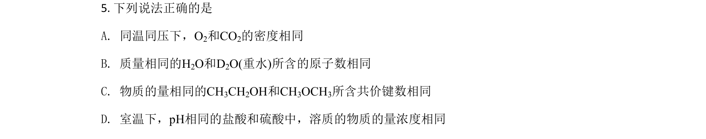
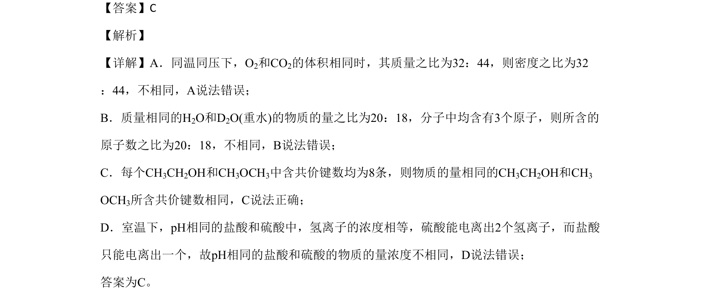

## 题面

## 摘要

考查阿伏伽德罗定律、物质的量计算、共价键数目及溶液pH与浓度关系的正误判断。

## 关联考点

- [[阿伏伽德罗定律]]
- [[779-物质的量|物质的量]]
- [[255-共价键|共价键]]
- [[pH与浓度]]

## 答案与解析

> 📄 原 PDF 第 3 页：`素材/真题/北京/2008-2024·（北京）化学高考真题/2020年高考化学试卷（北京）（解析卷）.pdf`
