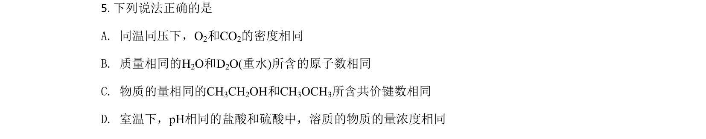
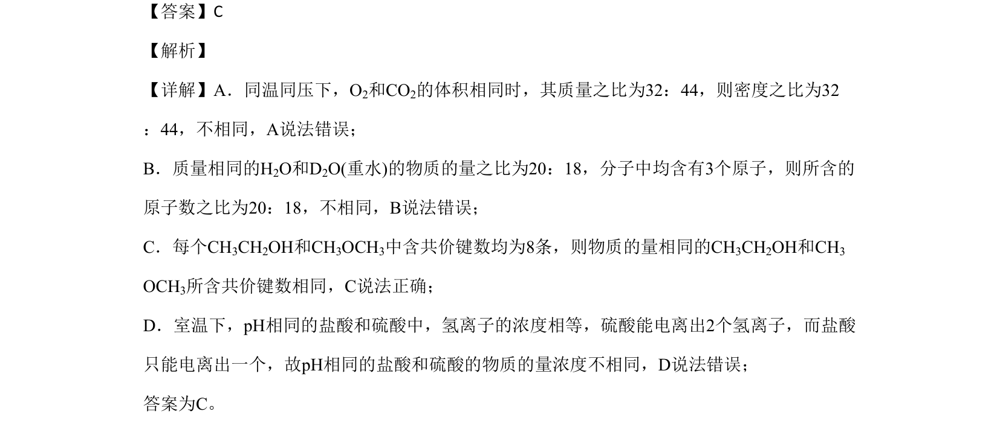

## 题面

## 摘要

考查阿伏伽德罗定律、物质的量计算、共价键数目及溶液pH与浓度关系的正误判断。

## 关联考点

- [[阿伏伽德罗定律]]
- [[779-物质的量|物质的量]]
- [[255-共价键|共价键]]
- [[pH与浓度]]

## 答案与解析

> 📄 原 PDF 第 3 页：`素材/真题/北京/2008-2024·（北京）化学高考真题/2020年高考化学试卷（北京）（解析卷）.pdf`

<!-- 题干文本-start -->
## 题干文本
5. 下列说法正确的是
A. 同温同压下，O2和CO2的密度相同
B. 质量相同的H2O和D2O(重水)所含的原子数相同
C. 物质的量相同的CH3CH2OH和CH3OCH3所含共价键数相同
D. 室温下，pH相同的盐酸和硫酸中，溶质的物质的量浓度相同
<!-- 题干文本-end -->

<!-- 解析文本-start -->
## 解析文本
【答案】C
【解析】
【详解】A．同温同压下，O2和CO2的体积相同时，其质量之比为32：44，则密度之比为32
：44，不相同，A说法错误；
B．质量相同的H2O和D2O(重水)的物质的量之比为20：18，分子中均含有3个原子，则所含的
原子数之比为20：18，不相同，B说法错误；
C．每个CH3CH2OH和CH3OCH3中含共价键数均为8条，则物质的量相同的CH3CH2OH和CH3
OCH3所含共价键数相同，C说法正确；
D．室温下，pH相同的盐酸和硫酸中，氢离子的浓度相等，硫酸能电离出2个氢离子，而盐酸
只能电离出一个，故pH相同的盐酸和硫酸的物质的量浓度不相同，D说法错误；
答案为C。
<!-- 解析文本-end -->
