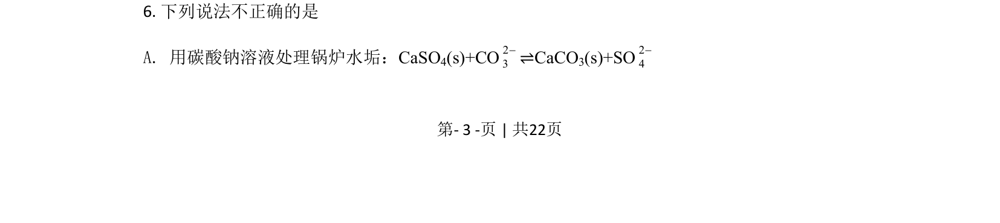
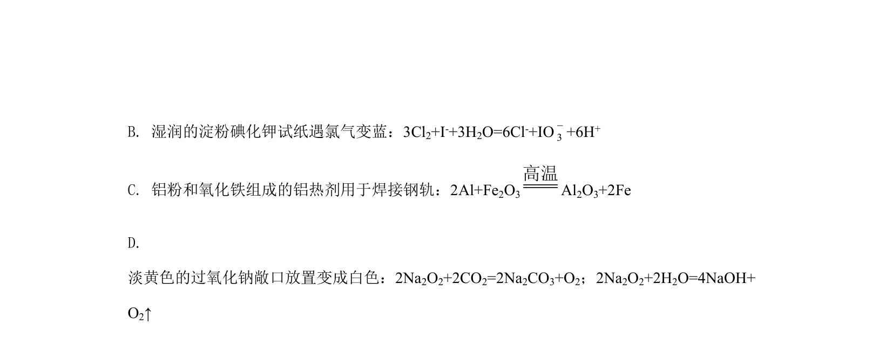
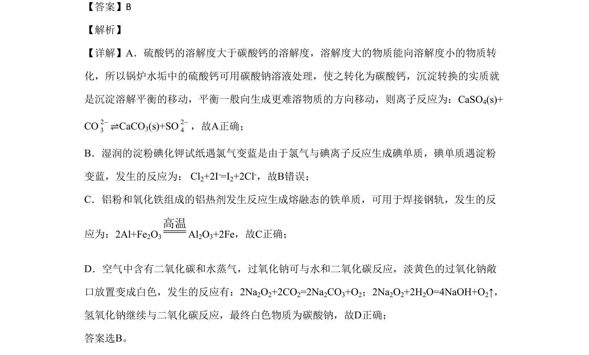

## 题面

## 摘要

本题考查化学方程式正误判断，涉及沉淀转化、氯气氧化性、铝热反应及钠氧化物性质等。

## 关联考点

- [[907-离子方程式书写与正误判断|离子方程式正误判断]]
- [[328-沉淀溶解平衡|沉淀溶解平衡]]
- [[氯气氧化性]]
- [[193-铝热反应|铝热反应]]
- [[571-过氧化钠性质|过氧化钠性质]]

## 答案与解析

> 📄 原 PDF 第 3 页：`素材/真题/北京/2008-2024·（北京）化学高考真题/2020年高考化学试卷（北京）（解析卷）.pdf`
