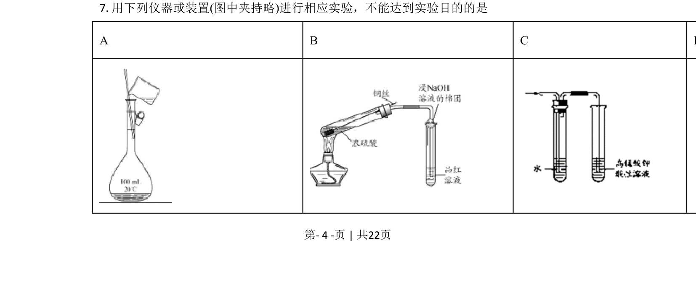
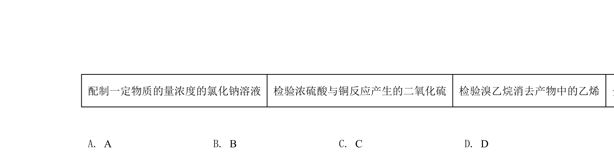
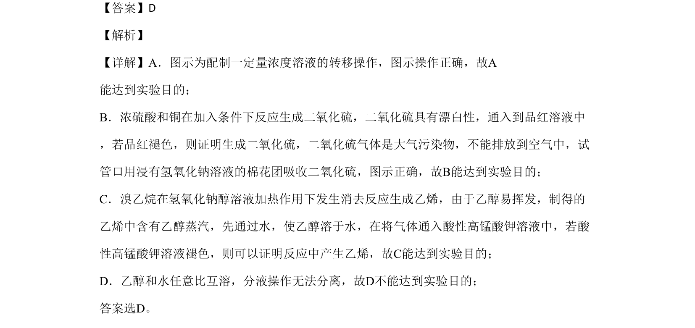

## 题面

## 摘要

考查化学实验基本操作与目的判断，涉及溶液配制、气体检验、物质分离等。

## 关联考点

- [[002-化学实验基本操作|化学实验基本操作]]
- [[729-气体检验|气体检验]]
- [[555-物质分离|物质分离]]
- [[756-消去反应|消去反应]]

## 答案与解析

> 📄 原 PDF 第 4 页：`素材/真题/北京/2008-2024·（北京）化学高考真题/2020年高考化学试卷（北京）（解析卷）.pdf`
